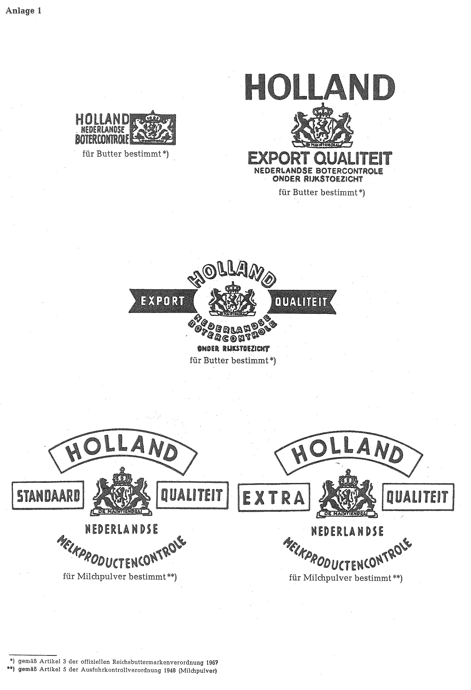

# Bekanntmachung zu § 4 des Warenzeichengesetzes (WZG§4NLDBek 1975)

Ausfertigungsdatum
:   1975-11-21

Fundstelle
:   BGBl I: 1975, 2911

## (XXXX)

(1) Auf Grund des § 4 Abs. 2 Nr. 3 des Warenzeichengesetzes in der
Fassung der Bekanntmachung vom 2. Januar 1968 (Bundesgesetzbl. I S. 1,
29), zuletzt geändert durch das Gesetz vom 9. Dezember 1974
(Bundesgesetzbl. I S. 3416), werden in der Anlage 1 amtliche Prüf- und
Gewährzeichen für Butter und Milchpulver bekanntgemacht, die im
Königreich der Niederlande eingeführt sind.

(2) Diese Bekanntmachung ergeht im Anschluß an die Bekanntmachung vom
21\. Juli 1975 (Bundesgesetzblatt I S. 1946).

## Schlussformel

Der Bundesminister der Justiz

## Anlage 1

(Fundstelle: BGBl. I 1975, 2912)

## Anlage 2

-

