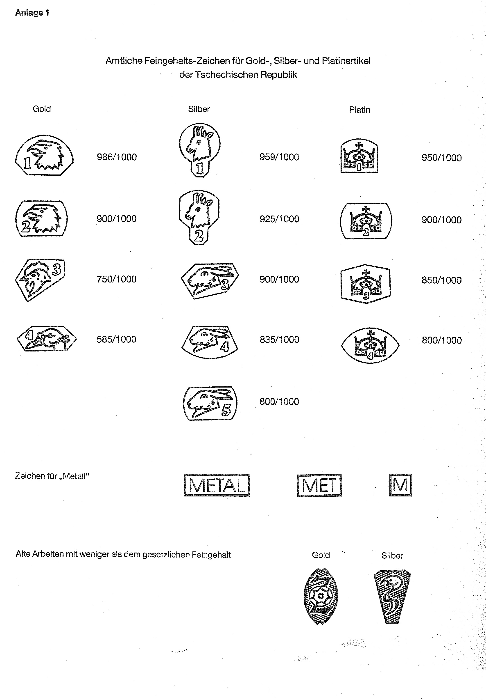
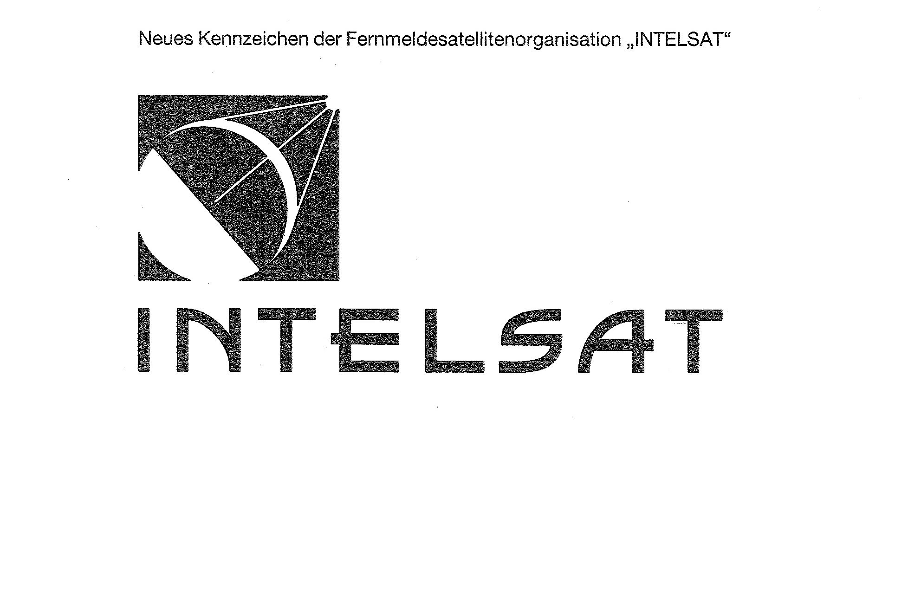
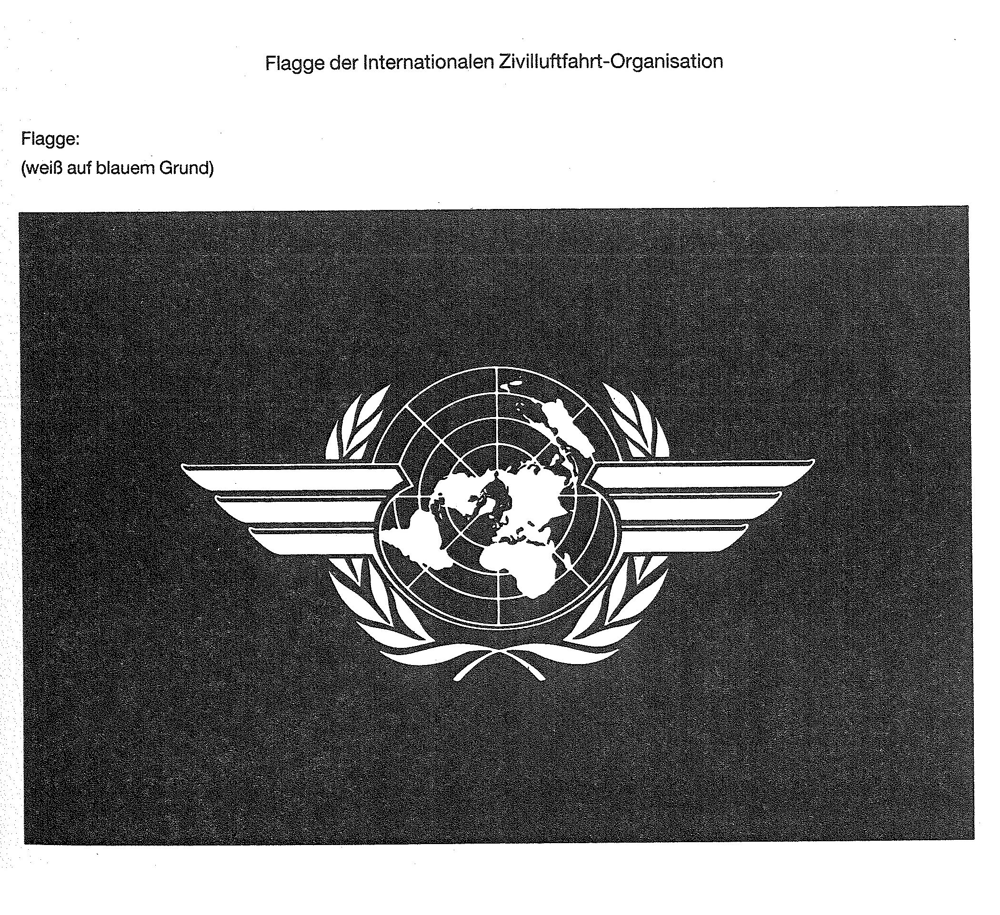

# Bekanntmachung zu § 4 des Warenzeichengesetzes (WZG§4TRBek)

Ausfertigungsdatum
:   1994-04-05

Fundstelle
:   BGBl I: 1994, 849

## I.

Auf Grund des § 4 Abs. 2 Nr. 3 des Warenzeichengesetzes in der Fassung
der Bekanntmachung vom 2. Januar 1968 (BGBl. I S. 1, 29) werden
amtliche Prüf- und Gewährzeichen bekanntgemacht, die in der
Tschechischen Republik eingeführt sind (Anlage 1).

## II.

Auf Grund des § 4 Abs. 2 Nr. 3a desselben Gesetzes wird
bekanntgemacht, daß

1.  neben dem in der Bekanntmachung vom 23. Juni 1983 (BGBl. I S. 833)
    wiedergegebenen Kennzeichen auch das neue Kennzeichen der
    Internationalen Fernmeldesatellitenorganisation "INTELSAT" (Anlage 2),

2.  neben den in den Bekanntmachungen vom 12. September 1963 (BGBl. I S.
    781) und vom 14. April 1975 (BGBl. I S. 962) wiedergegebenen
    Bezeichnungen und Kennzeichen auch die Flagge der Internationalen
    Zivilluftfahrt-Organisation (Anlage 3)

von der Eintragung als Warenzeichen ausgeschlossen sind.

## III.

Diese Bekanntmachung ergeht im Anschluß an die Bekanntmachung vom 25.
Juni 1993 (BGBl. I S. 1155).

## Schlußformel

Bundesministerium der Justiz

## Anlage 1 Amtliche Feingehalts-Zeichen für Gold-, Silber- und Platinartikel der Tschechischen Republik

Fundstelle: BGBl. I 1994, 850)

## Anlage 2 Neues Kennzeichen der Fernmeldesatellitenorganisation "INTELSAT"

Fundstelle: BGBl. I 1994, S. 851)

## Anlage 3 Flagge der Internationalen Zivilluftfahrt-Organisation

Fundstelle: BGBl. I 1994, 851)

