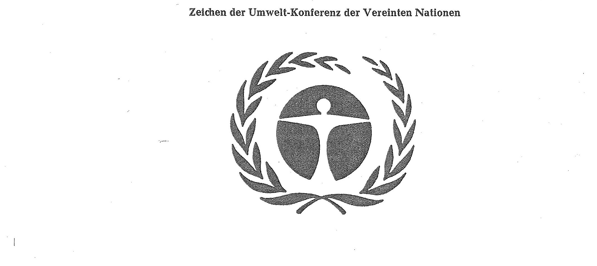

# Bekanntmachung zu § 4 des Warenzeichengesetzes (WZG§4UmWBek)

Ausfertigungsdatum
:   1973-07-25

Fundstelle
:   BGBl I: 1973, 912

## (XXXX)

(1) Auf Grund des § 4 Abs. 2 Nr. 3a des Warenzeichengesetzes in der
Fassung der Bekanntmachung vom 2. Januar 1968 (Bundesgesetzbl. I S. 1,
29), zuletzt geändert durch das Gesetz vom 23. Juni 1970
(Bundesgesetzbl. I S. 805), wird bekanntgemacht, daß das Zeichen der
Umwelt-Konferenz der Vereinten Nationen (Anlage) von der Eintragung
als Warenzeichen ausgeschlossen ist.

(2) Diese Bekanntmachung ergeht im Anschluß an die Bekanntmachung vom
18\. April 1973 (Bundesgesetzbl. I S. 323).

## Schlussformel

Der Bundesminister der Justiz

## Anlage

Fundstelle: BGBl. I 1973, 912)
**Zeichen der Umwelt-Konferenz der Vereinten Nationen**

