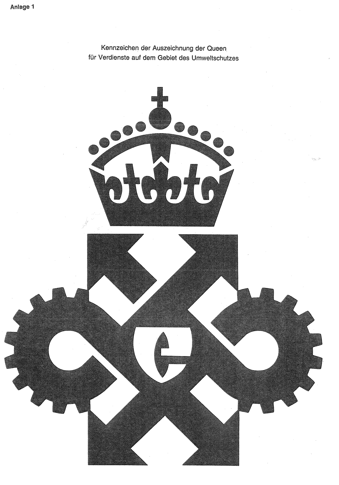
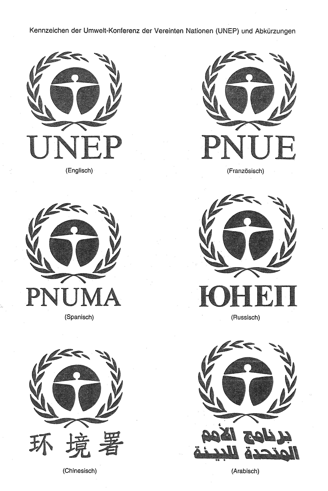

# Bekanntmachung zu § 4 des Warenzeichengesetzes (WZG§4UmwSchBek)

Ausfertigungsdatum
:   1993-06-25

Fundstelle
:   BGBl I: 1993, 1155

## (XXXX)

Auf Grund des § 4 Abs. 2 Nr. 3a des Warenzeichengesetzes in der
Fassung der Bekanntmachung vom 2. Januar 1968 (BGBl. I S. 1, 29) wird
bekanntgemacht, daß die Kennzeichen, Namen und Abkürzungen

-   der Auszeichnung der Queen für Verdienste auf dem Gebiet des
    Umweltschutzes (Anlage 1),

-   des BENELUX-Markenamts (Anlage 2),

-   des Gemeinsamen Fonds für Rohstoffe (Anlage 3) und

-   der Umwelt-Konferenz der Vereinten Nationen (UNEP) in Englisch,
    Französisch, Spanisch, Russisch, Chinesisch und Arabisch

von der Eintragung als Warenzeichen ausgeschlossen sind.
Diese Bekanntmachung ergeht im Anschluß an die Bekanntmachung vom 10.
März 1993 (BGBl. I S. 398).

## Schlussformel

Bundesministerium der Justiz

## Anlage 1 Kennzeichen der Auszeichnung der Queen für Verdienste auf dem Gebiet des Umweltschutzes

Fundstelle: BGBl. I 1993, 1156)

## Anlage 2 Namen, Abkürzungen und Kennzeichen des BENELUX-Markenamts

*    *   Namen:

    *   BENELUX-MERKENBUREAU (BMB)

*    *   (Niederländisch)

*    *   BUREAU BENELUX DES MARQUES (BBM)

*    *   (Französisch)

*    *   Kennzeichen:

    *

   (Inhalt: Nicht darstellbares Kennzeichen,
(Kennzeichen gelb-rot-blau, Verbindungslinien schwarz)
Fundstelle: BGBl. I 1993, 1157)

## Anlage 3 Kennzeichen mit Namen und Abkürzung des Gemeinsamen Fonds für Rohstoffe

(Inhalt: Nicht darstellbares Kennzeichen, mit Namen und Abkürzung,
(Kennzeichen schwarz-weiß, Abkürzung grün)
Fundstelle: BGBl. I 1993, 1158)

## Anlage 4 Kennzeichen der Umwelt-Konferenz der Vereinten Nationen (UNEP) und Abkürzungen

Fundstelle: BGBl. I 1993, 1159)

