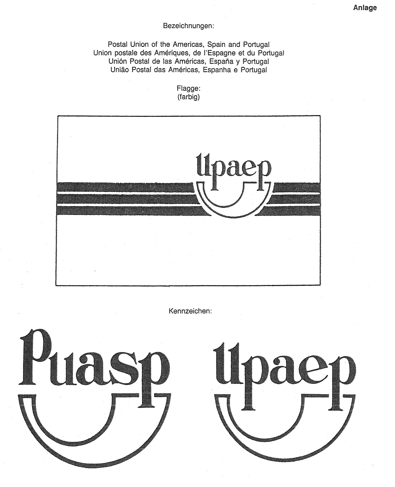

# Bekanntmachung zu § 4 des Warenzeichengesetzes (WZG§4UpaepBek)

Ausfertigungsdatum
:   1991-08-22

Fundstelle
:   BGBl I: 1991, 1926

## (XXXX)

Auf Grund des § 4 Abs. 2 Nr. 3a des Warenzeichengesetzes in der
Fassung der Bekanntmachung vom 2. Januar 1968 (BGBl. I S. 1, 29) wird
bekanntgemacht, daß die Bezeichnungen, die Flagge und die Kennzeichen
der

*   Postunion für den Amerikanischen Kontinent, Spanien und Portugal

    (Anlage)

von der Eintragung als Warenzeichen ausgeschlossen sind.
Diese Bekanntmachung ergeht im Anschluß an die Bekanntmachung vom 22.
Mai 1990 (BGBl. I S. 1006).

## Schlussformel

Der Bundesminister der Justiz

## Anlage

Fundstelle: BGBl. I 1991, 1927)

