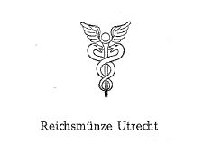

# Bekanntmachung zu § 4 des Warenzeichengesetzes (WZG§4UTRECHTBek)

Ausfertigungsdatum
:   1968-03-01

Fundstelle
:   BGBl I: 1968, 212

## (XXXX)

(1) Auf Grund des § 4 Abs. 2 Nr. 3 des Warenzeichengesetzes in der
Fassung vom 2. Januar 1968 (Bundesgesetzbl. I S. 1, 29) wird in der
Anlage ein amtliches Prüf- und Gewährzeichen bekanntgemacht, das in
der Reichsmünze Utrecht des Königreichs der Niederlande eingeführt
ist.

(2) Diese Bekanntmachung ergeht im Anschluß an die Bekanntmachung vom
30\. Oktober 1967 (Bundesgesetzbl. I S. 1122).

## Schlussformel

Der Bundesminister der Justiz

## Anlage

(Fundstelle: BGBl. I 1968, 212)
Auf Grund des § 4 Abs. 2 Nr. 3 des Warenzeichengesetzes in der Fassung
vom 2. Januar 1968 (Bundesgesetzbl. I S. 1, 29) wird in der Anlage ein
amtliches Prüf- und Gewährzeichen bekanntgemacht, das in der
Reichsmünze Utrecht des Königreichs der Niederlande eingeführt ist.
Diese Bekanntmachung ergeht im Anschluß an die Bekanntmachung vom 30.
Oktober 1967 (Bundesgesetzbl. I S. 1122).
Bonn, den 1. März 1968

*    *   Der Bundesminister der Justiz

*    *   Dr. Heinemann

