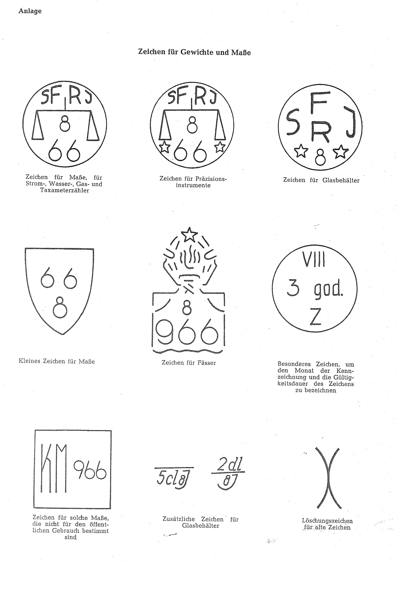
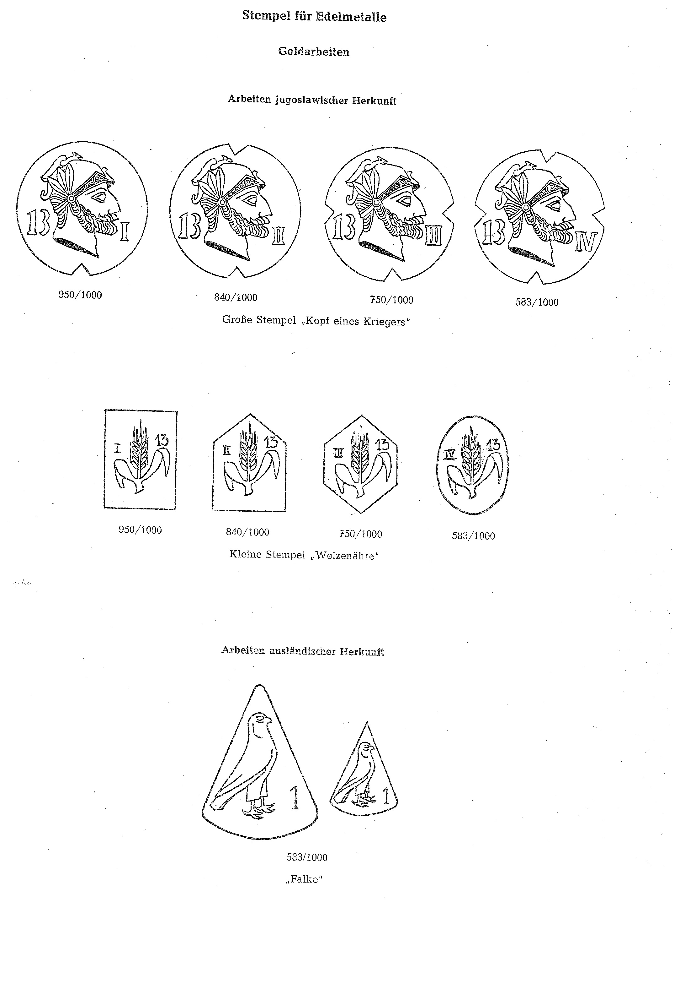
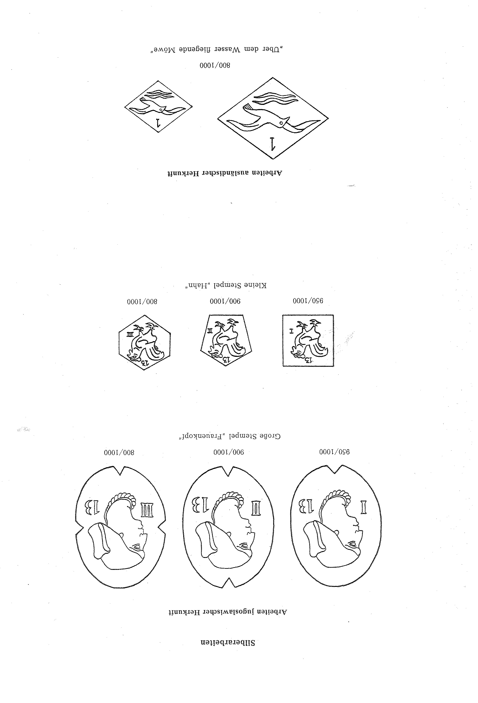
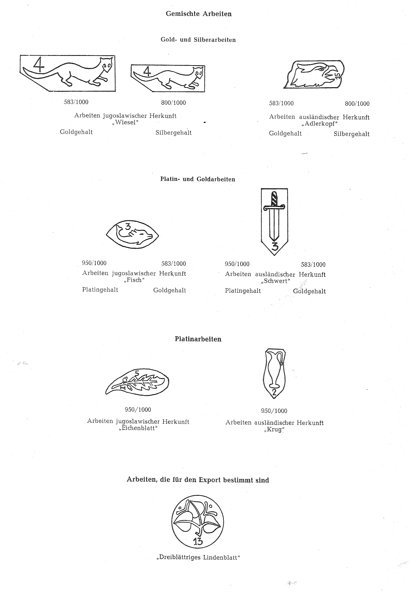

# Bekanntmachung zu § 4 des Warenzeichengesetzes (WZG§4YUGBek)

Ausfertigungsdatum
:   1968-08-14

Fundstelle
:   BGBl I: 1968, 975

## (XXXX)

(1) Auf Grund des § 4 Abs. 2 Nr. 3 des Warenzeichengesetzes in der
Fassung vom 2. Januar 1968 (Bundesgesetzbl. I S. 1, 29) werden in der
Anlage amtliche Prüf- und Gewährzeichen bekanntgemacht, die in der
Sozialistischen Föderativen Republik Jugoslawien eingeführt sind.

(2) Diese Bekanntmachung ergeht im Anschluß an die Bekanntmachung vom
8\. März 1968 (Bundesgesetzblatt I S. 212).

## Schlussformel

Der Bundesminister der Justiz

## Anlage

(Fundstelle: BGBl. I 1968, 976 - 979)

