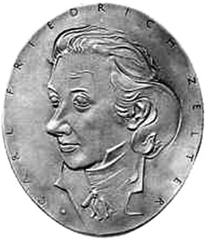
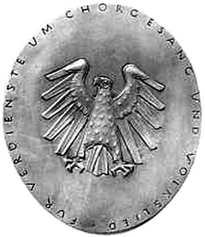

# Richtlinien über die Verleihung der Zelter-Plakette (ZelterPlRL)

Ausfertigungsdatum
:   1956-08-07

Fundstelle
:   BGBl I: 1956, 740

Geändert durch
:   Erlass v. 19.11.2014 I 1761

## (XXXX)

1.  Die Zelter-Plakette ist als Auszeichnung für Chöre bestimmt, die sich
    in langjährigem Wirken besondere Verdienste um die Pflege der
    Chormusik und des deutschen Volksliedes und damit um die Förderung des
    kulturellen Lebens erworben haben. Sie besteht aus einer Plakette, die
    auf der Vorderseite das Bildnis Carl Friedrich Zelters und auf der
    Rückseite den Bundesadler mit der Umschrift „Für Verdienste um
    Chorgesang und Volkslied“ zeigt. Form und Größe der Zelter-Plakette
    sind auf einer Mustertafel festgelegt.

2.  Die Zelter-Plakette wird durch den Bundespräsidenten aus Anlass des
    mindestens einhundertjährigen Bestehens eines Chores auf dessen Antrag
    verliehen. Voraussetzung für die Verleihung ist der Nachweis, dass
    sich der Chor über einen Zeitraum von mindestens einhundert Jahren in
    ernster und erfolgreicher musikalischer Arbeit der Liederpflege
    gewidmet und im Rahmen der örtlich gegebenen Verhältnisse
    künstlerische Verdienste oder Verdienste um die musikalische Bildung
    erworben hat.

3.  Der Antrag auf Verleihung der Zelter-Plakette kann frühestens im
    Vorjahr des Jubiläumsjahres gestellt werden. Die Antragsformulare sind
    bei der Geschäftsstelle des Empfehlungsausschusses zur Verleihung der
    Zelter-Plakette und den bundesweit tätigen Chororganisationen
    erhältlich.

    Chöre, die durch eine bundesweit tätige Chororganisation vertreten
    werden, richten ihren Antrag bis zum 30. Juni des Jahres der
    Antragsstellung an ihre Chororganisation. Die Chororganisation prüft
    den Antrag formal und bescheinigt die Vollständigkeit des Antrags und
    die Plausibilität der in dem Antrag gemachten Angaben. Die
    Chororganisation leitet den Antrag nebst den eingereichten
    Ergänzungsunterlagen bis zum 31. August des Jahres der Antragsstellung
    an die Geschäftsstelle des Empfehlungsausschusses weiter.

    Chöre, die durch keine bundesweit tätige Chororganisation vertreten
    werden, richten den Antrag bis zum 30. Juni des Jahres der
    Antragsstellung an das jeweils zuständige Landesministerium. Das
    Landesministerium prüft den Antrag formal und bescheinigt die
    Vollständigkeit des Antrags und die Plausibilität der in dem Antrag
    gemachten Angaben. Das Landesministerium leitet den Antrag nebst den
    eingereichten Ergänzungsunterlagen bis zum 31. August des Jahres der
    Antragsstellung an die Geschäftsstelle des Empfehlungsausschusses
    weiter.

    Chöre mit Sitz im Ausland richten ihren Antrag bis zum 30. Juni des
    Jahres der Antragsstellung über die jeweilige diplomatische oder
    konsularische Vertretung der Bundesrepublik Deutschland an das
    Auswärtige Amt. Das Auswärtige Amt prüft den Antrag formal und
    bescheinigt die Vollständigkeit des Antrags und die Plausibilität der
    in dem Antrag gemachten Angaben. Das Auswärtige Amt leitet den Antrag
    nebst den eingereichten Ergänzungsunterlagen bis zum 31. August des
    Jahres der Antragsstellung an die Geschäftsstelle des
    Empfehlungsausschusses weiter.

4.  Der Antrag ist in dreifacher Ausfertigung einzureichen. Dem Antrag
    sind folgende Unterlagen in einfacher Ausfertigung beizufügen:

    a)  ein geschichtlicher Abriss des Chores mit Daten in Zeitabständen von 5
        bis 10 Jahren unter Hinweis auf die hierfür beigefügten Belege.
        Ebenfalls beizufügen ist eine Auflistung aller Chorleiter und
        gegebenenfalls Vorsitzenden mit genauer Angabe der Jahreszahlen ihrer
        Tätigkeit sowie eine tabellarische Belegübersicht;

    b)  ein Nachweis über die Gründungszeit (Gründungsprotokoll, Satzung oder
        authentische Belege, die auf die Gründungszeit hinweisen). Die
        Dokumente sind in beglaubigter Kopie vorzulegen;

    c)  ein Tätigkeitsbericht des Chores über die musikalischen Aktivitäten
        der letzten fünf Jahre, hierzu Konzertprogramme sowie einschlägige,
        mit Datum versehene Presseberichte, ein Verzeichnis des
        Chorrepertoires, ferner Programme und Festbücher eventuell schon
        stattgefundener Jubiläumsfeiern sowie Unterlagen über besondere
        Leistungen in früherer Zeit, die zur Begründung des Antrags wesentlich
        erscheinen;

    d)  eine Bescheinigung der Stadt oder der Gemeinde im Original über die
        kulturelle Betätigung des Chores und seiner Verdienste um das vokale
        Musizieren;

    e)  bei eingetragenen Vereinen ein aktueller Auszug aus dem
        Vereinsregister.

5.  Die Geschäftsstelle des Empfehlungsausschusses ist bei einer
    bundesweit tätigen Chororganisation angesiedelt, die durch gesonderte
    Vereinbarung zwischen dem Bundespräsidialamt, der für Kultur und
    Medien zuständigen obersten Bundesbehörde und den bundesweit tätigen
    Chororganisationen zu bestimmen ist. Die Geschäftsstelle verantwortet
    die organisatorische und inhaltliche Vorbereitung der Sitzung des
    Empfehlungsausschusses.

6.  Der Empfehlungsausschuss besteht aus zwei institutionellen Mitgliedern
    und gegebenenfalls hinzutretenden Mitgliedern. Der
    Empfehlungsausschuss tagt jährlich.

    Zu den institutionellen Mitgliedern gehören ein Vertreter der für
    Kultur und Medien zuständigen obersten Bundesbehörde und ein Vertreter
    der Ständigen Konferenz der Kultusminister der Länder.

    Es können hinzutreten:

    a)  ein Vertreter einer der bundesweit tätigen Chororganisationen, wenn
        der Empfehlungsausschuss über einen Antrag zu entscheiden hat, der von
        einem zu dieser Chororganisation gehörenden Chor gestellt wurde;

    b)  ein Vertreter eines Chorverbandes, wenn der Empfehlungsausschuss über
        einen Antrag zu entscheiden hat, der von einem zu diesem Chorverband
        gehörenden Chor gestellt wurde und der antragstellende Chor nicht
        durch eine bundesweit tätige Chororganisation vertreten wird;

    c)  ein Vertreter des Auswärtigen Amtes, wenn der Empfehlungsausschuss
        über einen Antrag eines Chores mit Sitz im Ausland zu entscheiden hat.

    Die hinzutretenden Mitglieder nehmen für die Dauer der gesamten
    Sitzung an der Beratung und Entscheidung des Empfehlungsausschusses
    teil.

    Beschlussfassungen des Empfehlungsausschusses durch
    Fernkommunikationsmittel sind zulässig, wenn kein Mitglied diesem
    Verfahren widerspricht. Diese Beschlüsse sind schriftlich festzuhalten
    und der Niederschrift über die nächste Ausschusssitzung als Anlage
    beizufügen.

7.  Der Empfehlungsausschuss prüft die von seiner Geschäftsstelle
    vorbereiteten Anträge inhaltlich und empfiehlt dem jeweils zuständigen
    Landesministerium, dem Bundespräsidenten den Vorschlag zur Verleihung
    der Zelter-Plakette zu unterbreiten. Der Vorschlag wird dem
    Bundespräsidenten nach Gegenzeichnung durch den Bundeskanzler oder
    einen zuständigen Bundesminister durch die für Kultur und Medien
    zuständige oberste Bundesbehörde vorgelegt.

    Bei Anträgen von Chören mit Sitz im Ausland empfiehlt der
    Empfehlungsausschuss dem Auswärtigen Amt, dem Bundespräsidenten den
    Vorschlag zur Verleihung der Zelter-Plakette zu unterbreiten. Der
    Vorschlag wird dem Bundespräsidenten nach Gegenzeichnung durch den
    Bundesminister des Auswärtigen durch das Auswärtige Amt vorgelegt.

8.  Die Urkunde über die Verleihung der Ehrenplakette vollzieht der
    Bundespräsident.

    Die Urkunde kann dem Chor erst nach der zentralen
    Verleihungsveranstaltung auf Bundesebene ausgehändigt werden.
    Gleichzeitig wird die Ehrenplakette überreicht.

    Bei Chören mit Sitz im Ausland erfolgt die Aushändigung der Urkunde
    und der Ehrenplakette durch die diplomatische oder konsularische
    Vertretung der Bundesrepublik Deutschland in dem betreffenden Land.

9.  Bundesweit tätige Chororganisation im Sinne dieser Richtlinien ist ein
    Dachverband, dem mehrere, nicht nur zu einer bestimmten Region
    gehörende Chorverbände oder Chöre als Mitglieder angehören.
    Chorverband im Sinne dieser Richtlinien ist ein Zusammenschluss von
    einzelnen Chören.

*    *   Vorderseite

    *   Rückseite

*    *        
    *        

*    *   Plakette: oval, Bronze
        Originalgröße: 16 cm hoch, 14 cm breit.

## Schlußformel

Der Bundespräsident
Der Stellvertreter des Bundeskanzlers
Der Bundesminister des Innern

