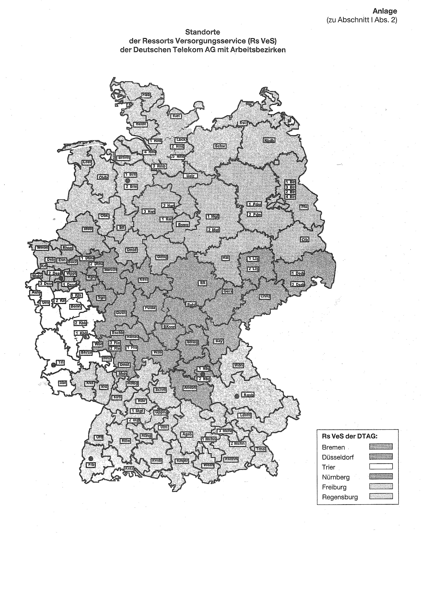

# Anordnung über die Übertragung von Zuständigkeiten auf dem Gebiet der beamtenrechtlichen Versorgung im Geschäftsbereich der Deutschen Telekom AG (ZOVersDTAG)

Ausfertigungsdatum
:   1997-07-25

Fundstelle
:   BGBl I: 1997, 2288

Geändert durch
:   Abschn. III Satz 2 AnO v. 2.12.1997; 1998 I 523

## I. Pensionsfestsetzungs- und -regelungsbehörden

(1) Auf Grund des § 49 Abs. 1 Satz 2 des Gesetzes über die Versorgung
der Beamten und Richter in Bund und Ländern in der Fassung der
Bekanntmachung vom 16. Dezember 1994 (BGBl. I S. 3858), zuletzt
geändert durch Artikel 4 des Gesetzes zur Reform des öffentlichen
Dienstrechts (Reformgesetz) vom 24. Februar 1997 (BGBl. I S. 322), in
Verbindung mit § 14 Abs. 1 Satz 1 des Gesetzes zum Personalrecht der
Beschäftigten der früheren Deutschen Bundespost vom 14. September 1994
(BGBl. I S. 2325, 2353) übertragen wir im Einvernehmen mit dem
Bundesministerium für Post und Telekommunikation und dem
Bundesministerium des Innern die uns als oberster Dienstbehörde im
Sinne des Beamtenversorgungsrechts für die Versorgungsberechtigten der
Deutschen Telekom AG zustehenden Befugnisse auf die nachstehend
genannten Organisationseinheiten (Pensionsfestsetzungs- und
-regelungsbehörden) für ihren jeweiligen Zuständigkeitsbereich. Die
sachliche Zuständigkeit der Pensionsfestsetzungs- und
-regelungsbehörden umfaßt versorgungsrechtliche Entscheidungen aller
Art, soweit nicht gesetzlich oder in dieser Anordnung etwas anderes
bestimmt ist.

(2) Örtlich zuständig sind:
für alle vor und nach Eintritt eines Versorgungsfalles notwendigen
Entscheidungen und Maßnahmen zur Festsetzung, Regelung und
Zahlbarmachung von Versorgungsbezügen die Niederlassungen der
Deutschen Telekom AG mit Ressort Versorgungsservice, in deren
Zuständigkeitsbereich der Sitz der Organisationseinheit liegt, der der
Versorgungsberechtigte angehört beziehungsweise vor Eintritt des
Versorgungsfalles angehört hat. Ein Zuständigkeitswechsel infolge
Wohnsitzänderung eines Versorgungsempfängers erfolgt nicht. Die bei
der Zurruhesetzung beziehungsweise beim Tod eines aktiven Beamten
gegebene Zuständigkeit bleibt auch für die Hinterbliebenen erhalten.
Die Niederlassung mit Ressort Versorgungsservice nimmt die Aufgaben
einer Pensionsfestsetzungs- und -regelungsbehörde für alle
Organisationseinheiten wahr, deren Sitz sich innerhalb des sich aus
der Anlage ergebenden Arbeitsbezirks der jeweiligen Niederlassung mit
Ressort Versorgungsservice befindet. Eine Aufstellung der
Organisationseinheiten, die sich im jeweiligen Zuständigkeitsbereich
einer Niederlassung mit Ressort Versorgungsservice befinden, wird mit
besonderer Anweisung bekanntgegeben.
Die Zuständigkeit für vorhandene Versorgungsfälle, die bis zum 31.
Dezember 1996 von Organisationseinheiten der Deutschen Post AG
wahrgenommen wurde, wird ab dem 1. Januar 1997 von folgenden
Organisationseinheiten der Deutschen Telekom AG wahrgenommen:

*    *   Organisationseinheiten der Deutschen Post AG bis zum 31. Dezember 1996

    *   Organisationseinheiten der Deutschen Telekom AG ab 1. Januar 1997

*    *   Versorgungszentrum Hamburg

    *   Deutsche Telekom AG

*    *
    *   Niederlassung 2 Bremen

*    *   Versorgungszentrum Hamburg

    *   Deutsche Telekom AG

*    *   Außenstelle Kiel

    *   Niederlassung 2 Bremen

*    *   Versorgungszentrum Hamburg

    *   Deutsche Telekom AG

*    *   Außenstelle Bremen

    *   Niederlassung 2 Bremen

*    *   Versorgungszentrum Hannover

    *   Deutsche Telekom AG

*    *
    *   Niederlassung 3 Düsseldorf

*    *   Versorgungszentrum Hannover

    *   Deutsche Telekom AG

*    *   Außenstelle Berlin

    *   Niederlassung 3 Düsseldorf

*    *   Versorgungszentrum Münster

    *   Deutsche Telekom AG

*    *
    *   Niederlassung 3 Düsseldorf

*    *   Versorgungszentrum Köln

    *   Deutsche Telekom AG

*    *   Außenstelle Düsseldorf

    *   Niederlassung 3 Düsseldorf

*    *   Versorgungszentrum Frankfurt

    *   Deutsche Telekom AG

*    *   Außenstelle Saarbrücken

    *   Niederlassung Trier

*    *   Versorgungszentrum Köln

    *   Deutsche Telekom AG

*    *
    *   Niederlassung Trier

*    *   Versorgungszentrum Frankfurt

    *   Deutsche Telekom AG

*    *   Außenstelle Trier

    *   Niederlassung Trier

*    *   Versorgungszentrum Stuttgart

    *   Deutsche Telekom AG

*    *   Außenstelle Karlsruhe

    *   Niederlassung Freiburg

*    *   Versorgungszentrum Stuttgart

    *   Deutsche Telekom AG

*    *
    *   Niederlassung Freiburg

*    *   Versorgungszentrum Stuttgart

    *   Deutsche Telekom AG

*    *   Außenstelle Freiburg

    *   Niederlassung Freiburg

*    *   Versorgungszentrum Münster

    *   Deutsche Telekom AG

*    *   Außenstelle Dortmund

    *   Niederlassung 1 Nürnberg

*    *   Versorgungszentrum Frankfurt am Main

    *   Deutsche Telekom AG

*    *
    *   Niederlassung 1 Nürnberg

*    *   Versorgungszentrum München

    *   Deutsche Telekom AG

*    *   Außenstelle Nürnberg

    *   Niederlassung 1 Nürnberg

*    *   Versorgungszentrum München

    *   Deutsche Telekom AG

*    *
    *   Niederlassung Regensburg

*    *   Versorgungszentrum München

    *   Deutsche Telekom AG

*    *   Außenstelle Regensburg

    *   Niederlassung Regensburg

(3) Abweichend von der Übertragung nach Absatz 2 werden folgende
Zuständigkeiten der Niederlassung Trier übertragen:

1.  die vor und nach Eintritt des Versorgungsfalles zu treffenden
    Entscheidungen und Maßnahmen zur Festsetzung und Regelung der
    Versorgungsbezüge für die der obersten Organisationseinheit der
    Deutschen Telekom AG angehörenden Versorgungsberechtigten,

2.  die vor und nach Eintritt des Versorgungsfalles zu treffenden
    Entscheidungen und Maßnahmen zur erstmaligen Festsetzung von
    Versorgungsbezügen der von § 14 des Gesetzes über die
    Unternehmensverfassung der Deutschen Bundespost (PostVerfG) erfaßten
    Personen mit Ausnahme der vertraglichen Versorgungsansprüche nach § 12
    Abs. 5 des Gesetzes über die Unternehmensverfassung der Deutschen
    Bundespost (PostVerfG), soweit der Versorgungsanspruch bei der
    Deutschen Telekom AG besteht,

3.  die vor und nach Eintritt des Versorgungsfalles zu treffenden
    Entscheidungen und Maßnahmen zur erstmaligen Festsetzung von
    Versorgungsbezügen im Rahmen des Beamtenversorgungsrechts des von § 47
    Abs. 1 und 2 des Gesetzes über die Unternehmensverfassung der
    Deutschen Bundespost (PostVerfG) erfaßten Personenkreises aus Vertrag
    nach § 12 Abs. 5 des Gesetzes über die Unternehmensverfassung der
    Deutschen Bundespost (PostVerfG) sowie nach dem
    Beamtenversorgungsgesetz, soweit der Versorgungsanspruch bei der
    Deutschen Telekom AG besteht.

(4) Für die Gewährung von Übergangsgeld nach § 47 des
Beamtenversorgungsgesetzes ist das Dienstleistungszentrum Personal in
Münster zuständig.

(5) Ausgenommen von der Übertragung der Zuständigkeiten nach den
Absätzen 2, 3 und 4 und damit dem Vorstand der Deutschen Telekom AG -
gegebenenfalls über das zuständige Fachministerium im Einvernehmen mit
dem Bundesministerium des Innern (vgl. § 49 Abs. 3 BeamtVG, § 5 Abs. 3
Satz 2 BeamtVG) - vorbehalten sind:

1.  Herbeiführung versorgungsrechtlicher Entscheidungen, die eine
    grundsätzliche über den Einzelfall hinausgehende Bedeutung haben,

2.  Entscheidungen, die nach dem Gesetz oder in Verwaltungsvorschriften
    der obersten Dienstbehörde vorbehalten sind, zum Beispiel nach § 5
    Abs. 3 Satz 2, § 6 Abs. 2 Satz 2, §§ 60, 64 des
    Beamtenversorgungsgesetzes,

3.  Entscheidungen über das Absehen von der Rückforderung zuviel gezahlter
    Versorgungsbezüge aus Billigkeitsgründen nach § 52 Abs. 2 Satz 3 des
    Beamtenversorgungsgesetzes, wenn der vom Vorstand der Deutschen
    Telekom AG durch besondere Anweisung festgesetzte Höchstbetrag
    überschritten wird oder die Überzahlung im Prüfungsbericht des
    Bundesrechnungshofes erörtert worden ist.

## II.

(weggefallen)

## III. Inkrafttreten

Diese Anordnung tritt am 1. Januar 1997 in Kraft.

(zu Abschnitt I Abs. 2)

## Anlage Standorte der Ressorts Versorgungsservice (Rs VeS) der Deutschen Telekom AG mit Arbeitsbezirken

(Fundstelle: BGBl. I 1997, 2291)

