# Gesetz über den nationalen Zuteilungsplan für Treibhausgas-Emissionsberechtigungen in der Zuteilungsperiode 2008 bis 2012 (ZuG 2012)

Ausfertigungsdatum
:   2007-08-07

Fundstelle
:   BGBl I: 2007, 1788

Zuletzt geändert durch
:   Art. 2 Abs. 23 G v. 22.12.2011 I 3044

Dieses Gesetz dient der Umsetzung der Richtlinie 2003/87/EG des
Europäischen Parlaments und des Rates vom 13. Oktober 2003 über ein
System für den Handel mit Treibhausgasemissionszertifikaten in der
Gemeinschaft und zur Änderung der Richtlinie 96/61/EG des Rates (ABl.
EU Nr. L 275 S. 32). Das G wurde als Artikel 1 d. G v. 7.8.2007 I 1788
vom Bundestag beschlossen. Es ist gem. Art. 4 dieses G am 11.8.2007 in
Kraft getreten.

## Inhaltsverzeichnis

*    *   Abschnitt 1

*    *   Allgemeine Vorschriften

*    *   § 1

    *   Zweck des Gesetzes

*    *   § 2

    *   Anwendungsbereich

*    *   § 3

    *   Begriffsbestimmungen

*    *

*    *   Abschnitt 2

*    *   Mengenplanung

*    *   § 4

    *   Nationale Emissionsziele

*    *   § 5

    *   Reserve

*    *

*    *   Abschnitt 3

*    *   Zuteilungsregeln

*    *   § 6

    *   Zuteilung für bestehende Industrieanlagen mit Inbetriebnahme bis zum
        31\. Dezember 2002

*    *   § 7

    *   Zuteilung für bestehende Anlagen der Energiewirtschaft mit
        Inbetriebnahme bis zum 31. Dezember 2002

*    *   § 8

    *   Zuteilung für bestehende Anlagen mit Inbetriebnahme in den Jahren 2003
        bis 2007

*    *   § 9

    *   Zuteilung für Neuanlagen

*    *   § 10

    *   Einstellung des Betriebes von Anlagen

*    *   § 11

    *   Kuppelgas

*    *   § 12

    *   Besondere Härtefallregelung

*    *   § 13

    *   Nähere Bestimmung der Berechnung der Zuteilung

*    *   § 14

    *   Antragsfristen

*    *   § 15

    *   Überprüfung von Angaben

*    *   § 16

    *   Kosten der Zuteilung

*    *

*    *   Abschnitt 4

*    *   Ausgabe und Abgabe von Berechtigungen

*    *   § 17

    *   Ausgabe

*    *   § 18

    *   Erfüllung der Abgabepflicht

*    *

*    *   Abschnitt 5

*    *   Veräußerung von Berechtigungen

*    *   § 19

    *   Umfang und Verwendung

*    *   § 20

    *   Aufkommen

*    *   § 21

    *   Verfahren

*    *

*    *   Abschnitt 6

*    *   Gemeinsame Vorschriften

*    *   § 22

    *   Bußgeldvorschriften

*    *   § 23

    *   Zuständige Behörde

*    *

*    *   Anhang 1 bis 5

## Abschnitt 1 - Allgemeine Vorschriften

### § 1 Zweck des Gesetzes

Zweck dieses Gesetzes ist es, im Hinblick auf die Zuteilungsperiode
2008 bis 2012 nationale Ziele für die Emission von Treibhausgasen in
Deutschland sowie Regeln für die Zuteilung, die Ausgabe und die
Veräußerung von Emissionsberechtigungen festzulegen.

### § 2 Anwendungsbereich

Dieses Gesetz gilt für diejenige Freisetzung von Treibhausgasen durch
Anlagen, welche dem Anwendungsbereich des Treibhausgas-
Emissionshandelsgesetzes vom 8. Juli 2004 (BGBl. I S. 1578), das
zuletzt durch Artikel 9 des Gesetzes vom 11. August 2010 (BGBl. I S.
1163) geändert worden ist, unterliegt. Soweit nichts anderes bestimmt
ist, gilt es für die Zuteilungsperiode 2008 bis 2012. Soweit sich
Regelungen des Zuteilungsgesetzes 2007 über die Zuteilungsperiode 2005
bis 2007 hinaus erstrecken, werden sie durch die Regelungen dieses
Gesetzes ersetzt.

### § 3 Begriffsbestimmungen

(1) Soweit nichts anderes bestimmt ist, gelten die
Begriffsbestimmungen des Treibhausgas-Emissionshandelsgesetzes.

(2) Im Sinne dieses Gesetzes sind

1.  Neuanlagen: Anlagen, deren Inbetriebnahme nach dem 31. Dezember 2007
    erfolgt,

2.  Inbetriebnahme: die erstmalige Aufnahme des Regelbetriebes nach
    Abschluss des Probebetriebes,

3.  Probebetrieb: der zeitweilige Betrieb einer Anlage zur Prüfung ihrer
    Betriebstüchtigkeit entsprechend dem vorgesehenen Ablauf der
    Inbetriebsetzung,

4.  Produktionsmenge: die Menge der je Jahr in einer Anlage erzeugten
    Produkteinheiten,

5.  Kapazität: die tatsächlich und rechtlich maximal mögliche
    Produktionsmenge pro Jahr,

6.  Kapazitätserweiterung: eine Erhöhung der Kapazität aufgrund einer
    immissionsschutzrechtlich genehmigten Änderung der Anlage,

7.  Inbetriebnahme einer Kapazitätserweiterung: die Aufnahme des
    Regelbetriebs der Anlage mit der erweiterten Kapazität,

8.  Standardauslastungsfaktor: der Quotient aus den nach Anhang 4 für die
    jeweiligen Tätigkeiten festgelegten Vollbenutzungsstunden und der
    Anzahl der genehmigten maximalen Vollbenutzungsstunden pro Jahr; für
    die Berechnung des Standardauslastungsfaktors ist Anhang 4 maßgeblich,

9.  Kuppelgas: als Nebenprodukt bei der Erzeugung von Grundstoffen
    entstehendes Gicht-, Kokerei- oder Konvertergas oder eine Mischung aus
    diesen Gasen.

## Abschnitt 2 - Mengenplanung

### § 4 Nationale Emissionsziele

(1) Es wird eine Gesamtmenge für die Emission von Treibhausgasen in
Deutschland festgelegt, welche die Einhaltung der
Minderungsverpflichtung der Bundesrepublik Deutschland nach der
Entscheidung des Rates 2002/358/EG vom 25. April 2002 über die
Genehmigung des Protokolls von Kyoto zum Rahmenübereinkommen der
Vereinten Nationen über Klimaänderungen im Namen der Europäischen
Gemeinschaft sowie die gemeinsame Erfüllung der daraus erwachsenden
Verpflichtungen (ABl. EG Nr. L 130 S. 1, Nr. L 176 S. 47)
gewährleistet. In der Zuteilungsperiode 2008 bis 2012 beträgt die
Gesamtmenge 973,6 Millionen Tonnen Kohlendioxid-Äquivalente je Jahr.

(2) Die Gesamtmenge der zuteilbaren Berechtigungen in der
Zuteilungsperiode 2008 bis 2012 beträgt 442,07 Millionen
Berechtigungen pro Jahr zuzüglich einer Menge von bis zu 11 Millionen
Berechtigungen pro Jahr für die Zuteilungen an Anlagen, auf die § 26
Abs. 1 des Treibhausgas-Emissionshandelsgesetzes vom 8. Juli 2004
(BGBl. I S. 1578), das zuletzt durch Artikel 9 des Gesetzes vom 11.
August 2010 (BGBl. I S. 1163) geändert worden ist, Anwendung findet.
Diese Gesamtmenge umfasst auch die Berechtigungen, die als Reserve
nach § 5 Abs. 1 und für eine Veräußerung nach § 19 zurückbehalten
werden.

(3) Übersteigt die Gesamtmenge der nach den Vorschriften dieses
Gesetzes mit Ausnahme der nach § 9 für Neuanlagen zuzuteilenden
Berechtigungen die Menge von 379,07 Millionen Berechtigungen je Jahr
zuzüglich der Menge von Berechtigungen, die an Anlagen zuzuteilen
sind, auf die § 26 Abs. 1 des Treibhausgas-Emissionshandelsgesetzes
vom 8. Juli 2004 (BGBl. I S. 1578), das zuletzt durch Artikel 9 des
Gesetzes vom 11. August 2010 (BGBl. I S. 1163) geändert worden ist,
Anwendung findet, werden die Zuteilungen für Anlagen nach Anhang 1
Ziffern I bis V des Treibhausgas-Emissionshandelsgesetzes vom 8. Juli
2004 (BGBl. I S. 1578), das zuletzt durch Artikel 9 des Gesetzes vom
11\. August 2010 (BGBl. I S. 1163) geändert worden ist, nach den §§ 7
und 8 entsprechend dem Effizienzstandard der Anlage nach Maßgabe von
Anhang 5 anteilig gekürzt. Bei einer Unterschreitung des Wertes nach
Satz 1 fließen die verbleibenden Berechtigungen der Reserve zu. Von
der anteiligen Kürzung ausgenommen sind Zuteilungen an Anlagen, die in
der Zuteilungsperiode 2005 bis 2007 eine Zuteilung nach § 12 Abs. 1
des Zuteilungsgesetzes 2007 erhalten haben, soweit der Zeitraum von
zwölf auf den Abschluss der Modernisierungsmaßnahme folgenden
Kalenderjahren in die Zuteilungsperiode 2008 bis 2012 hineinreicht
oder der Nachweis nach § 12 Abs. 1 Satz 5 des Zuteilungsgesetzes 2007
erbracht wurde.

### § 5 Reserve

(1) 23 Millionen Berechtigungen pro Jahr werden als Reserve für die
Zuteilungsperiode 2008 bis 2012 zurückbehalten.

(2) Die Reserve dient vorbehaltlich des Absatzes 3 der Erfüllung von
Ansprüchen:

1.  auf Zuteilung von Berechtigungen

    a)  für Neuanlagen nach § 9,

    b)  in den Fällen, in denen die Ansprüche nach Abschluss des
        Zuteilungsverfahrens rechtskräftig festgestellt worden sind und soweit
        diese Ansprüche über die ursprüngliche Zuteilungsmenge hinausgehen,
        sowie

2.  auf Zuweisung von Berechtigungen nach § 6 Abs. 3 Satz 2 des
    Zuteilungsgesetzes 2007.

(3) Die Kosten, die dem Bund durch die Wahrnehmung der ihm im Rahmen
des Emissionshandels zugewiesenen Aufgaben entstehen, werden in der
Zuteilungsperiode 2008 bis 2012 durch Veräußerung von Berechtigungen
aus der Reserve gedeckt. Satz 1 gilt auch für nicht anderweitig
gedeckte Kosten, die dem Bund vor der Zuteilungsperiode 2008 bis 2012
für die Wahrnehmung der in Satz 1 genannten Aufgaben entstanden sind.
§ 21 gilt entsprechend. Die Erhebung von Verwaltungsgebühren bleibt
hiervon unberührt.

(4) Soweit Berechtigungen infolge der Aufhebung oder Änderung von
Zuteilungsentscheidungen zurückgegeben oder nicht ausgegeben werden,
fließen sie der Reserve zu. Berechtigungen in der Reserve, die bis zum
Ende der Zuteilungsperiode 2008 bis 2012 nicht für in den Absätzen 1
bis 3 genannten Zwecke benötigt werden, können veräußert, nach Maßgabe
von § 6 Abs. 4 Satz 4 des Treibhausgas-Emissionshandelsgesetzes vom 8.
Juli 2004 (BGBl. I S. 1578), das zuletzt durch Artikel 9 des Gesetzes
vom 11. August 2010 (BGBl. I S. 1163) geändert worden ist, in die
nachfolgende Zuteilungsperiode überführt oder gelöscht werden.

(5) Soweit es zur Erfüllung der in Absatz 2 Nr. 1 genannten Ansprüche
oder zur Deckung der Kosten nach Absatz 3 erforderlich ist, beauftragt
das Bundesministerium für Umwelt, Naturschutz und Reaktorsicherheit im
Einvernehmen mit dem Bundesministerium der Finanzen eine Stelle, auf
eigene Rechnung Berechtigungen zu kaufen und diese der zuständigen
Behörde kostenlos zur Verfügung zu stellen. Zum Ausgleich erhält die
beauftragte Stelle die Beschaffungskosten sowie den mit der
Beschaffung verbundenen Aufwand erstattet.

## Abschnitt 3 - Zuteilungsregeln

### § 6 Zuteilung für bestehende Industrieanlagen mit Inbetriebnahme bis zum 31. Dezember 2002

(1) Für Anlagen nach Anhang 1 Ziffern VI bis XVIII des Treibhausgas-
Emissionshandelsgesetzes vom 8. Juli 2004 (BGBl. I S. 1578), das
zuletzt durch Artikel 9 des Gesetzes vom 11. August 2010 (BGBl. I S.
1163) geändert worden ist, deren Inbetriebnahme bis zum 31. Dezember
2002 erfolgte, werden auf Antrag Berechtigungen in einer Anzahl
zugeteilt, die dem rechnerischen Produkt aus den durchschnittlichen
jährlichen Kohlendioxid-Emissionen der Anlage in einer Basisperiode,
einem Erfüllungsfaktor von 0,9875 und der Anzahl der Jahre der
Zuteilungsperiode 2008 bis 2012 entspricht. Die durchschnittlichen
jährlichen Kohlendioxid-Emissionen einer Anlage werden bestimmt nach
Absatz 5 und den Vorschriften einer Rechtsverordnung nach § 13. Die
Emissionsmenge, für die Berechtigungen nach Satz 1 zuzuteilen sind,
errechnet sich nach Formel 1 des Anhangs 1 sowie nach den Vorschriften
einer Rechtsverordnung nach § 13.

(2) Für Anlagen, deren Inbetriebnahme bis zum 31. Dezember 1999
erfolgte, ist Basisperiode der Zeitraum vom 1. Januar 2000 bis zum 31.
Dezember 2005.

(3) Für Anlagen, deren Inbetriebnahme im Zeitraum vom 1. Januar 2000
bis zum 31. Dezember 2002 erfolgte, ist Basisperiode der Zeitraum vom
1\. Januar des Jahres, das auf das Jahr der Inbetriebnahme folgt, bis
zum 31. Dezember 2005.

(4) Sofern die Kapazitäten einer Anlage zwischen dem 1. Januar 2000
und dem 31. Dezember 2002 erweitert oder verringert wurden, ist für
die Bestimmung der Basisperiode der Zeitpunkt der letztmaligen
Erweiterung oder Verringerung von Kapazitäten der Anlage nach ihrer
Inbetriebnahme maßgeblich.

(5) Für die Bestimmung der durchschnittlichen jährlichen Kohlendioxid-
Emissionen nach Absatz 1 Satz 1 in der Basisperiode sind die Daten
maßgeblich,

1.  die der Zuteilungsentscheidung für die Handelsperiode 2005 bis 2007
    durch die zuständige Behörde zugrunde gelegt wurden,

2.  die der Betreiber auf Grundlage der Datenerhebungsverordnung 2012
    mitgeteilt hat oder die bei nicht rechtzeitiger Mitteilung durch den
    Betreiber von der zuständigen Behörde im Rahmen der Auswertung der
    Datenerhebung zugrunde gelegt wurden und

3.  die der Betreiber für das Jahr 2005 nach § 5 Abs. 1 des Treibhausgas-
    Emissionshandelsgesetzes vom 8. Juli 2004 (BGBl. I S. 1578), das
    zuletzt durch Artikel 9 des Gesetzes vom 11. August 2010 (BGBl. I S.
    1163) geändert worden ist, berichtet hat.

Die zuständige Behörde kann für die Zuteilungsentscheidung die
Datenbasis nach Satz 1 korrigieren, soweit die Angaben des Betreibers
nicht den für die Ermittlung und Mitteilung von Daten jeweils
geltenden Anforderungen nach § 5 des Treibhausgas-
Emissionshandelsgesetzes vom 8. Juli 2004 (BGBl. I S. 1578), das
zuletzt durch Artikel 9 des Gesetzes vom 11. August 2010 (BGBl. I S.
1163) geändert worden ist, der Zuteilungsverordnung 2007 oder der
Datenerhebungsverordnung 2012 entsprechen. Satz 2 gilt nicht für Daten
nach Satz 1 Nr. 1, soweit der Zuteilungsbescheid bestandskräftig ist,
sowie ebenfalls nicht für Daten nach Satz 1 Nr. 3, soweit die
zuständige Behörde kein Verfahren zur Schätzung der Emissionen nach §
18 Abs. 2 des Treibhausgas-Emissionshandelsgesetzes vom 8. Juli 2004
(BGBl. I S. 1578), das zuletzt durch Artikel 9 des Gesetzes vom 11.
August 2010 (BGBl. I S. 1163) geändert worden ist, eingeleitet hat.
Rechtsbehelfe gegen Entscheidungen nach Satz 2 können nur mit den
gegen die Zuteilungsentscheidung zulässigen Rechtsbehelfen geltend
gemacht werden. Auf Verlangen der zuständigen Behörde hat der
Betreiber einer Anlage die für die Bestimmung der durchschnittlichen
jährlichen Kohlendioxid-Emissionen in der Basisperiode zusätzlich
erforderlichen Angaben unverzüglich zu übermitteln. Die Sätze 1 bis 5
gelten nur für Anlagen, auf die das Zuteilungsgesetz 2007 Anwendung
findet.

(6) Bedeutete eine Zuteilung nach den vorstehenden Absätzen eine
unzumutbare Härte für den Anlagenbetreiber und für ein mit diesem
verbundenes Unternehmen, das mit seinem Kapital aus handels- oder
gesellschaftsrechtlichem Rechtsgrund für die wirtschaftlichen Risiken
des Anlagenbetriebes einstehen muss, teilt die zuständige Behörde auf
Antrag des Betreibers zusätzliche Berechtigungen in der für einen
Ausgleich angemessenen Menge zu.

(7) Für bestehende Anlagen mit einer Kapazitätserweiterung in den
Jahren 2003 bis 2007 erfolgt die Zuteilung für die Anlage nach § 8
Abs. 2.

(8) Für Anlagen, die eine Zuteilung nach § 12 Abs. 1 des
Zuteilungsgesetzes 2007 in der Zuteilungsperiode 2005 bis 2007
erhalten haben, findet diese Regelung auf Antrag bei der Zuteilung
entsprechende Anwendung.

(9) Für Anlagen, deren jahresdurchschnittliche Emissionsmenge 25 000
Tonnen Kohlendioxid in der Basisperiode nicht überschreitet, wird bei
der Berechnung der Zuteilungsmenge nach Absatz 1 kein Erfüllungsfaktor
angewendet. Die Emissionsmenge, für die Berechtigungen zuzuteilen
sind, errechnet sich nach Formel 2 des Anhangs 1. Für Anlagen mit
einer höheren Emissionsmenge beträgt die Mindestzuteilungsmenge 25 000
Berechtigungen pro Jahr.

(10) Für Anlagen, auf die das Zuteilungsgesetz 2007 keine Anwendung
findet, muss der Antrag auf Zuteilung nach § 10 Abs. 1 des
Treibhausgas-Emissionshandelsgesetzes vom 8. Juli 2004 (BGBl. I S.
1578), das zuletzt durch Artikel 9 des Gesetzes vom 11. August 2010
(BGBl. I S. 1163) geändert worden ist, die nach den vorstehenden
Absätzen erforderlichen Angaben über die durchschnittlichen jährlichen
Kohlendioxid-Emissionen der Anlage in der jeweils gültigen
Basisperiode enthalten, soweit diese Angaben nicht bereits Gegenstand
der Datenmitteilung nach § 2 Abs. 2 Nr. 2 der Datenerhebungsverordnung
2012 waren. § 12 Abs. 1 bis 4 des Zuteilungsgesetzes 2007 findet für
diese Anlagen entsprechende Anwendung.

### § 7 Zuteilung für bestehende Anlagen der Energiewirtschaft mit Inbetriebnahme bis zum 31. Dezember 2002

(1) Für Anlagen nach Anhang 1 Ziffern I bis V des Treibhausgas-
Emissionshandelsgesetzes vom 8. Juli 2004 (BGBl. I S. 1578), das
zuletzt durch Artikel 9 des Gesetzes vom 11. August 2010 (BGBl. I S.
1163) geändert worden ist, deren Inbetriebnahme bis zum 31. Dezember
2002 erfolgte, werden auf Antrag Berechtigungen in einer Anzahl
zugeteilt, die dem rechnerischen Produkt aus der durchschnittlichen
jährlichen Produktionsmenge der Anlage in einer Basisperiode, dem
Emissionswert je erzeugter Produkteinheit nach Anhang 3 oder den
Vorschriften einer Rechtsverordnung nach § 13 und der Anzahl der Jahre
der Zuteilungsperiode 2008 bis 2012 entspricht. Für die Bestimmung der
Basisperiode gilt § 6 Abs. 2 bis 4 entsprechend. Für die Ermittlung
der durchschnittlichen jährlichen Produktionsmenge einer Anlage sind
die Vorschriften einer Rechtsverordnung nach § 13 maßgeblich. Die
Emissionsmenge, für die Berechtigungen nach Satz 1 zuzuteilen sind,
errechnet sich nach Formel 3 des Anhangs 1 sowie nach den Vorschriften
einer Rechtsverordnung nach § 13.

(2) Sofern in einer Anlage mehrere Brennstoffe eingesetzt werden
konnten, errechnet sich der Emissionswert je erzeugter Produkteinheit
nach Absatz 1 mit der Maßgabe, dass eine Zuordnung zu den
brennstoffdifferenzierten Emissionswerten je erzeugter Produkteinheit
entsprechend den Anteilen der Brennstoffenergie der in den Jahren 2005
und 2006 eingesetzten Brennstoffe an der Gesamtbrennstoffenergie
dieser Jahre erfolgt. In diesem Fall errechnet sich der Emissionswert
je erzeugter Produkteinheit nach Formel 4 des Anhangs 1.

(3) Bei Kraft-Wärme-Kopplungsanlagen nach Absatz 1 erfolgt eine
Zuteilung unter Zugrundelegung einer technisch vergleichbaren Anlage
zur ausschließlichen Erzeugung von Strom und mechanischer Arbeit;
daneben erfolgt eine Zuteilung nach Absatz 1 unter Zugrundelegung
einer technisch vergleichbaren Anlage zur ausschließlichen Erzeugung
von Wärme. Abweichend von Absatz 1 Satz 4 errechnet sich die
Emissionsmenge, für die Berechtigungen zuzuteilen sind, nach Formel 5
des Anhangs 1.

(4) Anlagen, deren jahresdurchschnittliche Emissionsmenge 25 000
Tonnen Kohlendioxid in der Basisperiode nicht überschreitet, erhalten
abweichend von Absatz 1 eine Zuteilung nach § 6 ohne Anwendung eines
Erfüllungsfaktors.

(5) § 6 Abs. 6 und 7 gilt entsprechend.

### § 8 Zuteilung für bestehende Anlagen mit Inbetriebnahme in den Jahren 2003 bis 2007

(1) Für Anlagen, deren Inbetriebnahme im Zeitraum vom 1. Januar 2003
bis zum 31. Dezember 2007 erfolgte, werden auf Antrag Berechtigungen
in einer Anzahl zugeteilt, die dem rechnerischen Produkt aus der
Kapazität der Anlage, dem für die Anlage maßgeblichen
Standardauslastungsfaktor, dem Emissionswert je erzeugter
Produkteinheit und der Anzahl der Jahre der Zuteilungsperiode 2008 bis
2012 entspricht. Für die Bestimmung des Emissionswertes je erzeugter
Produkteinheit gilt § 9 Abs. 2 bis 4 entsprechend. Die Emissionsmenge,
für die Berechtigungen nach Satz 1 zuzuteilen sind, errechnet sich
nach Formel 6 des Anhangs 1. Bei Kraft-Wärme-Kopplungsanlagen
errechnet sich die Zuteilungsmenge nach Formel 7 des Anhangs 1.

(2) Bei Inbetriebnahme einer Kapazitätserweiterung einer bestehenden
Anlage zwischen dem 1. Januar 2003 und dem 31. Dezember 2007 werden
auf Antrag Berechtigungen für die gesamte Anlage nach Maßgabe der
Sätze 2 bis 4 zugeteilt. Bei der Berechnung der Zuteilungsmenge für
die Kapazitätserweiterung findet Absatz 1 entsprechende Anwendung. Bei
einer Anlage nach § 6 werden für die Anlage im Übrigen zusätzlich
Berechtigungen nach § 6 Abs. 1 zugeteilt; dabei sind bei
Inbetriebnahme einer Kapazitätserweiterung zwischen dem 1. Januar 2003
und dem 31. Dezember 2005 zur Ermittlung der durchschnittlichen
jährlichen Kohlendioxid-Emissionen von den gesamten Kohlendioxid-
Emissionen der Anlage in der Basisperiode abzuziehen:

1.  die der Kapazitätserweiterung im Zeitraum von der Inbetriebnahme bis
    zum Ende der Basisperiode nach Maßgabe von Absatz 1 Satz 1 anteilig
    zuzurechnende Emissionsmenge sowie

2.  die Kohlendioxid-Emissionen, die durch die Kapazitätserweiterung bis
    zu deren Inbetriebnahme entstanden sind.

Bei einer Anlage nach § 7 werden für die Anlage im Übrigen zusätzlich
Berechtigungen nach § 7 Abs. 1 zugeteilt; dabei sind bei
Inbetriebnahme einer Kapazitätserweiterung zwischen dem 1. Januar 2003
und dem 31. Dezember 2005 zur Ermittlung der durchschnittlichen
jährlichen Produktionsmenge von der gesamten Produktionsmenge der
Anlage in der Basisperiode abzuziehen:

1.  die der Kapazitätserweiterung im Zeitraum von der Inbetriebnahme bis
    zum Ende der Basisperiode nach Maßgabe von Absatz 1 Satz 1 anteilig
    zuzurechnende Produktionsmenge sowie

2.  die Produktionsmenge der Kapazitätserweiterung bis zu deren
    Inbetriebnahme.

(3) Bei Anlagen, deren Inbetriebnahme in der Zuteilungsperiode 2005
bis 2007 erfolgte, umfasst die Inbetriebnahme im Sinne dieser
Vorschrift auch den Probebetrieb. Abweichend von Absatz 1 erhalten
Ersatzanlagen nach § 10 des Zuteilungsgesetzes 2007, deren
Emissionswert je erzeugter Produkteinheit den nach § 9 Abs. 2 bis 4
maßgeblichen Emissionswert nicht überschreitet, für einen Zeitraum von
insgesamt vier Betriebsjahren ab der Inbetriebnahme der Neuanlage
Berechtigungen in einem Umfang, wie er sich aus der
Zuteilungsentscheidung für die Ersatzanlage aus der Zuteilungsperiode
2005 bis 2007 ergibt, soweit dieser Zeitraum in die Zuteilungsperiode
2008 bis 2012 hineinreicht.

### § 9 Zuteilung für Neuanlagen

(1) Für Neuanlagen werden auf Antrag Berechtigungen für die Jahre 2008
bis 2012 in einer Anzahl zugeteilt, die dem rechnerischen Produkt aus
der Kapazität der Anlage, dem für die jeweilige Anlage maßgeblichen
Standardauslastungsfaktor, dem Emissionswert je erzeugter
Produkteinheit sowie der Anzahl der Kalenderjahre in der
Zuteilungsperiode seit Inbetriebnahme entspricht. Sofern die Neuanlage
nicht vom Beginn eines Kalenderjahres an betrieben worden ist, sind
für das Kalenderjahr der Inbetriebnahme für jeden Tag des Betriebes
ein Dreihundertfünfundsechzigstel in Ansatz zu bringen. Die
Emissionsmenge, für die Berechtigungen nach Satz 1 zuzuteilen sind,
errechnet sich nach Formel 8 des Anhangs 1. Für die Dauer eines
Probebetriebes werden Berechtigungen in einer Anzahl zugeteilt, die
dem rechnerischen Produkt aus dem Emissionswert je erzeugter
Produkteinheit und den während des Probebetriebes hergestellten
Produkteinheiten entspricht.

(2) Die Emissionswerte je erzeugter Produkteinheit sind in Anhang 3
festgelegt. Die Bundesregierung kann Emissionswerte für weitere
Produkte sowie für die Zuordnung anderer als der in Anhang 3 Teil A
Nr. I genannten Brennstoffe zu den jeweiligen Emissionswerten durch
Rechtsverordnung festlegen.

(3) Soweit einer Neuanlage kein Emissionswert je erzeugter
Produkteinheit nach Anhang 3 oder aufgrund einer Rechtsverordnung nach
Absatz 2 zuzuordnen ist, bestimmt sich dieser nach dem Emissionswert,
der bei Anwendung der besten verfügbaren Techniken zur Herstellung
einer Produkteinheit in den nach Maßgabe von Anhang 2 vergleichbaren
Anlagen erreichbar ist. Sofern in der Anlage unterschiedliche Produkte
hergestellt werden, bestimmt sich der für die Anwendung von Absatz 1
Satz 1 maßgebliche Emissionswert als Durchschnitt der Emissionswerte
der Einzelprodukte entsprechend des Anteils der Einzelprodukte an der
Gesamtproduktionsmenge. Für die Bestimmung des Emissionswertes nach
den vorstehenden Sätzen sind die näheren Festlegungen in einer
Rechtsverordnung nach § 13 maßgeblich.

(4) Bei Kraft-Wärme-Kopplungsanlagen erfolgt eine Zuteilung nach
Absatz 1 unter Zugrundelegung einer technisch vergleichbaren Anlage
zur ausschließlichen Erzeugung von Strom und mechanischer Arbeit;
daneben erfolgt eine Zuteilung nach Absatz 1 unter Zugrundelegung
einer technisch vergleichbaren Anlage zur ausschließlichen Erzeugung
von Wärme. Abweichend von Absatz 1 Satz 3 errechnet sich die
Emissionsmenge, für die Berechtigungen zuzuteilen sind, nach Formel 9
des Anhangs 1.

(5) Bei der Inbetriebnahme einer Kapazitätserweiterung einer
bestehenden Anlage nach dem 31. Dezember 2007 finden die Absätze 1 bis
4 für die neuen Kapazitäten entsprechende Anwendung. Die Zuteilung für
die Anlage im Übrigen bleibt unberührt.

### § 10 Einstellung des Betriebes von Anlagen

(1) Wird der Betrieb einer Anlage vor oder innerhalb der
Zuteilungsperiode 2008 bis 2012 eingestellt, so widerruft die
zuständige Behörde die Zuteilungsentscheidung. In diesem Fall hat der
Betreiber bis zum 31. Mai des auf den Widerruf folgenden Jahres die
für das Jahr der Betriebseinstellung zu viel ausgegebenen
Berechtigungen zurückzugeben.

(2) Der Betreiber einer Anlage hat der zuständigen Behörde die
Einstellung des Betriebes einer Anlage nach Absatz 1 unverzüglich
anzuzeigen.

(3) Die zuständige Behörde kann den fortdauernden Betrieb einer Anlage
überprüfen. § 21 des Treibhausgas-Emissionshandelsgesetzes vom 8. Juli
2004 (BGBl. I S. 1578), das zuletzt durch Artikel 9 des Gesetzes vom
11\. August 2010 (BGBl. I S. 1163) geändert worden ist, findet insoweit
entsprechende Anwendung.

(4) Der Widerruf nach Absatz 1 Satz 1 unterbleibt, wenn der Betreiber
beantragt, die Produktion der Anlage von einer oder mehrerer seiner
Anlagen nach § 6 oder § 7 zu übernehmen, und er jeweils bis zum 31.
Januar eines Jahres nachweist, dass die tatsächliche Mehrproduktion
aufgrund der Produktionsübernahme insgesamt mindestens 80 Prozent der
jahresdurchschnittlichen Produktionsmenge der übernommenen Anlage in
der Basisperiode beträgt. Der Nachweis nach Satz 1 ist erstmals für
das auf die Anzeige der Produktionsübernahme folgende Kalenderjahr zu
erbringen. Wird der nach Satz 1 erforderliche Nachweis nicht erbracht,
wird die Zuteilung der Anlage, deren Betrieb eingestellt wurde, mit
Wirkung für die Zukunft widerrufen.

(5) Für Anlagen, deren Betrieb bis zum 31. Dezember 2007 eingestellt
wird, werden keine Berechtigungen zugeteilt. Satz 1 gilt auch für
Anlagen, deren durchschnittliche jährliche Kohlendioxid-Emissionen in
dem Zeitraum vom 1. Januar 2005 bis zum 31. Dezember 2006 infolge von
Produktionsrückgängen weniger als 25 Prozent der durchschnittlichen
jährlichen Kohlendioxid-Emissionen in dem Zeitraum vom 1. Januar 2000
bis 31. Dezember 2004 betragen haben, soweit die Produktionsrückgänge
nicht nachweislich auf Stillstandszeiten der Anlage wegen der
Durchführung von Modernisierungsmaßnahmen oder Reparaturarbeiten
beruhen.

(6) Sofern eine Anlage bis zum Ablauf der Frist nach § 14 Abs. 1 ihren
Betrieb eingestellt hat und die Voraussetzungen für eine
Produktionsübernahme nach § 9 Abs. 4 Satz 1 des Zuteilungsgesetzes
2007 vorliegen, werden auf Antrag für die übernehmende Anlage
zusätzlich zu der Zuteilung nach § 6 oder § 7 auf Antrag
Berechtigungen in einer Anzahl zugeteilt, die dem rechnerischen
Produkt aus dem Emissionswert je erzeugter Produkteinheit, der
nachgewiesenen und auf ein Betriebsjahr bezogenen Mehrproduktion der
übernehmenden Anlage seit der Betriebseinstellung sowie der Anzahl der
Kalenderjahre in der Zuteilungsperiode entspricht. Für die Bestimmung
des Emissionswertes je erzeugter Produkteinheit gilt § 9 Abs. 2 bis 4
entsprechend. Für den Nachweis der Mehrproduktion sind die näheren
Festlegungen in einer Rechtsverordnung nach § 13 maßgeblich.

### § 11 Kuppelgas

(1) Für Anlagen im Sinne von Anhang 1 Nr. VII, IX oder IXa des
Treibhausgas-Emissionshandelsgesetzes vom 8. Juli 2004 (BGBl. I S.
1578), das zuletzt durch Artikel 9 des Gesetzes vom 11. August 2010
(BGBl. I S. 1163) geändert worden ist, bei denen im Rahmen des
Produktionsverfahrens Kuppelgase anfallen (Kuppelgas erzeugende
Anlage), sowie für andere Anlagen im Anwendungsbereich des
Treibhausgas-Emissionshandelsgesetzes vom 8. Juli 2004 (BGBl. I S.
1578), das zuletzt durch Artikel 9 des Gesetzes vom 11. August 2010
(BGBl. I S. 1163) geändert worden ist, die Kuppelgase verwerten,
erfolgt die Zuteilung nach Maßgabe der Absätze 2 bis 6. Diese
Zuteilung lässt die Zuordnung der Pflichten nach den §§ 5 und 6 des
Treibhausgas-Emissionshandelsgesetzes vom 8. Juli 2004 (BGBl. I S.
1578), das zuletzt durch Artikel 9 des Gesetzes vom 11. August 2010
(BGBl. I S. 1163) geändert worden ist, unberührt.

(2) Im Rahmen der Zuteilung von Berechtigungen nach § 6 an Kuppelgas
erzeugende Anlagen werden zu den nach § 6 Abs. 5 maßgeblichen
Emissionen die Emissionen hinzugerechnet, die aus der Verwertung der
weitergeleiteten Kuppelgase in Anlagen im Sinne von Anhang 1 des
Treibhausgas-Emissionshandelsgesetzes vom 8. Juli 2004 (BGBl. I S.
1578), das zuletzt durch Artikel 9 des Gesetzes vom 11. August 2010
(BGBl. I S. 1163) geändert worden ist, resultieren. Bei Anlagen, die
weitergeleitete Kuppelgase verwertet haben und eine Zuteilung nach § 6
erhalten, werden von den nach § 6 Abs. 5 maßgeblichen Emissionen die
Emissionen abgezogen, die aus der Verwertung der weitergeleiteten
Kuppelgase resultieren. § 6 Abs. 9 findet keine Anwendung.

(3) Im Rahmen der Zuteilung von Berechtigungen nach § 7 an Anlagen,
die weitergeleitete Kuppelgase verwertet haben, wird von der für die
Zuteilung maßgeblichen Produktionsmenge die Produktionsmenge
abgezogen, die dem Einsatz der weitergeleiteten Kuppelgase zuzurechnen
ist. Bei der Ermittlung des Emissionswertes je erzeugter
Produkteinheit der Anlage bleibt der Kuppelgaseinsatz
unberücksichtigt. § 7 Abs. 4 findet keine Anwendung.

(4) Bei der Zuteilung von Berechtigungen nach den §§ 8 und 9 an
Kuppelgas erzeugende Anlagen hat die zuständige Behörde den
Emissionswert je erzeugter Produkteinheit entsprechend der Zuordnung
von Kuppelgasen nach Absatz 2 Satz 1 festzusetzen. Im Falle von
Kapazitätserweiterungen gilt Satz 1 entsprechend.

(5) Für die Zuteilung von Berechtigungen nach den §§ 8 und 9 für
Anlagen, die weitergeleitete Kuppelgase verwerten und für die ein
Emissionswert je erzeugter Produkteinheit nach § 9 Abs. 2 festgelegt
ist, wird bei der Berechnung des Standardauslastungsfaktors an Stelle
der in Anhang 4 festgelegten Vollbenutzungsstunden ein Wert von 400
Vollbenutzungsstunden zugrunde gelegt. Soweit kein Emissionswert je
erzeugter Produkteinheit nach § 9 Abs. 2 festgelegt ist, bleibt der
Kuppelgaseinsatz bei der Bestimmung des Emissionswertes je erzeugter
Produkteinheit unberücksichtigt. Im Falle von Kapazitätserweiterungen
gelten die Sätze 1 und 2 entsprechend.

(6) Für die Hinzurechnung und den Abzug nach Absatz 2, für die
Bestimmung der dem Kuppelgaseinsatz zuzurechnenden Produktionsmenge
nach Absatz 3 sowie für die Neuberechnung nach den Absätzen 3 bis 5
sind die näheren Festlegungen in einer Rechtsverordnung nach § 13
maßgeblich. Sind für Berechnungen nach den Absätzen 2 bis 5
zusätzliche Angaben oder Daten erforderlich, ist der Betreiber
verpflichtet, diese auf Verlangen der zuständigen Behörde unverzüglich
zu übermitteln.

(7) Betreiber der Kuppelgas erzeugenden Anlage sind verpflichtet, den
Betreibern der Anlagen, die das weitergeleitete Kuppelgas verwerten,
jeweils bis zum 1. März eines Jahres, erstmals im Jahr 2009, eine
Anzahl von Berechtigungen kostenlos zu übertragen, die dem
Kohlendioxid-Äquivalent der im vorangegangenen Kalenderjahr
verwerteten Kuppelgasmenge entspricht.

### § 12 Besondere Härtefallregelung

(1) Wurde durch die Gesamtheit der von demselben Unternehmen
betriebenen und nach Maßgabe des Anhangs 2 vergleichbaren Anlagen nach
§ 6 oder § 7 im Durchschnitt der Kalenderjahre 2005 und 2006
mindestens 10 Prozent mehr produziert als im Durchschnitt der
Kalenderjahre 2000 bis 2004, so wird auf Antrag für jede dieser
Anlagen abweichend von § 6 oder § 7 eine Anzahl an Berechtigungen
zugeteilt, die dem rechnerischen Produkt aus der durchschnittlichen
jährlichen Produktionsmenge der Anlage in den Kalenderjahren 2005 und
2006, dem für eine entsprechende Neuanlage nach § 9 Abs. 2 bis 4
geltenden Emissionswert je erzeugter Produkteinheit und der Anzahl der
Kalenderjahre in der Zuteilungsperiode 2008 bis 2012 entspricht.
Anlagen nach § 7 unterliegen der anteiligen Kürzung nach § 4 Abs. 3.
Bei Anlagen nach § 6 wird der Erfüllungsfaktor angewendet.

(2) Absatz 1 findet keine Anwendung auf nach Anhang 2 vergleichbare
Anlagen eines Unternehmens, deren Kohlendioxid-Emissionen im
Kalenderjahr 2005 insgesamt mehr als eine Million Tonnen betrugen, es
sei denn, der Umsatz des Unternehmens betrug im letzten Geschäftsjahr
vor dem 1. Januar 2007 weniger als 250 Millionen Euro. Sofern die
Gesamtsumme der Zuteilungen nach Absatz 1 gegenüber den Zuteilungen
für die betroffenen Anlagen nach § 6 oder § 7 den Gegenwert von acht
Millionen Tonnen Kohlendioxid für die Zuteilungsperiode 2008 bis 2012
übersteigt, wird die über die Zuteilungen nach § 6 oder § 7
hinausgehende Zuteilungsmenge anteilig gekürzt.

(3) War das betreibende Unternehmen zum Abschluss des maßgeblichen
Geschäftsjahres nach Absatz 2 ein abhängiges Unternehmen im Sinne von
§ 17 des Aktiengesetzes oder ein Konzernunternehmen im Sinne von § 18
des Aktiengesetzes, sind die so verbundenen Unternehmen für die
Anwendung dieser Vorschrift als einheitliches Unternehmen anzusehen.
Wirken mehrere Unternehmen derart zusammen, dass sie gemeinsam einen
beherrschenden Einfluss auf ein anderes Unternehmen ausüben können,
gilt jedes von ihnen als herrschendes. Steht einer Person oder
Personenvereinigung, die nicht Unternehmen ist, die
Mehrheitsbeteiligung an einem Unternehmen zu, gilt sie als
Unternehmen.

### § 13 Nähere Bestimmung der Berechnung der Zuteilung

Die Bundesregierung wird ermächtigt, durch Rechtsverordnung ohne
Zustimmung des Bundesrates Vorschriften zu erlassen für

1.  die Bestimmung der durchschnittlichen jährlichen Kohlendioxid-
    Emissionen sowie Festlegungen zur Vereinheitlichung der anzuwendenden
    Berechnungsgrößen zur Berechnung der Anzahl zuzuteilender
    Berechtigungen nach § 6 Abs. 1;

2.  die Bestimmung der durchschnittlichen jährlichen Produktionsmenge und
    für die Berechnung der Anzahl zuzuteilender Berechtigungen nach § 7
    Abs. 1;

3.  die Festlegung zusätzlicher Emissionswerte je erzeugter Produkteinheit
    und die Zuordnung von Brennstoffen zu den Emissionswerten je erzeugter
    Produkteinheit nach § 9 Abs. 2;

4.  die Bestimmung der Kapazität einer Neuanlage und des Emissionswertes
    je erzeugter Produkteinheit, die bei der Berechnung zuzuteilender
    Berechtigungen nach § 9 zugrunde zu legen ist;

5.  die nähere Bestimmung des maßgeblichen Standardauslastungsfaktors nach
    § 3 Nr. 8;

6.  die Hinzurechnung und den Abzug nach § 11 Abs. 2, für die Bestimmung
    der dem Kuppelgaseinsatz zuzurechnenden Produktionsmenge nach § 11
    Abs. 3 sowie für die Neuberechnung nach § 11 Abs. 3 bis 5;

7.  die von Anhang 3 Teil A Nr. I abweichende Zuordnung eines
    Emissionswertes je erzeugter Produkteinheit, soweit Anlagen nach § 7
    Abs. 1 Synthesegas aus Kohlevergasung einsetzen, sowie für
    Anforderungen an den Nachweis des Synthesegaseinsatzes;

8.  die von Anhang 5 Nr. 2 abweichende Zuordnung eines Produktstandards,
    soweit Anlagen nach § 7 Abs. 1 Synthesegas aus Kohlevergasung
    einsetzen;

9.  den Nachweis der Mehrproduktion im Falle der Produktionsübernahme nach
    § 10 Abs. 6.

### § 14 Antragsfristen

(1)  Anträge auf Zuteilungen nach den §§ 6 bis 8 oder § 12 sind
innerhalb von drei Monaten nach Inkrafttreten der Verordnung nach § 13
zu stellen.

(2) Anträge auf Zuteilungen nach § 9 sind spätestens bis zur
Inbetriebnahme der Neuanlage zu stellen.

### § 15 Überprüfung von Angaben

Die zuständige Behörde überprüft die nach diesem Gesetz oder aufgrund
einer Rechtsverordnung nach § 10 Abs. 5 Nr. 1 des Treibhausgas-
Emissionshandelsgesetzes vom 8. Juli 2004 (BGBl. I S. 1578), das
zuletzt durch Artikel 9 des Gesetzes vom 11. August 2010 (BGBl. I S.
1163) geändert worden ist, erforderlichen Angaben des Betreibers. Sie
kann zur Überprüfung der Angaben des Betreibers nach § 9 Abs. 3 einen
Sachverständigen beauftragen. Die zuständige Behörde teilt
Berechtigungen nur zu, soweit die Richtigkeit der Angaben ausreichend
gesichert ist.

### § 16 Kosten der Zuteilung

Von der zuständigen Behörde nach den §§ 6 bis 9 zugeteilte
Berechtigungen sind kostenlos. Die Erhebung von Gebühren nach § 22 des
Treibhausgas-Emissionshandelsgesetzes vom 8. Juli 2004 (BGBl. I S.
1578), das zuletzt durch Artikel 9 des Gesetzes vom 11. August 2010
(BGBl. I S. 1163) geändert worden ist, bleibt hiervon unberührt.

## Abschnitt 4 - Ausgabe und Abgabe von Berechtigungen

### § 17 Ausgabe

(1) Die zugeteilten Berechtigungen werden zu den Terminen nach § 9
Abs. 2 Satz 3 des Treibhausgas-Emissionshandelsgesetzes vom 8. Juli
2004 (BGBl. I S. 1578), das zuletzt durch Artikel 9 des Gesetzes vom
11\. August 2010 (BGBl. I S. 1163) geändert worden ist, in jeweils
gleich großen Teilmengen ausgegeben.

(2) Abweichend von Absatz 1 werden in den Fällen des § 9 für das erste
Betriebsjahr zugeteilte Berechtigungen unverzüglich nach der
Zuteilungsentscheidung ausgegeben, sofern diese nicht vor dem 28.
Februar eines Kalenderjahres erfolgt ist. Ergeht die
Zuteilungsentscheidung vor dem 28. Februar eines Kalenderjahres, so
werden Berechtigungen nach Satz 1 erstmals zum 28. Februar desselben
Jahres ausgegeben.

### § 18 Erfüllung der Abgabepflicht

Bei der Erfüllung der Abgabepflicht nach § 6 Abs. 1 des Treibhausgas-
Emissionshandelsgesetzes vom 8. Juli 2004 (BGBl. I S. 1578), das
zuletzt durch Artikel 9 des Gesetzes vom 11. August 2010 (BGBl. I S.
1163) geändert worden ist, durch die Abgabe von
Emissionsreduktionseinheiten gemäß § 2 Nr. 20 des Projekt-Mechanismen-
Gesetzes oder zertifizierten Emissionsreduktionen gemäß § 2 Nr. 21 des
Projekt-Mechanismen-Gesetzes darf die Anzahl der innerhalb der
Zuteilungsperiode 2008 bis 2012 für eine Anlage abgegebenen
Emissionsreduktionseinheiten oder zertifizierten Emissionsreduktionen
insgesamt nicht höher sein als 22 Prozent der für die
Zuteilungsperiode 2008 bis 2012 dem Betreiber zugeteilten Menge an
Berechtigungen.

## Abschnitt 5 - Veräußerung von Berechtigungen

### § 19 Umfang und Verwendung

In der Zuteilungsperiode 2008 bis 2012 werden unbeschadet des § 5 Abs.
3 40 Millionen Berechtigungen pro Jahr nach Maßgabe der §§ 20 und 21
veräußert. Die Erlöse aus der Veräußerung stehen dem Bund zu. Über die
Verwendung der Erlöse wird im Rahmen des jährlichen Haushaltsgesetzes
entschieden.

### § 20 Aufkommen

Zur Erzielung des Berechtigungsaufkommens für die Veräußerung wird bei
Anlagen nach Anhang 1 Ziffern I bis V des Treibhausgas-
Emissionshandelsgesetzes vom 8. Juli 2004 (BGBl. I S. 1578), das
zuletzt durch Artikel 9 des Gesetzes vom 11. August 2010 (BGBl. I S.
1163) geändert worden ist, die eine Zuteilung nach den §§ 7 bis 9 oder
nach § 12 erhalten, die auf die Produktion von Strom entfallende
Zuteilungsmenge um einen Faktor verringert, der dem Verhältnis von 38
Millionen Berechtigungen pro Jahr zur gesamten jährlichen Zuteilung
für die Stromproduktion an bestehende Anlagen nach den §§ 7, 8 und 12
entspricht.

### § 21 Verfahren

(1) Die Berechtigungen werden entweder an den Handelsplätzen für
Berechtigungen zum Marktpreis verkauft oder spätestens ab dem Jahr
2010 im Rahmen einer Versteigerung abgegeben. Im Falle des Verkaufs
werden die Berechtigungen mit dem Ziel einer möglichst geringen
Beeinflussung des Marktes kontinuierlich an den Handelsplätzen für
Berechtigungen angeboten. Im Falle der Versteigerung wird die in den
Jahren 2008 bis 2012 zur Verfügung stehende Menge von 40 Millionen
Berechtigungen pro Jahr in regelmäßigen Abständen in gleichen
Teilmengen angeboten.

(2) Die Bundesregierung wird ermächtigt, durch Rechtsverordnung ohne
Zustimmung des Bundesrates ein Versteigerungsverfahren vorzusehen. Die
Rechtsverordnung bedarf der Zustimmung des Bundestages. In der
Rechtsverordnung sind die zuständige Stelle und die Regeln für die
Durchführung des Versteigerungsverfahrens festzulegen; diese müssen
objektiv, nachvollziehbar und diskriminierungsfrei sein und
Vorkehrungen gegen die Beeinflussung der Preisbildung durch das
Verhalten einzelner Bieter treffen.

(3) Das Bundesministerium für Umwelt, Naturschutz und
Reaktorsicherheit beauftragt im Einvernehmen mit dem Bundesministerium
der Finanzen eine geeignete Stelle mit der Abwicklung des Verfahrens
nach Absatz 1 Satz 1. Im Falle der Versteigerung macht das
Bundesministerium für Umwelt, Naturschutz und Reaktorsicherheit die
Versteigerungstermine nach Absatz 1 Satz 3 spätestens zwei Monate im
Voraus im Bundesanzeiger bekannt; bei der Festlegung der
Versteigerungstermine sollen Überschneidungen mit
Versteigerungsterminen in anderen Mitgliedstaaten der Europäischen
Union vermieden werden.

## Abschnitt 6 - Gemeinsame Vorschriften

### § 22 Bußgeldvorschriften

(1) Ordnungswidrig handelt, wer vorsätzlich oder fahrlässig

1.  entgegen § 10 Abs. 2 eine Anzeige nicht, nicht richtig oder nicht
    rechtzeitig erstattet oder

2.  entgegen § 10 Abs. 3 Satz 2 in Verbindung mit § 21 Abs. 2 Satz 1 Nr. 1
    oder 2 des Treibhausgas-Emissionshandelsgesetzes vom 8. Juli 2004
    (BGBl. I S. 1578), das zuletzt durch Artikel 9 des Gesetzes vom 11.
    August 2010 (BGBl. I S. 1163) geändert worden ist, eine dort genannte
    Maßnahme nicht gestattet.

(2) Die Ordnungswidrigkeit kann mit einer Geldbuße bis zu
fünfzigtausend Euro geahndet werden.

### § 23 Zuständige Behörde

Zuständige Behörde im Sinne dieses Gesetzes ist die Behörde nach § 20
Abs. 1 Satz 2 des Treibhausgas-Emissionshandelsgesetzes vom 8. Juli
2004 (BGBl. I S. 1578), das zuletzt durch Artikel 9 des Gesetzes vom
11\. August 2010 (BGBl. I S. 1163) geändert worden ist.

### Anhang 1 Berechnungsformeln

(Fundstelle: BGBl. I 2007, 1796 - 1797;
bzgl. der einzelnen Änderungen vgl. Fußnote)
## Formel 1

Zuteilung für Anlagen nach Anhang 1 Ziffern VI bis XVIII des
Treibhausgas-Emissionshandelsgesetzes vom 8. Juli 2004 (BGBl. I S.
1578), das zuletzt durch Artikel 9 des Gesetzes vom 11. August 2010
(BGBl. I S. 1163) geändert worden ist, die bis zum 31. Dezember 2002
in Betrieb gegangen sind

*    *        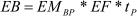

   ## Formel 2

Zuteilung für Anlagen nach Anhang 1 Ziffern VI bis XVIII des
Treibhausgas-Emissionshandelsgesetzes vom 8. Juli 2004 (BGBl. I S.
1578), das zuletzt durch Artikel 9 des Gesetzes vom 11. August 2010
(BGBl. I S. 1163) geändert worden ist, mit durchschnittlichen
jährlichen Emissionen von weniger als 25 000 t CO
2             , die bis zum 31. Dezember 2002 in Betrieb gegangen sind

*    *        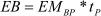

   ## Formel 3

Zuteilung vor Anwendung einer anteiligen Kürzung für Anlagen nach
Anhang 1 Ziffern I bis V des Treibhausgas-Emissionshandelsgesetzes vom
8\. Juli 2004 (BGBl. I S. 1578), das zuletzt durch Artikel 9 des
Gesetzes vom 11. August 2010 (BGBl. I S. 1163) geändert worden ist,
die bis zum 31. Dezember 2002 in Betrieb gegangen sind

a)  für Anlagen zur Stromerzeugung

    *        *            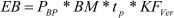

b)  für sonstige Anlagen

    *        *            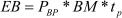

   ## Formel 4

Ermittlung des Emissionswertes je erzeugter Produkteinheit in den
Fällen des § 7 Abs. 2

*    *        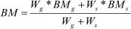

   ## Formel 5

Zuteilung für Anlagen nach Anhang 1 Ziffern I bis V des Treibhausgas-
Emissionshandelsgesetzes vom 8. Juli 2004 (BGBl. I S. 1578), das
zuletzt durch Artikel 9 des Gesetzes vom 11. August 2010 (BGBl. I S.
1163) geändert worden ist, mit Kraft-Wärme-Kopplung, die bis zum 31.
Dezember 2002 in Betrieb gegangen sind, vor Anwendung einer anteiligen
Kürzung

*    *        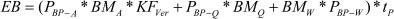

   ## Formel 6

Zuteilung für Anlagen, die zwischen dem 1. Januar 2003 und dem 31.
Dezember 2007 in Betrieb gegangen sind, vor Anwendung einer anteiligen
Kürzung

a)  für Anlagen zur Stromerzeugung

    *        *            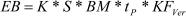

b)  für sonstige Anlagen

    *        *            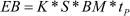

   ## Formel 7

Zuteilung für Anlagen mit Kraft-Wärme-Kopplung, die zwischen dem 1.
Januar 2003 und dem 31. Dezember 2007 in Betrieb gegangen sind, vor
Anwendung einer anteiligen Kürzung

*    *        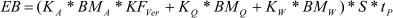

   ## Formel 8

Zuteilung für Anlagen mit Inbetriebnahme ab dem 1. Januar 2008

a)  für Anlagen zur Stromerzeugung

    *        *            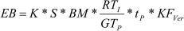

b)  für sonstige Anlagen

    *        *            

   ## Formel 9

Zuteilung für Anlagen mit Kraft-Wärme-Kopplung mit Inbetriebnahme ab
dem 1. Januar 2008

*    *        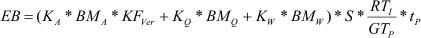

   ## **Erläuterung der Abkürzungen**

*    *   BM

    *   Emissionswert (benchmark) je erzeugter Produkteinheit (z. B. in t CO
        2                     -Äquiv./MWh oder t CO
        2                     -Äquiv./t)

*    *   BM
        A

    *   Emissionswert (benchmark) je erzeugter Produkteinheit für
        Stromerzeugung (in t CO
        2                     -Äquiv./MWh)

*    *   BM
        Q

    *   Emissionswert (benchmark) je erzeugter Produkteinheit für
        Wärmeerzeugung (in t CO
        2                     -Äquiv./MWh)

*    *   BM
        W

    *   Emissionswert (benchmark) je erzeugter Produkteinheit für Wellenarbeit
        (in t CO
        2                     -Äquiv./MWh)

*    *   BM
        g

    *   Emissionswert (benchmark) je erzeugter Produkteinheit für den Einsatz
        gasförmiger Brennstoffe (in t CO
        2                     -Äquiv./MWh)

*    *   BM
        s

    *   Emissionswert (benchmark) je erzeugter Produkteinheit für den Einsatz
        sonstiger Brennstoffe (in t CO
        2                     -Äquiv./MWh)

*    *   EB

    *   Menge der Emissionsberechtigungen für die Zuteilungsperiode nach
        Anwendung der für die Anlage maßgeblichen Zuteilungsregel (in t CO
        2                     -Äquiv.)

*    *   EF

    *   Erfüllungsfaktor für die Zuteilungsperiode für Anlagen nach Anhang 1,
        Nr. VI bis XVIII des TEHG vom 8. Juli 2004 (BGBl. I S. 1578), das
        zuletzt durch Artikel 9 des Gesetzes vom 11. August 2010 (BGBl. I S.
        1163) geändert worden ist

*    *   EM
        BP

    *   Durchschnittliche jährliche Emissionen der Anlage in der Basisperiode

*    *   GT
        P

    *   Gesamtanzahl der Tage der jeweiligen Zuteilungsperiode (Gesamttage)

*    *   K

    *   Kapazität der Anlage (z. B. in MWh pro Jahr oder t pro Jahr)

*    *   K
        A

    *   Kapazität der Nettostromerzeugung der KWK-Anlage (in MWh pro Jahr)

*    *   K
        Q

    *   Kapazität der Nettowärmeerzeugung der KWK-Anlage (in MWh pro Jahr)

*    *   K
        W

    *   Kapazität der Nettoerzeugung von Wellenarbeit der KWK-Anlage (in MWh
        pro Jahr)

*    *   KF
        Ver

    *   Kürzungsfaktor nach § 20 zur Erzielung des Berechtigungsaufkommens für
        die Veräußerung

*    *   P
        BP

    *   Durchschnittliche jährliche Nettoproduktion der Anlage in der
        Basisperiode (in MWh pro Jahr)

*    *   P
        BP-A

    *   Durchschnittliche jährliche Nettostromproduktion der Anlage in der
        Basisperiode (in MWh pro Jahr)

*    *   P
        BP-Q

    *   Durchschnittliche jährliche Nettowärmeproduktion der Anlage in der
        Basisperiode (in MWh pro Jahr)

*    *   P
        BP-W

    *   Durchschnittliche jährliche Nettoproduktion von Wellenarbeit der
        Anlage in der Basisperiode (in MWh pro Jahr)

*    *   RT
        I

    *   Anzahl der Tage von der Inbetriebnahme der Anlage bis zum Ende der
        Zuteilungsperiode (Resttage)

*    *   S

    *   Standardauslastungsfaktor

*    *   tp

    *   Anzahl der Jahre der Zuteilungsperiode

*    *   W
        g

    *   Brennstoffenergie der eingesetzten gasförmigen Brennstoffe in den
        Jahren 2005 und 2006 (in MWh pro Jahr)

*    *   W
        s

    *   Brennstoffenergie der eingesetzten sonstigen Brennstoffe in den Jahren
        2005 und 2006 (in MWh pro Jahr)

(zu § 9 Abs. 3 und § 12 Abs. 1)

### Anhang 2 Vergleichbarkeit von Anlagen

(Fundstelle: BGBl. I 2007, 1798;
bzgl. der einzelnen Änderungen vgl. Fußnote)
Anlagen sind vergleichbar, wenn sie derselben der nachfolgenden
Kategorien zuzuordnen sind.

Kategorie  1: Anlagen zur Erzeugung von Strom einschließlich Kraft-Wärme-Kopplungs-
    Anlagen, die dem Treibhausgas-Emissionshandelsgesetz vom 8. Juli 2004
    (BGBl. I S. 1578), das zuletzt durch Artikel 9 des Gesetzes vom 11.
    August 2010 (BGBl. I S. 1163) geändert worden ist, nach dessen Anhang
    1, Nummern I bis III unterliegen.

Kategorie  2: Anlagen zur Erzeugung von Dampf, Warmwasser, Prozesswärme oder
    erhitztem Abgas einschließlich zugehöriger Dampfkessel einschließlich
    Kraft-Wärme-Kopplungs-Anlagen, die dem Treibhausgas-
    Emissionshandelsgesetz vom 8. Juli 2004 (BGBl. I S. 1578), das zuletzt
    durch Artikel 9 des Gesetzes vom 11. August 2010 (BGBl. I S. 1163)
    geändert worden ist, nach dessen Anhang 1, Nummern I bis III
    unterliegen.

Kategorie  3: Verbrennungsmotoranlagen und Gasturbinenanlagen zum Antrieb von
    Arbeitsmaschinen, die dem Treibhausgas-Emissionshandelsgesetz vom 8.
    Juli 2004 (BGBl. I S. 1578), das zuletzt durch Artikel 9 des Gesetzes
    vom 11. August 2010 (BGBl. I S. 1163) geändert worden ist, nach dessen
    Anhang 1, Nummern IV und V unterliegen.

Kategorie  4: Anlagen zur Destillation oder Raffination oder sonstiger
    Weiterverarbeitung von Erdöl oder Erdölerzeugnissen in Mineralöl- oder
    Schmierstoffraffinerien, die dem Treibhausgas-Emissionshandelsgesetz
    vom 8. Juli 2004 (BGBl. I S. 1578), das zuletzt durch Artikel 9 des
    Gesetzes vom 11. August 2010 (BGBl. I S. 1163) geändert worden ist,
    nach dessen Anhang 1, Nummer VI unterliegen.

Kategorie  5: Anlagen zur Trockendestillation von Steinkohle oder Braunkohle
    (Kokereien), die dem Treibhausgas-Emissionshandelsgesetz vom 8. Juli
    2004 (BGBl. I S. 1578), das zuletzt durch Artikel 9 des Gesetzes vom
    11\. August 2010 (BGBl. I S. 1163) geändert worden ist, nach dessen
    Anhang 1, Nummern VII unterliegen.

Kategorie  6: Anlagen zum Rösten, Schmelzen oder Sintern von Eisenerzen, die dem
    Treibhausgas-Emissionshandelsgesetz vom 8. Juli 2004 (BGBl. I S.
    1578), das zuletzt durch Artikel 9 des Gesetzes vom 11. August 2010
    (BGBl. I S. 1163) geändert worden ist, nach dessen Anhang 1, Nummer
    VIII unterliegen.

Kategorie  7: Anlagen zur Herstellung oder zum Erschmelzen von Roheisen oder Stahl
    einschließlich Stranggießen, soweit die Anlagen nicht in integrierten
    Hüttenwerken betrieben werden, die dem Treibhausgas-
    Emissionshandelsgesetz vom 8. Juli 2004 (BGBl. I S. 1578), das zuletzt
    durch Artikel 9 des Gesetzes vom 11. August 2010 (BGBl. I S. 1163)
    geändert worden ist, nach dessen Anhang 1, Nummer IX unterliegen,
    sowie Anlagen, als integrierte Hüttenwerke betrieben, zur Gewinnung
    von Roheisen und zur Weiterverarbeitung zu Rohstahl, bei denen sich
    Gewinnungs- und Weiterverarbeitungseinheiten nebeneinander befinden
    und in funktioneller Hinsicht miteinander verbunden sind, die dem
    Treibhausgas-Emissionshandelsgesetz vom 8. Juli 2004 (BGBl. I S.
    1578), das zuletzt durch Artikel 9 des Gesetzes vom 11. August 2010
    (BGBl. I S. 1163) geändert worden ist, nach dessen Anhang 1, Nummer IX
    a unterliegen.

Kategorie  8: Anlagen zur Herstellung von Zementklinker, die dem Treibhausgas-
    Emissionshandelsgesetz vom 8. Juli 2004 (BGBl. I S. 1578), das zuletzt
    durch Artikel 9 des Gesetzes vom 11. August 2010 (BGBl. I S. 1163)
    geändert worden ist, nach dessen Anhang 1, Nummer X unterliegen.

Kategorie  9: Anlagen zum Brennen von Kalkstein oder Dolomit, die dem Treibhausgas-
    Emissionshandelsgesetz vom 8. Juli 2004 (BGBl. I S. 1578), das zuletzt
    durch Artikel 9 des Gesetzes vom 11. August 2010 (BGBl. I S. 1163)
    geändert worden ist, nach dessen Anhang 1, Nummer XI unterliegen.

Kategorie 10: Anlagen zur Herstellung von Glas, auch soweit Altglas hergestellt
    wird, einschließlich Anlagen zur Herstellung von Glasfasern, die dem
    Treibhausgas-Emissionshandelsgesetz vom 8. Juli 2004 (BGBl. I S.
    1578), das zuletzt durch Artikel 9 des Gesetzes vom 11. August 2010
    (BGBl. I S. 1163) geändert worden ist, nach dessen Anhang 1, Nummer
    XII unterliegen.

Kategorie 11: Anlagen zum Schmelzen mineralischer Stoffe einschließlich Anlagen zur
    Herstellung von Mineralfasern, die dem Treibhausgas-
    Emissionshandelsgesetz vom 8. Juli 2004 (BGBl. I S. 1578), das zuletzt
    durch Artikel 9 des Gesetzes vom 11. August 2010 (BGBl. I S. 1163)
    geändert worden ist, nach dessen Anhang 1, Nummer XII a unterliegen.

Kategorie 12: Anlagen zum Brennen keramischer Erzeugnisse, die dem Treibhausgas-
    Emissionshandelsgesetz vom 8. Juli 2004 (BGBl. I S. 1578), das zuletzt
    durch Artikel 9 des Gesetzes vom 11. August 2010 (BGBl. I S. 1163)
    geändert worden ist, nach dessen Anhang 1, Nummer XIII unterliegen.

Kategorie 13: Anlagen zur Gewinnung von Zellstoff aus Holz, Stroh oder ähnlichen
    Faserstoffen, die dem Treibhausgas-Emissionshandelsgesetz vom 8. Juli
    2004 (BGBl. I S. 1578), das zuletzt durch Artikel 9 des Gesetzes vom
    11\. August 2010 (BGBl. I S. 1163) geändert worden ist, nach dessen
    Anhang 1, Nummer XIV unterliegen.

Kategorie 14: Anlagen zur Herstellung von Papier, Karton oder Pappe, die dem
    Treibhausgas-Emissionshandelsgesetz vom 8. Juli 2004 (BGBl. I S.
    1578), das zuletzt durch Artikel 9 des Gesetzes vom 11. August 2010
    (BGBl. I S. 1163) geändert worden ist, nach dessen Anhang 1, Nummer XV
    unterliegen.

Kategorie 15: Anlagen zur Herstellung von Propylen oder Ethylen, die dem
    Treibhausgas-Emissionshandelsgesetz vom 8. Juli 2004 (BGBl. I S.
    1578), das zuletzt durch Artikel 9 des Gesetzes vom 11. August 2010
    (BGBl. I S. 1163) geändert worden ist, nach dessen Anhang 1, Nummer VI
    oder XVI unterliegen.

Kategorie 16: Anlagen zur Herstellung von Ruß, die dem Treibhausgas-
    Emissionshandelsgesetz vom 8. Juli 2004 (BGBl. I S. 1578), das zuletzt
    durch Artikel 9 des Gesetzes vom 11. August 2010 (BGBl. I S. 1163)
    geändert worden ist, nach dessen Anhang 1, Nummer XVII unterliegen.

Kategorie 17: Anlagen zum Abfackeln von gasförmigen Stoffen in See/Land-
    Übergabestationen für Mineralöl oder Gas, die dem Treibhausgas-
    Emissionshandelsgesetz vom 8. Juli 2004 (BGBl. I S. 1578), das zuletzt
    durch Artikel 9 des Gesetzes vom 11. August 2010 (BGBl. I S. 1163)
    geändert worden ist, nach dessen Anhang 1, Nummer XVIII unterliegen.

### Anhang 3 (zu § 7 Abs. 1 und 2, § 8 Abs. 1 und § 9 Abs. 2 Satz 1)

( Fundstelle: BGBl. I 2007, 1799 )
Teil A
## Produktbezogene Emissionswerte

I)  Anlagen zur Stromproduktion, zur Erzeugung von Wellenarbeit und zur
    Erzeugung von Wärme (thermische Energie)

    Als Emissionswert je erzeugter Produkteinheit gilt

    1.  bei Anlagen zur Stromproduktion

        a)  365 Gramm Kohlendioxid je Kilowattstunde Nettostromerzeugung, sofern
            gasförmige Brennstoffe verwendet werden können und in der
            Rechtsverordnung nach § 13 nichts anderes bestimmt ist; andernfalls

        b)  750 Gramm Kohlendioxid je Kilowattstunde Nettostromerzeugung;

    2.  bei Anlagen zur Erzeugung von Wellenarbeit einheitlich 530 Gramm
        Kohlendioxid je Kilowattstunde;

    3.  bei Anlagen zur Erzeugung von Wärme

        a)  225 Gramm Kohlendioxid je Kilowattstunde, sofern gasförmige
            Brennstoffe verwendet werden können und in der Rechtsverordnung nach §
            13 nichts anderes bestimmt ist; andernfalls

        b)  345 Gramm Kohlendioxid je Kilowattstunde;

II) Neuanlagen zur Herstellung von Zement und zur Herstellung von Glas

    Als Emissionswert je Produkteinheit gilt

    1.  bei Anlagen zur Herstellung von Zement oder Zementklinkern in
        Produktionsanlagen mit

        a)  drei Zyklonen 845 Gramm Kohlendioxid je erzeugtem Kilogramm
            Zementklinker,

        b)  vier Zyklonen 815 Gramm Kohlendioxid je erzeugtem Kilogramm
            Zementklinker,

        c)  fünf oder sechs Zyklonen 805 Gramm Kohlendioxid je erzeugtem Kilogramm
            Zementklinker;

    2.  bei Anlagen zur Herstellung von Glas

        a)  für Behälterglas 330 Gramm Kohlendioxid je erzeugtem Kilogramm Glas
            und

        b)  für Flachglas 670 Gramm Kohlendioxid je erzeugtem Kilogramm Glas.

III) Neuanlagen zur Herstellung von Keramik

    Als energiebedingter Emissionswert je Produkteinheit bei Anlagen zur
    Herstellung von Keramik gilt

    a)  für Vormauerziegel 115 Gramm Kohlendioxid je erzeugtem Kilogramm
        Ziegel,

    b)  für Hintermauerziegel 68 Gramm Kohlendioxid je erzeugtem Kilogramm
        Ziegel,

    c)  für Dachziegel (U-Kassette) 130 Gramm Kohlendioxid je erzeugtem
        Kilogramm Ziegeln und

    d)  für Dachziegel (H-Kassette) 158 Gramm Kohlendioxid je erzeugtem
        Kilogramm Ziegel.

    Zu diesem Emissionswert für kommerzielle und nicht-kommerzielle
    Brennstoffe ist ein den Emissionen aus Karbonaten und aus fossilem
    organischem Kohlenstoff entsprechender Wert hinzuzurechnen.

Teil B
## Anwendungsregeln für die Zuteilung nach den §§ 8 und 9

I)  Die genehmigungsrechtlich zulässige Möglichkeit, gasförmige
    Brennstoffe zu verwenden, bleibt bei der Festlegung des
    Emissionswertes nur unberücksichtigt, soweit sie ausschließlich zum
    Zwecke der notwendigen Zünd- und Stützfeuerung erfolgt.

II) Sofern die Anlage als gemeinsame Anlage aus mehreren, ansonsten
    selbständig genehmigungsbedürftigen Teilanlagen besteht, gilt die
    Zuordnung nach Teil A für jede Teilanlage gesondert.

(zu § 3 Abs. 2 Nr. 8 in Verbindung mit § 8 und § 9)

### Anhang 4 Vollbenutzungsstunden

(Fundstelle: BGBl. I 2007, 1800 - 1801;
bzgl. der einzelnen Änderungen vgl. Fußnote)

**I.** **Vollbenutzungsstunden**

    *        *   Tätigkeit

        *   Vollbenutzungsstunden pro Jahr

    *        *   Energieumwandlung und -umformung:
            **Tätigkeiten nach Anhang 1, Nr. I bis V des Treibhausgas-
            Emissionshandelsgesetzes vom 8. Juli 2004 (BGBl. I S. 1578), das
            zuletzt durch Artikel 9 des Gesetzes vom 11. August 2010 (BGBl. I S.
            1163) geändert worden ist**

    *        *   Kondensationskraftwerke

        *   7 500

    *        *   Kondensationskraftwerke zum Einsatz von Braunkohle

        *   8 250

    *        *   Gasturbinenanlagen als „Offene Gasturbine“

        *   1 000

    *        *   Anlagen zur Verdichtung von Erdgas zu Transportzwecken
            Anlagen zur Verdichtung von Erdgas zur Untergrundspeicherung

        *   4 200
            3 100

    *        *   Kraft-Wärme-Kopplungsanlagen zur Versorgung der Papier-, Zellstoff-,
            Mineralöl- oder chemischen Industrie sowie zur Versorgung von Anlagen
            zur Herstellung von Bioethanol

        *   8 000

    *        *   Sonstige Kraft-Wärme-Kopplungsanlagen

        *   7 500

    *        *   Prozesswärmeanlagen zur Versorgung der Papier-, Mineralöl- und
            chemischen Industrie

        *   8 000

    *        *   Heizwerke der öffentlichen Fernwärme

        *   2 500

    *        *   Prozesswärmeanlagen zur Versorgung der Nahrungsmittel- und
            Zuckerindustrie, Wärmeanlagen zur Versorgung des Sektors Gewerbe,
            Handel und Dienstleistungen, der sonstigen Industrie und von
            Krankenhäusern

        *   7 500

    *        *   **Tätigkeiten nach Anhang 1, Nr. VI bis XVIII des Treibhausgas-
            Emissionshandelsgesetzes vom 8. Juli 2004 (BGBl. I S. 1578), das
            zuletzt durch Artikel 9 des Gesetzes vom 11. August 2010 (BGBl. I S.
            1163) geändert worden ist**

    *        *   Anlagen der Mineralölindustrie

        *   8 000

    *        *   Kokereien

        *   8 300

    *        *   Sinteranlagen

        *   8 300

    *        *   Anlagen zur Eisenmetallerzeugung und -verarbeitung

        *   8 300

    *        *   Anlagen zur Herstellung von Zement

        *   7 500

    *        *   Produktion von Kalk in Anlagen der Kalkindustrie

        *   7 500

    *        *   Produktion von Kalk in Anlagen der Zuckerindustrie

        *   2 500

    *        *   Anlagen zur Herstellung von Glas

        *   8 500

    *        *   Anlagen zum Brennen keramischer Erzeugnisse

        *   7 500

    *        *   Anlagen zur Gewinnung von Zellstoff

        *   8 000

    *        *   Anlagen zur Herstellung von Papier oder Pappe

        *   8 000

    *        *   Anlagen zur Herstellung von Propylen oder Ethylen

        *   8 500

    *        *   Anlagen zur Herstellung von Ruß

        *   8 000

    *        *   Anlagen zum Abfackeln von gasförmigen Stoffen in See-/Land-
            Übergabestationen für Mineralöl oder Gas

        *   500

**II.** **Berechnung des Standardauslastungsfaktors und Zuordnung von
    Vollbenutzungsstunden**

    1.  Sofern für die Anlage keine Beschränkung der immissionsschutzrechtlich
        genehmigten maximalen Vollbenutzungsstunden pro Jahr vorliegt,
        berechnet sich der Standardauslastungsfaktor als Quotient aus den
        Vollbenutzungsstunden nach Nummer I und 8 760. Ansonsten berechnet er
        sich als Quotient aus den Vollbenutzungsstunden nach Nummer I und den
        genehmigten maximalen Vollbenutzungsstunden pro Jahr. Liegt eine
        produktionsbezogene Beschränkung der genehmigten Kapazität vor, so ist
        diese auf eine entsprechende Beschränkung der maximal zulässigen
        Vollbenutzungsstunden, die eine äquivalente Beschränkung der maximalen
        Produktionsmenge bewirken würde, umzurechnen. Hierzu ist der Quotient
        aus der maximal zulässigen Produktionsmenge und der sich bei 8 760
        Vollbenutzungsstunden ergebenden Produktionsmenge mit 8 760 zu
        multiplizieren.

    2.  Für den Standardauslastungsfaktor gilt ein Höchstwert von 1.

    3.  Sofern die tatsächlich mögliche Produktionsmenge aufgrund beschränkter
        Weiterverarbeitungskapazitäten, durch Einschränkungen der für den
        Absatz der Produktionsmenge erforderlichen technischen Infrastruktur
        oder durch witterungsabhängigen Anlagenbetrieb nicht erreicht wird,
        kann die zuständige Behörde die Anzahl der Vollbenutzungsstunden nach
        Nummer I entsprechend reduzieren.

    4.  Sofern die Anlage als gemeinsame Anlage aus mehreren, ansonsten
        selbständig genehmigungsbedürftigen Teilanlagen besteht, gilt die
        Zuordnung nach Nummer I für jede Teilanlage gesondert.

    5.  Kraftwerke gelten auch dann als Kondensationskraftwerke, wenn sie
        Nutzwärme auskoppeln, sofern der Quotient aus der Kapazität der
        Wärmeerzeugung in Kraft-Wärme-Kopplung und der tatsächlich und
        rechtlich maximal möglichen gesamten Brennstoffwärme der Anlage im
        Jahr der Beantragung der Zuteilung einen Wert von 0,1 nicht
        überschreitet.

    6.  Sind für die Zuordnung von Vollbenutzungsstunden Abnehmer der
        erzeugten Produkte einer Neuanlage maßgeblich, so ist im Fall mehrerer
        möglicher Abnehmer für die Zuordnung von Vollbenutzungsstunden der
        Hauptabnehmer maßgeblich.

(zu § 4 Abs. 3)

### Anhang 5 Anteilige Kürzung der Zuteilungsmenge entsprechend dem Effizienzstandard der Anlage

( Fundstelle: BGBl. I 2007, 1802 - 1803 )

1.  Grundsatz

    Die anteilige Kürzung erfolgt durch Anwendung eines Kürzungsfaktors
    auf die Zuteilungsmenge, die sich aus der Anwendung der für die Anlage
    maßgeblichen Zuteilungsregel ergibt. Die Zuteilungsmenge nach
    Anwendung der anteiligen Kürzung berechnet sich nach Formel 1 dieses
    Anhangs.

    Der Umfang der anteiligen Kürzung berechnet sich in Abhängigkeit vom
    Effizienzstandard der Anlage und dem Anpassungsfaktor. Die anteilige
    Kürzung berechnet sich nach Formel 2 dieses Anhangs.

    a)  Bestimmung des Effizienzstandards der Anlage

        Der Effizienzstandard der Anlage entspricht dem Verhältnis der
        Emissionsmenge, die sich aus der Multiplikation der Produktionsmenge
        der Anlage im Referenzjahr und dem Produktstandard nach Nummer 2
        ergibt, zu den Emissionen der Anlage im Referenzjahr.

        Stellt eine Anlage mehrere Produkte her, erfolgt die Berechnung für
        die Produkte Strom, Wärme und Wellenarbeit; maßgeblich ist dabei die
        Summe der für die Einzelprodukte berechneten Emissionen. Der
        Höchstwert für den Effizienzstandard der Anlage beträgt 1. Der
        Effizienzstandard berechnet sich nach Formel 3 dieses Anhangs.

    b)  Bestimmung des Anpassungsfaktors

        Soweit die Summe aller entsprechend dem Effizienzstandard berechneten
        Kürzungen von dem Gesamtminderungsbedarf abweicht, der durch die
        anteilige Kürzung insgesamt zu erbringen ist, werden die einzelnen
        Kürzungen durch Anwendung eines Anpassungsfaktors korrigiert. Der
        Anpassungsfaktor entspricht dem Verhältnis zwischen dem
        Gesamtminderungsbedarf und der Summe aller entsprechend dem
        Effizienzstandard berechneten Kürzungen. Die Summe der entsprechend
        dem Effizienzstandard berechneten Kürzungen berechnet sich aus der
        Differenz der Summe aller Zuteilungen und der Summe aller Zuteilungen
        nach Anwendung des Effizienzstandards. Der Anpassungsfaktor berechnet
        sich nach Formel 4 dieses Anhangs.

2.  Produktstandards für die Berechnung der anteiligen Kürzung

    a)  Erzeugung von Strom:

        aa) 365 Gramm Kohlendioxid je Kilowattstunde Nettostromerzeugung, sofern
            im Referenzjahr gasförmige Brennstoffe eingesetzt wurden und in der
            Rechtsverordnung nach § 13 nichts anderes bestimmt ist,

        bb) 990 Gramm Kohlendioxid je Kilowattstunde Nettostromerzeugung, sofern
            im Referenzjahr Braunkohle eingesetzt wurde mit dem beim
            Abnahmeversuch der Anlage ermittelten Wirkungsgrad und der am Standort
            nutzbaren Braunkohle, ansonsten

        cc) 750 Gramm Kohlendioxid je Kilowattstunde Nettostromerzeugung;

    b)  Erzeugung von Wärme:

        aa) 225 Gramm Kohlendioxid je Kilowattstunde, sofern im Referenzjahr
            gasförmige Brennstoffe eingesetzt wurden und in der Rechtsverordnung
            nach § 13 nichts anderes bestimmt ist, ansonsten

        bb) 400 Gramm Kohlendioxid je Kilowattstunde;

    c)  Erzeugung von Wellenarbeit

        530 Gramm Kohlendioxid je Kilowattstunde.

    Sofern in einer Anlage im Referenzjahr mehrere Brennstoffe eingesetzt
    wurden, errechnet sich der Produktstandard mit der Maßgabe, dass eine
    Zuordnung zu den Produktstandards entsprechend den Anteilen der
    Brennstoffenergie der im Referenzjahr eingesetzten Brennstoffe an der
    Gesamtbrennstoffenergie dieses Jahres erfolgt.

3.  Bestimmung des Referenzjahres

    Für Anlagen mit Inbetriebnahme bis zum 31. Dezember 2004 ist
    Referenzjahr das Jahr 2005. Für Anlagen mit Inbetriebnahme im Jahr
    2005 ist Referenzjahr das Jahr 2006. Für Anlagen mit Inbetriebnahme
    nach dem 31. Dezember 2005 ist Referenzjahr das Jahr, das dem Jahr der
    Inbetriebnahme folgt; abweichend von Nummer 1 Buchstabe a sind dabei
    die für das Referenzjahr prognostizierten Produktionsmengen und
    Emissionen maßgeblich.

4.  Berechnungsformeln

    **Formel 1**

    **Berechnung der Zuteilungsmenge nach Anwendung der anteiligen
    Kürzung**

    *        *            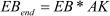

   **Formel 2**

    **Berechnung der anteiligen Kürzung**

    *        *            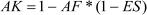

   **Formel 3**

    **Bestimmung des Effizienzstandards**

    *        *            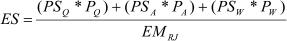

   **Formel 4**

    **Bestimmung des Anpassungsfaktors**

    *        *            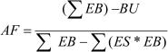

   ## **Erläuterung der Abkürzungen**

*    *   AK

    *   Anteilige Kürzung der Zuteilungsmenge

*    *   AF

    *   Anpassungsfaktor

*    *   BU

    *   Gesamtzuteilungsmenge für Bestandsanlagen in der Zuteilungsperiode

*    *   EB

    *   Menge der Emissionsberechtigungen nach Anwendung der für die Anlage
        maßgeblichen Zuteilungsregel

*    *   EB
        end

    *   Menge der Emissionsberechtigungen für die Zuteilungsperiode nach
        anteiliger Kürzung

*    *   EM
        RJ

    *   Emissionen der Anlage im Referenzjahr

*    *   ES

    *   Effizienzstandard der Anlage

*    *   P
        A

    *   Nettowärmeproduktion der Anlage im Referenzjahr (in MWh)

*    *   P
        Q

    *   Nettostromproduktion der Anlage im Referenzjahr (in MWh)

*    *   P
        W

    *   Nettoproduktion von Wellenarbeit der Anlage im Referenzjahr (in MWh)

*    *   PS
        A

    *   Produktstandard für die Erzeugung von Wärme

*    *   PS
        Q

    *   Produktstandard für die Erzeugung von Strom

*    *   PS
        W

    *   Produktstandard für die Erzeugung von Wellenarbeit

