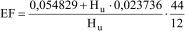
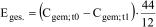
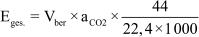
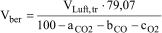
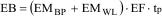
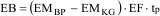
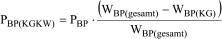

# Verordnung über die Zuteilung von Treibhausgas-Emissionsberechtigungen in der Zuteilungsperiode 2008 bis 2012 (ZuV 2012)

Ausfertigungsdatum
:   2007-08-13

Fundstelle
:   BGBl I: 2007, 1941

Geändert durch
:   Art. 11 G v. 21.7.2011 I 1475

## Eingangsformel

Auf Grund

-   des § 6 Abs. 1 Satz 2 und 3, § 7 Abs. 1 Satz 1, 3 und 4, § 9 Abs. 2
    Satz 2, Abs. 3 Satz 3, § 10 Abs. 6 Satz 3, § 11 Abs. 6 Satz 1, jeweils
    in Verbindung mit § 13 des Zuteilungsgesetzes 2012 vom 7. August 2007
    (BGBl. I S. 1788), und

-   des § 10 Abs. 5 Nr. 1 und 2 des Treibhausgas-Emissionshandelsgesetzes
    vom 8. Juli 2004 (BGBl. I S. 1578)

verordnet die Bundesregierung:

## Abschnitt 1 - Allgemeine Vorschriften

### § 1 Anwendungsbereich und Zweck

Diese Verordnung gilt innerhalb des Anwendungsbereichs des
Treibhausgas-Emissionshandelsgesetzes vom 8. Juli 2004 (BGBl. I S.
1578), das zuletzt durch Artikel 9 des Gesetzes vom 11. August 2010
(BGBl. I S. 1163) geändert worden ist, für die Zuteilungsperiode 2008
bis 2012. Sie dient der näheren Bestimmung der Berechnung der
Zuteilung von Berechtigungen zur Emission von Treibhausgasen, der im
Zuteilungsverfahren nach § 10 Abs. 1 des Treibhausgas-
Emissionshandelsgesetzes vom 8. Juli 2004 (BGBl. I S. 1578), das
zuletzt durch Artikel 9 des Gesetzes vom 11. August 2010 (BGBl. I S.
1163) geändert worden ist, zu fordernden Angaben und der Art der
beizubringenden Nachweise sowie deren Überprüfung. Soweit nichts
anderes bestimmt ist, findet die Zuteilungsverordnung 2007 keine
Anwendung.

### § 2 Begriffsbestimmungen

Im Sinne dieser Verordnung sind:

1.  Produktionsmenge: die Menge der je Jahr in einer Anlage erzeugten
    Produkteinheiten, bezogen auf die jährliche Nettomenge
    verkaufsfertiger Produkte;

2.  Aktivitätsrate: die eingesetzte Menge eines Stoffs pro Kalenderjahr;

3.  unterer Heizwert: die Wärmemenge, die bei vollständiger Verbrennung
    einer definierten Menge Brennstoffs entsteht, sofern der Wassergehalt
    des Brennstoffs und das Wasser, das bei der Verbrennung entsteht, sich
    in gasförmigem Zustand befinden, wobei die Wärmerückgewinnung durch
    die Kondensierung des Wasserdampfes im Abgas nicht mitgerechnet wird;

4.  Emissionsfaktor: Quotient aus der bei der Handhabung eines Stoffs
    freigesetzten Menge nicht biogenen Kohlendioxids und der eingesetzten
    Menge dieses Stoffs. Dabei bezieht sich der Emissionsfaktor eines
    Brennstoffs auf den unteren Heizwert des Brennstoffs;

5.  biogene Kohlendioxid-Emissionen: Emissionen aus der Oxidation von
    nicht fossilem Kohlenstoff zu Kohlendioxid;

6.  Brennstoff: Stoff, der vorrangig zum Zweck der Energiewandlung
    eingesetzt wird;

7.  Rohstoff: in einer Anlage eingesetzter Stoff, der kein Brennstoff ist;

8.  Konversionsfaktor: Koeffizient, der den Grad der Umwandlung des in den
    Brennstoffen oder Rohstoffen enthaltenen Kohlenstoffs zu Kohlendioxid
    angibt. Bei vollständiger Umwandlung ist der Konversionsfaktor eins.
    Bei Verbrennungsprozessen entspricht der Konversionsfaktor dem
    Oxidationsfaktor; bei Nicht-Verbrennungsprozessen entspricht der
    Konversionsfaktor dem Umsetzungsfaktor;

9.  Gichtgas: das bei der Roheisenerzeugung aus dem Hochofen an der Gicht
    (oberer Abschluss des Hochofens) austretende Gasgemisch;

10. Konvertergas: das bei der Rohstahlerzeugung nach dem
    Sauerstoffblasverfahren aus dem Konverter austretende Gasgemisch;

11. Kokereigas: das bei der Trockendestillation insbesondere von
    Braunkohle oder Steinkohle aus der Koksofenkammer austretende
    Gasgemisch.

### § 3 Allgemeine Anforderungen an die Zuteilungsanträge

(1) Soweit die Vorschriften der Abschnitte 2 und 3 keine abweichenden
Regelungen enthalten, sind die für die Zuteilung von
Emissionsberechtigungen im Zuteilungsantrag nach § 10 Abs. 1 des
Treibhausgas-Emissionshandelsgesetzes vom 8. Juli 2004 (BGBl. I S.
1578), das zuletzt durch Artikel 9 des Gesetzes vom 11. August 2010
(BGBl. I S. 1163) geändert worden ist, anzugebenden Daten und
Informationen, im Einklang mit der Entscheidung 2004/156/EG der
Kommission vom 29. Januar 2004 zur Festlegung von Leitlinien für
Überwachung und Berichterstattung betreffend Treibhausgasemissionen
gemäß der Richtlinie 2003/87/EG des Europäischen Parlaments und des
Rates (ABl. EU Nr. L 59 S. 1, Nr. L 177 S. 4) zu erheben und
anzugeben. Soweit die Anforderungen der in Satz 1 genannten Leitlinien
nicht eingehalten werden können, sind die Daten und Informationen mit
dem im Einzelfall höchsten erreichbaren Grad an Genauigkeit und
Vollständigkeit zu erheben und anzugeben.

(2) Der Antragsteller ist verpflichtet, die nach § 6 Abs. 5 Satz 2, §
7 Abs. 2, § 8 Abs. 3, § 9 Abs. 2, § 11 Abs. 2 bis 4, § 12 Abs. 1 und
2, § 13, § 14, § 15, § 16 Abs. 2 und 3, § 17 und § 19 Abs. 1
erforderlichen Angaben in den Zuteilungsanträgen zu machen. Soweit
diese Angaben die vorherige Durchführung von Berechnungen
voraussetzen, ist neben den geforderten Angaben jeweils auch die
angewandte Berechnungsmethode zu erläutern und die Ableitung der
Angaben nachvollziehbar darzustellen. Der Betreiber ist verpflichtet,
die den Angaben zugrunde liegenden Einzelnachweise auf Verlangen der
zuständigen Behörde vorzuweisen.

## Abschnitt 2 - Allgemeine Regeln zur Bestimmung der Kohlendioxid-Emissionen

### § 4 Nutzung einheitlicher Stoffwerte

(1) Bei Anlagen, die eine Zuteilung nach § 6 des Zuteilungsgesetzes
2012 erhalten, erfolgt die Ermittlung der Zuteilungsmenge für
diejenigen Brennstoffe, Rohstoffe und Produkte, für die in Anhang 1
einheitliche Emissionsfaktoren, untere Heizwerte und
Kohlenstoffgehalte festgelegt sind, auf Grundlage dieser Werte.

(2) Bei Verbrennungsprozessen ist ein Oxidationsfaktor von eins
zugrunde zu legen.

### § 5 Bestimmung von Emissionsfaktoren, unteren Heizwerten und Kohlenstoffgehalten

(1) Soweit nach § 4 keine einheitlichen Stoffwerte gelten, erfolgt die
Angabe dieser Stoffwerte auf der Grundlage der spezifischen
Eigenschaften der eingesetzten Stoffe. Dabei sind die
Genauigkeitsgrade nach dem Ebenenkonzept der Entscheidung 2004/156/EG
zu wählen. Soweit die Anforderungen dieser Leitlinien aus technischen
Gründen nicht eingehalten werden können oder der erforderliche
Mehraufwand wirtschaftlich nicht vertretbar ist, können die in Anhang
1 genannten einheitlichen Stoffwerte verwendet werden. Der
einheitliche Emissionsfaktor und untere Heizwert nach Anhang 1 sind
für einen Brennstoff immer gemeinsam anzuwenden.

(2) Die Emissionsfaktoren von Brennstoffen berechnen sich als Quotient
aus dem Kohlenstoffgehalt und dem unteren Heizwert des Brennstoffs
sowie der anschließenden Umrechnung in Kohlendioxid durch die
Multiplikation mit dem Quotienten aus 44 und zwölf. Dabei sind der
Kohlenstoffgehalt und der untere Heizwert nach den allgemein
anerkannten Regeln der Technik zu bestimmen. Eine unvollständige
Verbrennung bleibt bei der Bestimmung des Emissionsfaktors
unberücksichtigt.

(3) Eine Berechnung des Kohlenstoffgehalts aus dem unteren Heizwert
der Brennstoffe über statistische Methoden ist grundsätzlich nicht
zulässig. Soweit bei dem Brennstoff Vollwert-Steinkohle keine Angaben
über den Kohlenstoffgehalt des Brennstoffs vorliegen und das Gemisch
der Brennstoffchargen wegen spezifischer örtlicher Umstände nicht
bekannt ist, kann ausnahmsweise eine statistische Methode nach der
Formel in Anhang 2 angewandt werden, wenn die Methodenkonsistenz
zwischen der Ermittlung der Emissionsfaktoren für den Zuteilungsantrag
und für die Berichterstattung nach § 5 des Treibhausgas-
Emissionshandelsgesetzes vom 8. Juli 2004 (BGBl. I S. 1578), das
zuletzt durch Artikel 9 des Gesetzes vom 11. August 2010 (BGBl. I S.
1163) geändert worden ist, sichergestellt ist. Satz 2 gilt nicht für
Anthrazit.

(4) Die Emissionsfaktoren von Rohstoffen ermitteln sich aus dem
Kohlenstoffgehalt und der anschließenden Umrechnung in Kohlendioxid
durch Multiplikation mit dem Quotienten aus 44 und zwölf. Dabei ist
der Kohlenstoffgehalt nach den allgemein anerkannten Regeln der
Technik zu bestimmen. Eine unvollständige Umsetzung bleibt bei der
Bestimmung des Emissionsfaktors unberücksichtigt.

### § 6 Bestimmung der Kohlendioxid-Emissionen

(1) Die Kohlendioxid-Emissionen einer Anlage pro Jahr entsprechen der
Summe der Kohlendioxid-Emissionen aus dem Einsatz von Brenn- und
Rohstoffen. Die Emissionen einer einheitlichen Anlage im Sinne von §
25 des Treibhausgas-Emissionshandelsgesetzes vom 8. Juli 2004 (BGBl. I
S. 1578), das zuletzt durch Artikel 9 des Gesetzes vom 11. August 2010
(BGBl. I S. 1163) geändert worden ist, werden im Rahmen des
Zuteilungsantrags gemeinsam ermittelt.

(2) Die Kohlendioxid-Emissionen aus dem Einsatz von Brennstoffen
entsprechen dem rechnerischen Produkt aus der Aktivitätsrate des
Brennstoffs, dem unteren Heizwert, dem heizwertbezogenen
Emissionsfaktor und dem Oxidationsfaktor des Brennstoffs. Wird mehr
als ein Brennstoff in der Anlage eingesetzt, so sind die jährlichen
Kohlendioxid-Emissionen je Brennstoff zu ermitteln und zu addieren.

(3) In die Berechnung der Emissionen aus dem Einsatz von Rohstoffen
sind alle Freisetzungen von Kohlendioxid in die Atmosphäre
einzubeziehen, bei denen das Kohlendioxid als unmittelbares Produkt
einer chemischen Reaktion entsteht, die keine Verbrennung ist, oder im
direkten technologischen Verbund mittelbar und unvermeidbar aus dieser
chemischen Reaktion resultiert. Die Ermittlung dieser Kohlendioxid-
Emissionen erfolgt in der Regel über den für die Emission von
Kohlendioxid relevanten Rohstoffeinsatz. Die Kohlendioxid-Emissionen
entsprechen dem rechnerischen Produkt aus der Aktivitätsrate des
Rohstoffs, dem Emissionsfaktor und dem Umsetzungsfaktor des Rohstoffs.
Wird mehr als ein emissionsrelevanter Rohstoff in der Anlage
eingesetzt, so sind die jährlichen Kohlendioxid-Emissionen je Rohstoff
zu ermitteln und zu addieren.

(4) Die Ermittlung der Kohlendioxid-Emissionen aus dem Einsatz von
Rohstoffen bei der Produktion von Zementklinker, Branntkalk und
Dolomit und bei der Herstellung von Keramik kann abweichend von Absatz
3 über die Produktionsmenge erfolgen. Die Emissionen entsprechen dem
rechnerischen Produkt aus der hergestellten Menge des
emissionsrelevanten Produktes pro Jahr und folgenden Emissionswerten:

1.  0,525 Tonnen Kohlendioxid je Tonne Zementklinker,

2.  1,092 Tonnen Kohlendioxid je Tonne Magnesiumoxid,

3.  0,785 Tonnen Kohlendioxid je Tonne Branntkalk oder

4.  0,913 Tonnen Kohlendioxid je Tonne Dolomit.

Bei Keramikprodukten erfolgt die Berechnung auf Basis der Gehalte der
emissionsrelevanten Metalloxide im Produkt.

(5) Die Ermittlung der Kohlendioxid-Emissionen erfolgt auf Basis der
vorliegenden Daten nach § 6 Abs. 5 Satz 1 Nr. 1 bis 3 des
Zuteilungsgesetzes 2012 und der Anwendung von § 4. Im Übrigen muss der
Zuteilungsantrag die nach den vorstehenden Absätzen erforderlichen
Angaben enthalten über:

1.  die Aktivitätsraten der Brennstoffe einschließlich kohlenstofffreier
    Brennstoffe,

2.  die Aktivitätsraten der emissionsrelevanten Rohstoffe oder in Fällen
    von Absatz 4 die Produktionsmenge,

3.  die heizwertbezogenen Emissionsfaktoren der Brennstoffe,

4.  die Emissionsfaktoren der Rohstoffe mit Ausnahme der Fälle von Absatz
    4,

5.  die Umsetzungsfaktoren der Rohstoffe mit Ausnahme der Fälle von Absatz
    4,

6.  die unteren Heizwerte der Brennstoffe und

7.  die Anteile des biogenen Kohlenstoffs am Gesamtkohlenstoffgehalt der
    Brenn- und Rohstoffe.

### § 7 Emissionsberechnung auf der Grundlage einer Bilanzierung des Kohlenstoffgehalts

(1) Abweichend von § 6 kann die Ermittlung der Kohlendioxid-Emissionen
auf Basis einer Bilanzierung des Kohlenstoffgehalts des Brenn- und
Rohstoffeinsatzes sowie des aus den Brenn- und Rohstoffen stammenden
Kohlenstoffs in den Produkten erfolgen. Produkte umfassen hierbei auch
Nebenprodukte und Abfälle. Die jährlichen durchschnittlichen
Emissionen ergeben sich aus der Differenz zwischen dem
Gesamtkohlenstoffgehalt des jährlichen Brenn- und Rohstoffeinsatzes
und dem Gesamtkohlenstoffgehalt in den in der Anlage hergestellten
Produkten sowie der anschließenden Umrechnung des in Kohlendioxid
überführten Kohlenstoffs mit dem Quotienten aus 44 und zwölf.

(2) Für die Ermittlung der Kohlendioxid-Emissionen nach Absatz 1 muss
der Zuteilungsantrag Angaben enthalten über:

1.  die Aktivitätsraten der Brenn- und Rohstoffe sowie die
    Produktionsmengen,

2.  die Kohlenstoffgehalte der Brenn- und Rohstoffe und der Produkte,

3.  die unteren Heizwerte der Brennstoffe und

4.  die Anteile des biogenen Kohlenstoffs am Gesamtkohlenstoffgehalt der
    Brenn- und Rohstoffe und der Produkte.

### § 8 Messung der Kohlendioxid-Emissionen

(1) Abweichend von den §§ 6 und 7 können Kohlendioxid-Emissionen durch
Messung direkt ermittelt werden, wenn diese Messung nachweislich ein
genaueres Ergebnis bringt als die Emissionsermittlung über
Aktivitätsraten, untere Heizwerte sowie Emissions- und
Konversionsfaktoren oder über eine Bilanzierung des
Kohlenstoffgehalts. Die Messung ist auch zulässig, soweit die
Bestimmung der Kohlendioxid-Emissionen nach den Verfahren der §§ 6 und
7 aus technischen Gründen nicht erfolgen kann oder zu einem
unverhältnismäßigen Mehraufwand führen würde, wenn gewährleistet ist,
dass die Messung ein hinreichend genaues Ergebnis bringt. Dabei müssen
die direkt bestimmten Emissionen unmittelbar einer in den
Anwendungsbereich des Treibhausgas-Emissionshandelsgesetzes vom 8.
Juli 2004 (BGBl. I S. 1578), das zuletzt durch Artikel 9 des Gesetzes
vom 11. August 2010 (BGBl. I S. 1163) geändert worden ist, fallenden
Anlage zugeordnet werden können. Der Betreiber muss die Messungen
anhand flankierender Emissionsberechnungen bestätigen.

(2) Im Hinblick auf die für die direkte Ermittlung der Emissionen
anzuwendenden Messverfahren gilt § 3 entsprechend.

(3) Für die Emissionsermittlung nach Absatz 1 muss der
Zuteilungsantrag die nach Absatz 1 erforderlichen Angaben enthalten
über:

1.  die Gründe für die bessere Eignung der Messung gegenüber den Verfahren
    der §§ 6 und 7,

2.  die Methode und die hinreichende Genauigkeit des Messverfahrens,

3.  die gesamten direkt ermittelten jährlichen Kohlendioxid-Emissionen in
    Tonnen,

4.  die flankierende Berechnung im Sinne von Absatz 1 Satz 4 nach Maßgabe
    der §§ 6 und 7 und

5.  im Fall des Absatzes 1 Satz 2 die technische Unmöglichkeit oder den
    unverhältnismäßigen Mehraufwand einer Bestimmung nach den §§ 6 und 7.

## Abschnitt 3 - Besondere Antragserfordernisse und Regel der Berechnung der Kohlendioxid-Emissionen

### § 9 Kohlendioxid-Emissionen aus der Regeneration von Katalysatoren und aus der Kalzinierung von Petrolkoks

(1) Für die Regeneration von Katalysatoren und die Kalzinierung von
Petrolkoks werden die Kohlendioxid-Emissionen pro Jahr bestimmt durch:

1.  Messung des Kohlenstoffgehalts des Katalysators vor und nach dem
    Regenerationsprozess und stöchiometrische Berechnung der Kohlendioxid-
    Emissionen nach Formel 1 des Anhangs 3; im Fall der Kalzinierung von
    Petrolkoks Messung des Kohlenstoffgehalts des Kokses vor und nach der
    Kalzinierung,

2.  rechnerische Bestimmung des bei der Kalzinierung oder im
    Regenerationsprozess oxidierten Kohlenstoffs über eine Energie- und
    Massenbilanz und die stöchiometrische Berechnung der Kohlendioxid-
    Emissionen nach Formel 2 des Anhangs 3 oder

3.  Bestimmung der Kohlendioxid-Emissionen durch Messung der Konzentration
    im Abgasstrom und die Bestimmung der Gesamtmenge des Abgasstroms nach
    der Formel 3 des Anhangs 3.

Die Berechnung der trockenen Abgasmenge kann alternativ auch aus der
zugeführten Luftmenge erfolgen. Dabei beträgt der Anteil der Inertgase
in der zugeführten Luft konstant 79,07 Volumenprozent. Die Berechnung
der trockenen Abgasmenge bestimmt sich nach Formel 4 des Anhangs 3.

(2) Für die Ermittlung der Kohlendioxid-Emissionen nach Absatz 1 Satz
1 Nr. 1 und 2 muss der Zuteilungsantrag die nach Absatz 1
erforderlichen Angaben enthalten über

1.  die Aktivitätsraten der Koksmengen auf dem Katalysator vor und nach
    dem Regenerationsprozess in Tonnen; im Fall der Kalzinierung von
    Petrolkoks die Aktivitätsraten der Koksmengen vor und nach der
    Kalzinierung in Tonnen, und

2.  den Kohlenstoffgehalt des Kokses.

Für die Ermittlung der Kohlendioxid-Emissionen nach Absatz 1 Satz 1
Nr. 3 muss der Zuteilungsantrag Angaben enthalten über die gesamten
direkt ermittelten jährlichen Kohlendioxid-Emissionen in Tonnen.

### § 10 Ermittlung der Produktionsmenge

(1) Produktionsmengen sind nach den anerkannten Regeln der Technik mit
dem höchsten erreichbaren Grad an Genauigkeit zu erheben und
anzugeben. Ungenauigkeiten sind zu beziffern und zu belegen.

(2) Soweit die Angaben nach Absatz 1 die vorherige Durchführung von
Berechnungen voraussetzen, ist neben den geforderten Angaben im
Zuteilungsantrag jeweils auch die angewandte Berechnungsmethode zu
erläutern und die Ableitung der Angaben nachvollziehbar darzustellen.

(3) Bei der Ermittlung der Produktionsmenge sind nur diejenigen
Produktionsmengen zu berücksichtigen, die auf eine Oxidation eines
Brennstoffs oder eine Umsetzung eines Rohstoffs in der Anlage
zurückzuführen sind.

(4) Bei Anlagen nach Anhang 1 Nr. VI des Treibhausgas-
Emissionshandelsgesetzes vom 8. Juli 2004 (BGBl. I S. 1578), das
zuletzt durch Artikel 9 des Gesetzes vom 11. August 2010 (BGBl. I S.
1163) geändert worden ist, kann zur Ermittlung der Produktionsmenge
abweichend von Absatz 1 und § 2 Nr. 1 auf die eingesetzte
Rohstoffmenge abgestellt werden.

### § 11 Bestimmung des Emissionswertes

(1) Bei einer Zuteilung nach § 7 des Zuteilungsgesetzes 2012 gelten
die Emissionswerte für gasförmige Brennstoffe nach Anhang 3 Teil A Nr.
I des Zuteilungsgesetzes 2012 nicht für die Verwendung von Synthesegas
aus Kohlevergasung.

(2) Bei einer Anlage, für deren Produkt kein Emissionswert in Anhang 3
des Zuteilungsgesetzes 2012 festgelegt ist, gibt der Betreiber den
Emissionswert je Produkteinheit an, der bei Anwendung der besten
verfügbaren Techniken zur Herstellung einer Produkteinheit in den nach
Maßgabe von Anhang 2 des Zuteilungsgesetzes 2012 vergleichbaren
Anlagen erreichbar ist. Der Emissionswert je Produkteinheit entspricht
dabei dem Quotienten aus den Kohlendioxid-Emissionen und der
Produktionsmenge eines Jahres. Unwesentliche Abweichungen der
Produktspezifikation gegenüber den in vergleichbaren Anlagen
hergestellten Produkten sind unbeachtlich. Der Betreiber hat
darzulegen, dass der in Ansatz gebrachte Emissionswert für
Kohlendioxid der Wert ist, der bei Anwendung der besten verfügbaren
Techniken erreichbar ist. Die Begründung muss hinreichend genaue
Angaben enthalten über:

1.  die nach Anhang 2 des Zuteilungsgesetzes 2012 vergleichbaren Anlagen,
    die das Produkt herstellen, sowie die für diese Gruppe von Anlagen
    besten verfügbaren Produktionsverfahren und -techniken,

2.  die Möglichkeiten weiterer Effizienzverbesserungen und

3.  die Informationsquellen, nach denen der Emissionswert ermittelt wurde.

(3) Bei der Herstellung mehrerer Produkte in einer Anlage sind mehrere
Emissionswerte zu bilden, sofern eine hinreichend genaue Zuordnung der
Kohlendioxid-Emissionen zu den Produkteinheiten möglich ist. Mehrere
in einer Anlage erzeugte vergleichbare Produkte können zu
Produktgruppen zusammengefasst werden, sofern die Emissionswerte der
einzelnen Produkte innerhalb einer Produktgruppe nicht mehr als 10
Prozent voneinander abweichen. Dabei ist der Emissionswert für die
Produktgruppen gewichtet nach dem jeweiligen Anteil der Produkte in
der Produktgruppe zu ermitteln. Die Berechnung des Emissionswertes ist
im Zuteilungsantrag zu erläutern und die Ableitung der Angaben
nachvollziehbar darzustellen.

(4) Werden in einer Anlage unterschiedliche Produkte hergestellt und
ist die Bildung eines Emissionswertes je Produkteinheit nach Absatz 3
nicht möglich, so können die durchschnittlich jährlichen Emissionen
auf eine andere Bezugsgröße bezogen werden. Dabei ist Voraussetzung,
dass die Bezugsgröße in einem festen Verhältnis zur Produktionsmenge
steht und somit Veränderungen der Produktionsmenge aufgrund geringerer
oder höherer Kapazitätsauslastungen der Anlage und dadurch bedingten
Veränderungen der durchschnittlichen jährlichen Kohlendioxid-
Emissionen hinreichend genau abgebildet werden. Als Bezugsgröße kommt
vor allem die Menge der vorgesehenen Rohstoffe in Betracht. Das
Verhältnis der Bezugsgröße zur gesamten masse- oder volumenbezogenen
Produktionsmenge ist anzugeben. Die fehlende Möglichkeit der Bildung
eines Emissionswertes je Produkteinheit ist hinreichend genau zu
begründen.

(5) Werden in einer Anlage nach Anhang 1 Nr. VI bis XVIII des
Treibhausgas-Emissionshandelsgesetzes vom 8. Juli 2004 (BGBl. I S.
1578), das zuletzt durch Artikel 9 des Gesetzes vom 11. August 2010
(BGBl. I S. 1163) geändert worden ist, neben dem die Haupttätigkeit
bestimmenden Produkt auch Produkte anderer Tätigkeiten hergestellt,
bleibt bei der Zuteilung für die Produkte anderer Tätigkeiten die
Produktionsmenge außer Betracht, die zur Herstellung des Produktes der
Haupttätigkeit verwendet wird.

### § 12 Zuteilung für Industrieanlagen mit Inbetriebnahme bis 31. Dezember 2002

(1) Für die Zuteilung von Berechtigungen nach § 6 Abs. 1 des
Zuteilungsgesetzes 2012 muss der Zuteilungsantrag Angaben enthalten
über

1.  das Datum der Inbetriebnahme und

2.  im Fall von § 6 Abs. 4 des Zuteilungsgesetzes 2012 das Datum der
    letztmaligen Erweiterung oder Verringerung von Kapazitäten der Anlage
    nach ihrer Inbetriebnahme.

(2) Für Anlagen im Sinne von § 6 Abs. 10 des Zuteilungsgesetzes 2012,
bei denen eine Datenmitteilung nach § 2 Abs. 2 Nr. 2 der
Datenerhebungsverordnung 2012 vom 11. Juli 2006 (BGBl. I S. 1572)
vorliegt, gilt Absatz 1 entsprechend, sofern der Antragsteller im
Zuteilungsantrag auf diese Datenmitteilung abstellt. Sofern die
Kohlendioxid-Emissionen des Jahres 2005 weniger als 50 Prozent der
durchschnittlichen Kohlendioxid-Emissionen der Jahre 2000 bis 2004
betrugen, muss der Zuteilungsantrag zusätzlich die nach Maßgabe des
Abschnitts 2 ermittelten Kohlendioxid-Emissionen des Jahres 2006
enthalten.

(3) Bei Anlagen im Sinne von § 6 Abs. 10 des Zuteilungsgesetzes 2012,
bei denen der Antragsteller nicht auf eine Datenmitteilung nach § 2
Abs. 2 Nr. 2 der Datenerhebungsverordnung 2012 abstellt, berechnen
sich die Kohlendioxid-Emissionen pro Jahr nach den Vorschriften des
Abschnitts 2 unter Zugrundelegung der jeweiligen Basisperiode nach § 6
des Zuteilungsgesetzes 2012. Dabei werden die durchschnittlichen
jährlichen Kohlendioxid-Emissionen aus dem rechnerischen Mittel der
Kohlendioxid-Emissionen pro Jahr in den in Ansatz zu bringenden Jahren
errechnet. Absatz 2 Satz 2 gilt entsprechend.

### § 13 Zuteilung für Anlagen der Energiewirtschaft mit Inbetriebnahme bis 31. Dezember 2002

(1) Für die Zuteilung von Berechtigungen nach § 7 Abs. 1 des
Zuteilungsgesetzes 2012 muss der Zuteilungsantrag Angaben enthalten
über:

1.  die jährlichen Produktionsmengen der Anlage in der nach § 6 Abs. 2 bis
    4 des Zuteilungsgesetzes 2012 jeweils geltenden Basisperiode,

2.  die in der Anlage mit Inbetriebnahme bis zum 31. Dezember 2002 in den
    Jahren 2005 und 2006 eingesetzten Brennstoffe, deren Aktivitätsraten,
    Emissionsfaktoren, untere Heizwerte und die Anteile des biogenen
    Kohlenstoffs am Gesamtkohlenstoffgehalt, soweit diese der zuständigen
    Behörde nicht vorliegen,

3.  das Datum der Inbetriebnahme,

4.  im Fall von § 7 Abs. 1 des Zuteilungsgesetzes 2012 in Verbindung mit §
    6 Abs. 4 des Zuteilungsgesetzes 2012 das Datum der letztmaligen
    Erweiterung oder Verringerung von Kapazitäten der Anlage nach ihrer
    Inbetriebnahme und

5.  die Kapazität der Anlage mit Inbetriebnahme bis zum 31. Dezember 2002.

(2) Bei Anlagen nach § 7 Abs. 4 des Zuteilungsgesetzes 2012 gilt § 12
Abs. 1 entsprechend.

### § 14 Zuteilung für Anlagen mit Inbetriebnahme in den Jahren 2003 bis 2007

(1) Für die Zuteilung von Berechtigungen nach § 8 Abs. 1 des
Zuteilungsgesetzes 2012 muss der Zuteilungsantrag Angaben enthalten
über:

1.  die Kapazität der Anlage,

2.  den Emissionswert je Produkteinheit,

3.  bei Anlagen nach Anhang 1 Nr. I bis V des Treibhausgas-
    Emissionshandelsgesetzes vom 8. Juli 2004 (BGBl. I S. 1578), das
    zuletzt durch Artikel 9 des Gesetzes vom 11. August 2010 (BGBl. I S.
    1163) geändert worden ist, die eingesetzten Brennstoffe und deren
    Aktivitätsraten seit Inbetriebnahme sowie die nach der
    immissionsschutzrechtlichen Genehmigung einsetzbaren Brennstoffe,

4.  bei Anlagen nach Anhang 1 Nr. VI bis XVIII des Treibhausgas-
    Emissionshandelsgesetzes vom 8. Juli 2004 (BGBl. I S. 1578), das
    zuletzt durch Artikel 9 des Gesetzes vom 11. August 2010 (BGBl. I S.
    1163) geändert worden ist, soweit für deren Produkte in Anhang 3 des
    Zuteilungsgesetzes 2012 keine Emissionswerte festgelegt sind, die
    Angaben nach Nummer 3 sowie die in der Anlage eingesetzten Rohstoffe
    und deren Aktivitätsraten,

5.  die maßgebliche Tätigkeit nach Anhang 4 Abschnitt I des
    Zuteilungsgesetzes 2012,

6.  im Fall einer Beschränkung der immissionsschutzrechtlich genehmigten
    maximalen Vollbenutzungsstunden oder einer produktionsbezogenen
    Beschränkung der genehmigten Kapazität die sich aus dieser
    Beschränkung ergebenden maximalen Vollbenutzungsstunden,

7.  den Umfang etwaiger Beschränkungen im Sinne von Anhang 4 Abschnitt II
    Nr. 3 des Zuteilungsgesetzes 2012 sowie die sich daraus ergebenden
    tatsächlichen Vollbenutzungsstunden,

8.  den Einsatz von Kuppelgasen,

9.  das Datum der Inbetriebnahme und

10. im Fall von § 11 Abs. 5 die Produktionsmengen anderer Tätigkeiten, die
    nicht für die Herstellung der Produkte der Haupttätigkeit verwendet
    werden.

(2) Bei Kapazitätserweiterungen bestehender Anlagen nach Anhang 1 Nr.
I bis V des Treibhausgas-Emissionshandelsgesetzes vom 8. Juli 2004
(BGBl. I S. 1578), das zuletzt durch Artikel 9 des Gesetzes vom 11.
August 2010 (BGBl. I S. 1163) geändert worden ist, in den Jahren 2003
bis 2007 muss der Zuteilungsantrag für die Zuteilung von
Berechtigungen nach § 8 Abs. 2 des Zuteilungsgesetzes 2012 Angaben
enthalten über:

1.  die Produktionsmengen der Anlage einschließlich aller nach dem 31.
    Dezember 2002 erfolgten Kapazitätserweiterungen in der nach § 6 Abs. 2
    bis 4 des Zuteilungsgesetzes 2012 jeweils geltenden Basisperiode,

2.  im Fall einer Kapazitätserweiterung zwischen dem 1. Januar 2003 und
    31\. Dezember 2005 die Produktionsmengen für den Zeitraum des
    Probebetriebes.

Im Übrigen gilt für die Kapazitätserweiterung Absatz 1 und für den vor
dem Jahr 2003 in Betrieb genommenen Teil der Anlage § 13 entsprechend.

(3) Bei Kapazitätserweiterungen bestehender Anlagen nach Anhang 1 Nr.
VI bis XVIII des Treibhausgas-Emissionshandelsgesetzes vom 8. Juli
2004 (BGBl. I S. 1578), das zuletzt durch Artikel 9 des Gesetzes vom
11\. August 2010 (BGBl. I S. 1163) geändert worden ist, in den Jahren
2003 bis 2007 muss der Zuteilungsantrag für die Zuteilung von
Berechtigungen nach § 8 Abs. 2 des Zuteilungsgesetzes 2012 Angaben
enthalten über:

1.  die jährlichen Emissionsmengen der Anlage einschließlich aller nach
    dem 31. Dezember 2002 erfolgten Kapazitätserweiterungen in der nach §
    6 Abs. 2 bis 4 des Zuteilungsgesetzes 2012 jeweils geltenden
    Basisperiode,

2.  im Fall einer Kapazitätserweiterung zwischen dem 1. Januar 2003 und
    31\. Dezember 2005 die jährlichen Emissionsmengen für den Zeitraum des
    Probebetriebes,

3.  bei Herstellung unterschiedlicher Produkte in der Anlage den Anteil
    der Einzelprodukte an der Gesamtproduktionsmenge.

Im Übrigen gilt für die Kapazitätserweiterung Absatz 1 und für den vor
dem Jahr 2003 in Betrieb genommenen Teil der Anlage § 12 entsprechend.

(4) Besteht die Anlage nach § 8 des Zuteilungsgesetzes 2012 oder die
Kapazitätserweiterung aus mehreren, selbständig
genehmigungsbedürftigen Teilanlagen einer gemeinsamen Anlage, so sind
die Angaben nach Absatz 1, Absatz 2 Satz 1 Nr. 2 und Absatz 3 Satz 1
Nr. 2 für jede Teilanlage gesondert zu machen, sofern den Teilanlagen
unterschiedliche Emissionswerte nach Anhang 3 des Zuteilungsgesetzes
2012 oder unterschiedliche Vollbenutzungsstunden nach Anhang 4 des
Zuteilungsgesetzes 2012 zuzuordnen sind.

### § 15 Zuteilungen für Neuanlagen

(1) Für die Zuteilung von Berechtigungen nach § 9 Abs. 1 des
Zuteilungsgesetzes 2012 muss der Zuteilungsantrag Angaben enthalten
über:

1.  die Kapazität der Anlage oder im Fall von § 9 Abs. 5 des
    Zuteilungsgesetzes 2012 der Kapazitätserweiterung,

2.  den Emissionswert je Produkteinheit,

3.  bei Anlagen nach Anhang 1 Nr. I bis V des Treibhausgas-
    Emissionshandelsgesetzes vom 8. Juli 2004 (BGBl. I S. 1578), das
    zuletzt durch Artikel 9 des Gesetzes vom 11. August 2010 (BGBl. I S.
    1163) geändert worden ist, die nach der immissionsschutzrechtlichen
    Genehmigung einsetzbaren Brennstoffe sowie deren maximal mögliche
    Aktivitätsraten,

4.  bei Anlagen nach Anhang 1 Nr. VI bis XVIII des Treibhausgas-
    Emissionshandelsgesetzes vom 8. Juli 2004 (BGBl. I S. 1578), das
    zuletzt durch Artikel 9 des Gesetzes vom 11. August 2010 (BGBl. I S.
    1163) geändert worden ist, soweit für deren Produkte in Anhang 3 des
    Zuteilungsgesetzes 2012 keine Emissionswerte festgelegt sind, die nach
    der immissionsschutzrechtlichen Genehmigung einsetzbaren Brennstoffe
    und deren maximal mögliche Aktivitätsraten sowie die einsetzbaren
    Rohstoffe und deren maximal mögliche Aktivitätsraten,

5.  die maßgebliche Tätigkeit nach Anhang 4 Abschnitt I des
    Zuteilungsgesetzes 2012,

6.  im Fall einer Beschränkung der immissionsschutzrechtlich genehmigten
    maximalen Vollbenutzungsstunden oder einer produktionsbezogenen
    Beschränkung der genehmigten Kapazität die sich aus dieser
    Beschränkung ergebenden maximalen Vollbenutzungsstunden,

7.  den Umfang etwaiger Beschränkungen im Sinne von Anhang 4 Abschnitt II
    Nr. 3 des Zuteilungsgesetzes 2012 sowie die sich daraus ergebenden
    tatsächlichen Vollbenutzungsstunden,

8.  den Einsatz von Kuppelgasen,

9.  das Datum der Aufnahme des Probebetriebes und das Datum der
    Inbetriebnahme,

10. die während des Probebetriebes hergestellten Produkteinheiten und

11. im Fall von § 11 Abs. 5 die Produktionsmengen anderer Tätigkeiten, die
    nicht für die Herstellung der Produkte der Haupttätigkeit verwendet
    werden.

(2) Für die Zuteilung von Berechtigungen nach § 9 Abs. 1 des
Zuteilungsgesetzes 2012 muss der Zuteilungsantrag für Anlagen nach
Anhang 1 Nr. VI bis XVIII des Treibhausgas-Emissionshandelsgesetzes
vom 8. Juli 2004 (BGBl. I S. 1578), das zuletzt durch Artikel 9 des
Gesetzes vom 11. August 2010 (BGBl. I S. 1163) geändert worden ist,
bei Herstellung unterschiedlicher Produkte in der Anlage Angaben
enthalten über den Anteil der Einzelprodukte an der
Gesamtproduktionsmenge.

(3) Besteht die Neuanlage oder die Kapazitätserweiterung aus mehreren,
selbständig genehmigungsbedürftigen Teilanlagen einer gemeinsamen
Anlage, so sind die Angaben nach den vorstehenden Absätzen für jede
Teilanlage gesondert zu machen, sofern den Teilanlagen
unterschiedliche Emissionswerte nach Anhang 3 des Zuteilungsgesetzes
2012 oder unterschiedliche Vollbenutzungsstunden nach Anhang 4 des
Zuteilungsgesetzes 2012 zuzuordnen sind.

### § 16 Zuteilung nach § 10 Abs. 6 des Zuteilungsgesetzes 2012

(1) Die Mehrproduktion errechnet sich aus der Differenz der
Produktionsmengen der übernehmenden Anlage für das Betriebsjahr ab
Produktionsübernahme nach § 9 Abs. 4 des Zuteilungsgesetzes 2007 und
der Produktionsmenge der übernehmenden Anlage aus dem letzten
Kalenderjahr vor einer Produktionsübernahme. Die Mehrproduktion ist
beschränkt auf die Produktionsmenge der stillgelegten Anlage im
Kalenderjahr vor der Produktionsübernahme.

(2) Erfolgt die Produktionsübernahme weniger als ein Betriebsjahr vor
Ablauf der Frist nach § 14 Abs. 1 des Zuteilungsgesetzes 2012, hat der
Betreiber zur Ermittlung der Differenz der Produktionsmengen die
Produktion seit dem Zeitpunkt der Produktionsübernahme nach Anhang 8
der Zuteilungsverordnung 2007 auf ein volles Betriebsjahr
hochzurechnen.

(3) Der Zuteilungsantrag für die übernehmende Anlage muss Angaben
enthalten über

1.  den Emissionswert je Produkteinheit für jedes übernommene Produkt,

2.  das Datum der Produktionsübernahme,

3.  das Aktenzeichen der zuständigen Behörde für die Anlage, deren Betrieb
    eingestellt worden ist,

4.  die Produktionsmengen für das letzte Kalenderjahr vor dem Jahr der
    Produktionsübernahme,

5.  die Produktionsmengen für das Betriebsjahr nach Produktionsübernahme
    und

6.  die Produktionsmengen aller von dem Betreiber betriebenen, der
    übernehmenden Anlage vergleichbaren Anlagen im Sinne von Anhang 2 des
    Zuteilungsgesetzes 2012 für das nach Nummer 5 maßgebliche Betriebsjahr
    und

7.  die Mehrproduktion je Betriebsjahr.

### § 17 Bestimmung des Effizienzstandards

(1) Der Zuteilungsantrag muss bei Anlagen nach Anhang 1 Nr. I bis V
des Treibhausgas-Emissionshandelsgesetzes vom 8. Juli 2004 (BGBl. I S.
1578), das zuletzt durch Artikel 9 des Gesetzes vom 11. August 2010
(BGBl. I S. 1163) geändert worden ist, im Fall der Inbetriebnahme im
Jahr 2005 Angaben enthalten über die Produktionsmenge des Jahres 2006
sowie für Anlagen mit Inbetriebnahme ab dem 1. Januar 2006 Angaben
über die prognostizierten Produktionsmengen und Emissionen für das
nach Anhang 5 Nr. 3 des Zuteilungsgesetzes 2012 maßgebliche
Referenzjahr.

(2) Die Produktstandards für gasförmige Brennstoffe nach Anhang 5 Nr.
2 des Zuteilungsgesetzes 2012 gelten nicht für die Verwendung von
Synthesegas aus Kohlevergasung.

### § 18 Frühzeitige Emissionsminderungen

Für die Berechnung frühzeitiger Emissionsminderungen bei Anlagen im
Sinne von § 6 Abs. 10 des Zuteilungsgesetzes 2012 gilt § 13 Abs. 1 bis
5 der Zuteilungsverordnung 2007 mit Ausnahme von § 13 Abs. 2 Satz 2
bis 4 und § 13 Abs. 6 Satz 4 der Zuteilungsverordnung 2007
entsprechend.

### § 19 Kuppelgas

(1) Für die Zuteilung von Berechtigungen an Kuppelgas erzeugende
Anlagen im Sinne von § 11 Abs. 2 des Zuteilungsgesetzes 2012 muss der
Zuteilungsantrag ergänzend zu den Angaben nach Abschnitt 2 Angaben
enthalten über die durchschnittlichen jährlichen Kohlendioxid-
Emissionen aus den Kuppelgasmengen, die an Anlagen weitergeleitet
wurden, die nicht dem Anwendungsbereich des Treibhausgas-
Emissionshandelsgesetzes vom 8. Juli 2004 (BGBl. I S. 1578), das
zuletzt durch Artikel 9 des Gesetzes vom 11. August 2010 (BGBl. I S.
1163) geändert worden ist, unterliegen.

(2) Die Emissionsmenge von Anlagen im Sinne von § 11 Abs. 2 des
Zuteilungsgesetzes 2012, für die Berechtigungen zuzuteilen sind,
errechnet sich nach den Formeln 1 und 2 des Anhangs 4.

(3) Die für die Zuteilung von Berechtigungen maßgebliche
Produktionsmenge von Anlagen im Sinne von § 11 Abs. 3 des
Zuteilungsgesetzes 2012 berechnet sich nach Formel 3 des Anhangs 4.

(4) Bei der Bestimmung des Emissionswertes für die Zuteilung von
Berechtigungen an Anlagen im Sinne von § 11 Abs. 4 des
Zuteilungsgesetzes 2012 bleiben die Kohlendioxid-Emissionen aus
Kuppelgasen unberücksichtigt, die an Anlagen weitergeleitet wurden,
die nicht dem Anwendungsbereich des Treibhausgas-
Emissionshandelsgesetzes vom 8. Juli 2004 (BGBl. I S. 1578), das
zuletzt durch Artikel 9 des Gesetzes vom 11. August 2010 (BGBl. I S.
1163) geändert worden ist, unterliegen.

## Abschnitt 4 - Gemeinsame Vorschriften

### § 20 Anforderungen an die Verifizierung der Zuteilungsanträge

(1) Der Sachverständige hat im Rahmen der Verifizierung der
Zuteilungsanträge nach § 10 Abs. 1 Satz 3 des Treibhausgas-
Emissionshandelsgesetzes vom 8. Juli 2004 (BGBl. I S. 1578), das
zuletzt durch Artikel 9 des Gesetzes vom 11. August 2010 (BGBl. I S.
1163) geändert worden ist, die tatsachenbezogenen Angaben im
Zuteilungsantrag auf ihre Richtigkeit hin zu überprüfen. Abweichend
von Satz 1 bedürfen Zuteilungsanträge, für die ausschließlich die
Angaben nach § 12 Abs. 1 erforderlich sind, keiner Verifizierung.

(2) Der Sachverständige hat die Prüfungsrichtlinie zur Verifizierung
von Datenmitteilungen nach der Datenerhebungsverordnung 2012 (BAnz.
vom 23. August 2006 S. 5848) zu beachten. Die dort genannten
Anforderungen gelten für die Verifizierung von Zuteilungsanträgen
entsprechend.

(3) Von der Verifizierung ausgenommen sind Bewertungen mit erheblichem
Beurteilungsspielraum; der Sachverständige überprüft dabei nur die
tatsachenbezogenen Angaben, auf die der Betreiber in seiner jeweiligen
Herleitung verweist. Im Fall des § 11 Abs. 2 hat der Sachverständige
zu bestätigen, dass nach seiner Einschätzung der im Zuteilungsantrag
ausgewiesene Emissionswert für Kohlendioxid der Wert ist, der bei
Zugrundelegung der besten verfügbaren Techniken erreichbar ist.

(4) Für die Überprüfung der Richtigkeit hat der Sachverständige die im
Zuteilungsantrag gemachten Angaben und deren Herleitung mit den vom
Betreiber vorzulegenden Nachweisen sowie der Genehmigung nach § 4 des
Bundes-Immissionsschutzgesetzes und nach § 4 des Treibhausgas-
Emissionshandelsgesetzes vom 8. Juli 2004 (BGBl. I S. 1578), das
zuletzt durch Artikel 9 des Gesetzes vom 11. August 2010 (BGBl. I S.
1163) geändert worden ist, abzugleichen. Der Sachverständige hat über
die Prüfung der tatsachenbezogenen Angaben hinaus den Zuteilungsantrag
als Ganzes sowie die ihm vorgelegten Nachweise jeweils auf ihre innere
Schlüssigkeit und Glaubhaftigkeit zu überprüfen.

(5) Der Sachverständige hat wesentliche Prüftätigkeiten selbst
auszuführen. Soweit er Hilfstätigkeiten delegiert, hat er dies in
seinem Prüfbericht anzuzeigen.

(6) Der Prüfbericht muss in nachvollziehbarer Weise Inhalt und
Ergebnis der Prüfung erkennen lassen. Er muss Angaben zu sämtlichen im
elektronischen Format zur Ausfüllung durch den Sachverständigen
vorgesehenen Feldern enthalten. Im elektronischen Format sind die
jeweils zutreffenden Prüfvermerke auszuwählen. Hat der Sachverständige
in den Antragsangaben Fehler oder Abweichungen von den rechtlichen
Anforderungen festgestellt, muss er im Prüfbericht darauf hinweisen
und erläutern, warum er das Testat trotzdem erteilen konnte. Soweit
dem Sachverständigen eine Überprüfung nicht oder nur bedingt möglich
ist, hat er in seinem Prüfbericht zu vermerken, inwieweit ein Nachweis
geführt wurde, und zu begründen, warum die eingeschränkte Prüfbarkeit
der Erteilung des Testats nicht entgegenstand.

(7) Der Sachverständige hat in seinem Prüfbericht an Eides statt zu
versichern, dass bei der Verifizierung des Zuteilungsantrags die
Unabhängigkeit seiner Tätigkeit nach den jeweiligen Regelungen seiner
Zulassung als Umweltgutachter oder seiner Bestellung als
Sachverständiger gemäß § 36 der Gewerbeordnung gewahrt war und er bei
der Erstellung des Zuteilungsantrags nicht mitgewirkt hat.

(8) Bei der Prüfung von Angaben zur Produktionsmenge einer Anlage nach
§ 10 hat der Sachverständige darüber hinaus in seinem Prüfbericht zu
bestätigen, dass die Angaben entsprechend dem höchsterreichbaren Grad
an Genauigkeit ermittelt wurden und diese auf eine Oxidation eines
Brennstoffs oder einer Umsetzung eines Rohstoffs in der Anlage
zurückzuführen sind. Ferner ist die angegebene Ungenauigkeit der
Bestimmungsmethode zu bestätigen.

### § 21 Ordnungswidrigkeiten

Ordnungswidrig im Sinne des § 19 Abs. 1 Nr. 4 des Treibhausgas-
Emissionshandelsgesetzes vom 8. Juli 2004 (BGBl. I S. 1578), das
zuletzt durch Artikel 9 des Gesetzes vom 11. August 2010 (BGBl. I S.
1163) geändert worden ist, handelt, wer vorsätzlich oder fahrlässig
entgegen § 3 Abs. 2 Satz 1 eine Angabe nicht richtig macht.

### § 22 Inkrafttreten

Diese Verordnung tritt am 18. August 2007 in Kraft.

(zu den §§ 4 und 5)

### Anhang 1 Einheitliche Stoffwerte für Emissionsfaktoren, Heizwerte und Kohlenstoffgehalte für Brennstoffe, Rohstoffe und Produkte

( Fundstelle: BGBl. I 2007, 1949 - 1955 )

*    *   Brennstoff

    *   Emissionsfaktor

    *   Heizwert

*    *
    *   t CO
        2                      / GJ

    *   GJ / t

    *   GJ / 1.000 Nm
        3

*    *   Anthrazit (Wärmeerzeugung)

    *   0,098

    *   31,5

    *

*    *   Braunkohlenbrikett Lausitz

    *   0,101

    *   19,4

    *

*    *   Braunkohlenbrikett Rheinland

    *   0,099

    *   19,7

    *

*    *   Braunkohlenstaub Lausitz

    *   0,099

    *   21,6

    *

*    *   Braunkohlenstaub Mitteldeutschland

    *   0,098

    *   19,1

    *

*    *   Braunkohlenstaub Rheinland

    *   0,098

    *   22,0

    *

*    *   Erdgas Altmark

    *   0,056

    *
    *   11,7

*    *   Erdgas H

    *   0,056

    *
    *   36,0

*    *   Erdgas L

    *   0,056

    *
    *   33,0

*    *   Flüssiggas

    *   0,064

    *   45,6

    *

*    *   Grubengas

    *   0,055

    *
    *   17,8

*    *[^F759746_01_BJNR194100007BJNE002500000]
   Heizöl EL nach DIN 51603, Teil 1

    *   0,074

    *   42,6

    *

*    *   Heizöl S nach DIN 51603, Teil 3

    *   0,078

    *   39,5

    *

*    *   Rohbraunkohle Helmstedt

    *   0,099

    *   10,2

    *

*    *   Rohbraunkohle Lausitz

    *   0,113

    *   8,8

    *

*    *   Rohbraunkohle Mitteldeutschland

    *   0,104

    *   10,7

    *

*    *   Rohbraunkohle Rheinland

    *   0,114

    *   8,9

    *

*    *   Steinkohlenkoks

    *   0,105

    *   27,6

    *

*    *   Vollwertkohle Deutschland

    *   0,093

    *   28,3

    *

*    *   Vollwertkohle Import Australien

    *   0,095

    *   25,4

    *

*    *   Vollwertkohle Import China

    *   0,095

    *   25,5

    *

*    *   Vollwertkohle Import Indonesien

    *   0,095

    *   25,3

    *

*    *   Vollwertkohle Import Kanada

    *   0,095

    *   26,1

    *

*    *   Vollwertkohle Import Kolumbien

    *   0,094

    *   25,2

    *

*    *   Vollwertkohle Import Polen

    *   0,094

    *   27,5

    *

*    *   Vollwertkohle Import Russland

    *   0,095

    *   25,6

    *

*    *   Vollwertkohle Import Norwegen

    *   0,094

    *   28,6

    *

*    *   Vollwertkohle Import Südafrika

    *   0,096

    *   25,2

    *

*    *   Vollwertkohle Import USA

    *   0,094

    *   27,8

    *

*    *   Vollwertkohle Import Venezuela

    *   0,093

    *   27,8

    *

*    *   Wirbelschicht-Braunkohle Lausitz

    *   0,101

    *   19,4

    *

*    *   Wirbelschicht-Braunkohle Rheinland

    *   0,098

    *   21,6

    *

*    *
    *

*    *
    *

*    *   Stoff – Rohstoff

    *   Emissionsfaktor

*    *
    *   t CO
        2                      / t

*    *   BaCO
        3

    *   0,223

*    *   CaCO
        3

    *   0,440

*    *   Dolomit (50 % CaCO
        3                     , 50 % MgCO
        3                     )

    *   0,477

*    *   Elektrodenabbrand (98 % C-Gehalt)

    *   3,591

*    *   K
        2                     CO
        3

    *   0,318

*    *   MgCO
        3

    *   0,522

*    *   Na
        2                     CO
        3

    *   0,415

*    *   NaHCO
        3

    *   0,524

*    *   SrCO
        3

    *   0,298

*    *   Li
        2                     CO
        3

    *   0,596

*    *   TC, TIC, TOC im Materialstrom (bezogen auf C)

    *   3,664

*    *
    *

*    *
    *

*    *   Stoff – Produkt

    *   Emissionsfaktor

*    *
    *   t CO
        2                      / t

*    *   Produktion von Branntkalk (bezogen auf CaO)

    *   0,785

*    *   Produktion von Dolomitkalk (bezogen auf 50 % CaO und 50 % MgO)

    *   0,913

*    *   Produktion von Magnesiumoxid (aus MgCO
        3                      bezogen auf MgO)

    *   1,092

*    *   Produktion von Zementklinker

    *   0,525

*    *   Gips aus REA-Anlagen (bezogen auf CaCO
        3                     -Einsatz) CaSO
        4                     ·2 H
        2                     O

    *   0,256

*    *
    *

*    *
    *

*    *   Stoff – Kohlenstoffbilanz

    *   Kohlenstoffgehalt

*    *
    *   t C / t

*    *   Benzol (100 % Reinheit)

    *   0,923

*    *   Dieselkraftstoff

    *   0,868

*    *   Eisenschwamm

    *   0,020

*    *   Elektrodenabbrand (98 % C-Gehalt)

    *   0,980

*    *   Flüssiggas (Butan 100 % Reinheit)

    *   0,828

*    *   Flüssiggas (Propan 100 % Reinheit)

    *   0,818

*    *   Heizöl, leicht

    *   0,862

*    *   Heizöl, schwer

    *   0,872

*    *   Methanol (100 % Reinheit)

    *   0,375

*    *   Roheisen

    *   0,047

*    *   Rohöl

    *   0,932

*    *   Stahl (auch Stahlschrott)

    *   0,0015

*    *   Teer

    *   0,883

*    *   Polystyrol (geschäumt)

    *   0,923

    Amtlicher Hinweis: Die aufgeführten DIN-Normen sind im Beuth-Verlag,
    Berlin, erschienen und beim Deutschen Patent- und Markenamt in München
    archivmäßig gesichert und niedergelegt.
[^F759746_01_BJNR194100007BJNE002500000]: 
(zu § 5 Abs. 3)

### Anhang 2 Bestimmung des spezifischen Kohlendioxid-Emissionsfaktors für Vollwert-Steinkohle über den unteren Heizwert

( Fundstelle: BGBl. I 2007, 1951 )
## Formel

*    *   EF

    *   Heizwertbezogener CO
        2                     -Emissionsfaktor in t CO
        2                     /GJ

*    *   H
        u

    *   Unterer Heizwert des Brennstoffs in GJ/t

(zu § 9)

### Anhang 3 Ermittlung der Kohlendioxid-Emissionen aus der Regeneration von Katalysatoren und aus der Kalzinierung von Petrolkoks

( Fundstelle: BGBl. I 2007, 1952 )
## Formel 1

*    *   E
        ges.

    *   Gesamte Kohlendioxid-Emissionen in t CO
        2

*    *   C
        gem;t0

    *   Gemessener Kohlenstoffgehalt des Katalysators unmittelbar vor dem
        Regenerationsprozess in t; im Fall der Kalzinierung gemessener
        Kohlenstoffgehalt des Kokses vor der Kalzinierung in t

*    *   C
        gem;t1

    *   Gemessener Kohlenstoffgehalt des Katalysators unmittelbar nach dem
        Regenerationsprozess in t; im Fall der Kalzinierung gemessener
        Kohlenstoffgehalt des Kokses nach der Kalzinierung in t

## Formel 2

*    *   E
        ges.

    *   Gesamte Kohlendioxid-Emissionen in t CO
        2

*    *   C
        ber;t0

    *   Berechneter Kohlenstoffgehalt des Katalysators unmittelbar vor dem
        Regenerationsprozess in t; im Fall der Kalzinierung berechneter
        Kohlenstoffgehalt des Kokses vor der Kalzinierung in t

*    *   C
        ber;t1

    *   Berechneter Kohlenstoffgehalt des Katalysators unmittelbar nach dem
        Regenerationsprozess in t; im Fall der Kalzinierung berechneter
        Kohlenstoffgehalt des Kokses nach der Kalzinierung in t

## Formel 3

*    *   E
        ges.

    *   Gesamte Kohlendioxid-Emissionen in t CO
        2

*    *   V
        ber

    *   Aus der Mengenmessung des Gasstroms bestimmter Jahresvolumenstrom des
        Abgases (umgerechnet in trockenes Abgas) in Nm
        3

*    *   a
        CO2

    *   Gemessener Kohlendioxidgehalt des trockenen Abgases in Vol-%

*    *   Wenn eine Messung des Kohlenmonoxids vor der Umwandlung in
        Kohlendioxid erfolgt, ist das Kohlenmonoxid in die Rechnung
        einzubeziehen. Dabei wird unterstellt, dass das Kohlenmonoxid
        vollständig zu Kohlendioxid umgesetzt wird.

## Formel 4

Berechnung der trockenen Abgasmenge aus der zugeführten Luftmenge bei
konstantem Inertgasanteil von 79,07 Volumenprozent.

*    *   V
        luft,tr

    *   Volumenstrom der zugeführten Luft (umgerechnet in getrocknete Luft) in
        Nm
        3                      pro Zeiteinheit

*    *   a
        CO2

    *   Gemessener Kohlendioxidgehalt des trockenen Abgases in Vol-%

*    *   b
        CO

    *   Gemessener Kohlenmonoxidgehalt des trockenen Abgases in Vol-%

*    *   c
        O2

    *   Gemessener Sauerstoffgehalt des trockenen Abgases in Vol-%

(zu § 19)

### Anhang 4 Berechnungsvorschriften für Abzug und Hinzurechnung der Kuppelgasemissionen

(Fundstelle: BGBl. I 2007, 1953;
bzgl. der einzelnen Änderungen vgl. Fußnote)
## Formel 1

Zuteilung für Kuppelgas erzeugende Anlagen nach Anhang 1 Nr. VII bis
IXb des Treibhausgas-Emissionshandelsgesetzes vom 8. Juli 2004 (BGBl.
I S. 1578), das zuletzt durch Artikel 9 des Gesetzes vom 11. August
2010 (BGBl. I S. 1163) geändert worden ist, die bis zum 31. Dezember
2002 in Betrieb gegangen sind.

## Formel 2

Zuteilung für Kuppelgas verwertende Anlagen nach Anhang 1 Nr. VI bis
XVIII des Treibhausgas-Emissionshandelsgesetzes vom 8. Juli 2004
(BGBl. I S. 1578), das zuletzt durch Artikel 9 des Gesetzes vom 11.
August 2010 (BGBl. I S. 1163) geändert worden ist, die bis zum 31.
Dezember 2002 in Betrieb gegangen sind.

## Formel 3

Produktionsmenge von Kuppelgas verwertenden Anlagen nach Anhang 1 Nr.
I bis V des Treibhausgas-Emissionshandelsgesetzes vom 8. Juli 2004
(BGBl. I S. 1578), das zuletzt durch Artikel 9 des Gesetzes vom 11.
August 2010 (BGBl. I S. 1163) geändert worden ist, die bis zum 31.
Dezember 2002 in Betrieb gegangen sind.

*    *   EB

    *   Menge der Emissionsberechtigungen für die Zuteilungsperiode nach
        Anwendung der für die Anlage maßgeblichen Zuteilungsregel (in t CO
        2                     -Äquiv.)

*    *   EF

    *   Erfüllungsfaktor für die Zuteilungsperiode für Anlagen nach Anhang 1
        Nr. VI bis XVIII des Treibhausgas-Emissionshandelsgesetzes vom 8. Juli
        2004 (BGBl. I S. 1578), das zuletzt durch Artikel 9 des Gesetzes vom
        11\. August 2010 (BGBl. I S. 1163) geändert worden ist

*    *   EM
        BP

    *   Durchschnittliche jährliche Kohlendioxid-Emissionen der Anlage in der
        Basisperiode

*    *   EM
        KG

    *   Durchschnittliche jährliche Emissionen in der Basisperiode aus der
        Verwertung von Kuppelgasen

*    *   EM
        WL

    *   Durchschnittliche jährliche Emissionen in der Basisperiode aus
        Kuppelgasen, die an Anlagen weitergeleitet wurden, die dem
        Anwendungsbereich des Treibhausgas-Emissionshandelsgesetzes vom 8.
        Juli 2004 (BGBl. I S. 1578), das zuletzt durch Artikel 9 des Gesetzes
        vom 11. August 2010 (BGBl. I S. 1163) geändert worden ist, unterliegen

*    *   P
        BP

    *   Durchschnittliche jährliche Produktion der Anlage in der Basisperiode
        (in MWh pro Jahr)

*    *   P
        BP(KGKW)

    *   Produktionsmenge von Kuppelgas verwertenden Anlagen nach Anhang 1 Nr.
        I bis V des Treibhausgas-Emissionshandelsgesetzes vom 8. Juli 2004
        (BGBl. I S. 1578), das zuletzt durch Artikel 9 des Gesetzes vom 11.
        August 2010 (BGBl. I S. 1163) geändert worden ist

*    *   t
        p

    *   Anzahl der Jahre der Zuteilungsperiode

*    *   W
        BP(KG)

    *   Brennstoffenergie der eingesetzten Kuppelgase in der Basisperiode

*    *   W
        BP(gesamt)

    *   Brennstoffenergie aller eingesetzten Brennstoffe in der Basisperiode

