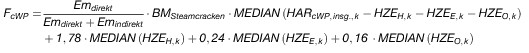
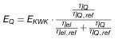
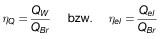

# Verordnung über die Zuteilung von Treibhausgas-Emissionsberechtigungen in der Handelsperiode 2013 bis 2020 (ZuV 2020)

Ausfertigungsdatum
:   2011-09-26

Fundstelle
:   BGBl I: 2011, 1921

Geändert durch
:   Art. 2 V v. 13.7.2017 I 2354

## Eingangsformel

Auf Grund der §§ 10 und 28 Absatz 1 Nummer 2, 4 und 5 des
Treibhausgas-Emissionshandelsgesetzes vom 21. Juli 2011 (BGBl. I S.
1475), hinsichtlich des § 10 nach Anhörung der beteiligten Kreise und
unter Wahrung der Rechte des Bundestages, verordnet die
Bundesregierung:

## Abschnitt 1 - Allgemeine Vorschriften

### § 1 Anwendungsbereich und Zweck

Diese Verordnung gilt im Anwendungsbereich des Treibhausgas-
Emissionshandelsgesetzes. Sie dient

1.  der nationalen Umsetzung des Beschlusses
    2011/278/EU                    der Kommission vom 27. April 2011 zur
    Festlegung EU-weiter Übergangsvorschriften zur Harmonisierung der
    kostenlosen Zuteilung von Emissionszertifikaten gemäß Artikel 10a der
    Richtlinie 2003/87/EG des Europäischen Parlaments und des Rates (ABl.
    L 130 vom 17.5.2011, S. 1) sowie der Festlegung der Angaben, die im
    Zuteilungsverfahren nach § 9 des Treibhausgas-Emissionshandelsgesetzes
    zu fordern sind, und

2.  der Konkretisierung der Anforderungen nach den §§ 8, 24 und 27 des
    Treibhausgas-Emissionshandelsgesetzes.

### § 2 Begriffsbestimmungen

Für diese Verordnung gelten neben den Begriffsbestimmungen des § 3 des
Treibhausgas-Emissionshandelsgesetzes die folgenden
Begriffsbestimmungen:

1.  Aufnahme des geänderten Betriebs

    der erste Tag eines durchgängigen 90-Tage-Zeitraums oder, falls der
    übliche Produktionszyklus in dem betreffenden Sektor keine
    durchgängige Produktion vorsieht, der erste Tag eines in
    sektorspezifische Produktionszyklen unterteilten 90-Tage-Zeitraums, in
    dem im Fall einer Kapazitätserweiterung die zusätzliche
    Produktionsleistung oder im Fall einer Kapazitätsverringerung die
    verbleibende verringerte Produktionsleistung des geänderten
    Zuteilungselements mit durchschnittlich mindestens 40 Prozent
    arbeitet, gegebenenfalls unter Berücksichtigung der für das geänderte
    Zuteilungselement spezifischen Betriebsbedingungen;

2.  Aufnahme des Regelbetriebs

    der erste Tag eines durchgängigen 90-Tage-Zeitraums oder, falls der
    übliche Produktionszyklus in dem betreffenden Sektor keine
    durchgängige Produktion vorsieht, der erste Tag eines in
    sektorspezifische Produktionszyklen unterteilten 90-Tage-Zeitraums, in
    dem die Anlage mit durchschnittlich mindestens 40 Prozent der
    Produktionsleistung arbeitet, für die sie ausgelegt ist,
    gegebenenfalls unter Berücksichtigung der anlagenspezifischen
    Betriebsbedingungen;

3.  Bestandsanlage

    eine Anlage, die eine oder mehrere der in Anhang 1 des Treibhausgas-
    Emissionshandelsgesetzes aufgeführten Tätigkeiten durchführt und der
    vor dem 1. Juli 2011 eine Genehmigung zur Emission von Treibhausgasen
    erteilt wurde;

4.  einheitliche EU-Zuteilungsregeln

    Beschluss 2011/278/EU der Kommission vom 27. April 2011 zur Festlegung
    EU-weiter Übergangsvorschriften zur Harmonisierung der kostenlosen
    Zuteilung von Emissionszertifikaten gemäß Artikel 10a der Richtlinie
    2003/87/EG des Europäischen Parlaments und des Rates (ABl. L 130 vom
    17\.5.2011, S. 1);

5.  installierte Kapazität nach einer wesentlichen Kapazitätsänderung

    der Durchschnitt der zwei höchsten Monatsproduktionsmengen innerhalb
    der ersten sechs Monate nach Aufnahme des geänderten Betriebs,
    hochgerechnet auf ein Kalenderjahr;

6.  messbare Wärme

    ein über einen Wärmeträger, beispielsweise Dampf, Heißluft, Wasser,
    Öl, Flüssigmetalle oder Salze, durch Rohre oder Leitungen
    transportierter Nettowärmefluss, für den ein Wärmezähler installiert
    wurde oder installiert werden könnte;

7.  Monitoring-Leitlinien

    die Entscheidung 2007/589/EG der Kommission vom 18. Juli 2007 zur
    Festlegung von Leitlinien für die Überwachung und Berichterstattung
    betreffend Treibhausgasemissionen im Sinne der Richtlinie 2003/87/EG
    des Europäischen Parlaments und des Rates (Monitoring-Leitlinien)
    (ABl. L 229 vom 31.8.2007, S. 1), die zuletzt durch den Beschluss
    2010/345/EU (ABl. L 155 vom 22.6.2010, S. 34) geändert worden ist;

8.  NACE-Code Rev 1.1

    statistische Systematik der Wirtschaftszweige in der Europäischen
    Gemeinschaft „NACE Rev 1.1“ nach Anhang I der Verordnung (EWG) Nr.
    3037/90 des Rates vom 9. Oktober 1990 betreffend die statistische
    Systematik der Wirtschaftszweige in der Europäischen Gemeinschaft
    (ABl. L 293 vom 24.10.1990, S. 1), die zuletzt durch die Verordnung
    (EG) Nr. 1893/2006 (ABl. L 393 vom 30.12.2006, S. 1) geändert worden
    ist;

9.  NACE-Code Rev 2

    statistische Systematik der Wirtschaftszweige in der Europäischen
    Gemeinschaft „NACE Rev 2“ nach Anhang I der Verordnung (EG) Nr.
    1893/2006 des Europäischen Parlaments und des Rates vom 20. Dezember
    2006 zur Aufstellung der statistischen Systematik der
    Wirtschaftszweige NACE Revision 2 und zur Änderung der Verordnung
    (EWG) Nr. 3037/90 des Rates sowie einiger Verordnungen der EG über
    bestimmte Bereiche der Statistik (ABl. L 393 vom 30.12.2006, S. 1),
    die durch die Verordnung (EG) Nr. 295/2008 (ABl. L 97 vom 9.4.2008, S.
    13) geändert worden ist;

10. Neuanlagen

    alle neuen Marktteilnehmer gemäß Artikel 3 Buchstabe h erster
    Gedankenstrich der Richtlinie 2003/87/EG;

11. nicht messbare Wärme

    jede Wärme mit Ausnahme messbarer Wärme;

12. Privathaushalt

    Gebäude, die überwiegend zu Wohnzwecken genutzt werden, oder anteilig
    andere Gebäude, soweit sie zu Wohnzwecken genutzt werden;

13. Prodcom-Code 2007

    Code gemäß Anhang der Verordnung (EG)
    Nr. 1165/2007                    der Kommission vom 3. September 2007
    zur Erstellung der „Prodcom-Liste“ der Industrieprodukte für 2007
    gemäß der Verordnung (EWG) Nr. 3924/91 des Rates (ABl. L 268 vom
    12\.10.2007, S. 1);

14. Prodcom-Code 2010

    Code gemäß Anhang der Verordnung (EU)
    Nr. 860/2010                    der Kommission vom 10. September 2010
    zur Erstellung der „Prodcom-Liste“ der Industrieprodukte für 2010
    gemäß der Verordnung (EWG) Nr. 3924/91 des Rates (ABl. L 262 vom
    5\.10.2010, S. 1);

15. Produkt-Emissionswert

    in Anhang I Nummer 1 Spalte 5 und Nummer 2 Spalte 5 der einheitlichen
    EU-Zuteilungsregeln unter der Bezeichnung „Benchmarkwert“ angegebene
    Anzahl Berechtigungen pro Produkteinheit;

16. Produktionsmenge

    die Menge erzeugter Produkteinheiten je Jahr, bei den in Anhang I oder
    Anhang II der einheitlichen EU-Zuteilungsregeln genannten Produkten
    bezogen auf die dort angegebenen Produktspezifikationen, im Übrigen
    bezogen auf die jährliche Nettomenge marktfähiger Produkteinheiten;

17. Restgas

    eine Mischung von Gasen, die unvollständig oxidierten Kohlenstoff als
    Nebenprodukt aus Prozessen gemäß Nummer 29 Buchstabe b enthält, so
    dass der chemische Energieinhalt ausreicht, um eigenständig ohne
    zusätzliche Brennstoffzufuhr zu verbrennen oder im Fall der
    Vermischung mit Brennstoffen mit höherem Heizwert signifikant zu der
    gesamten Energiezufuhr beizutragen;

18. Richtlinie 2003/87/EG

    Richtlinie 2003/87/EG des Europäischen Parlaments und des Rates vom
    13\. Oktober 2003 über ein System für den Handel mit
    Treibhausgasemissionszertifikaten in der Gemeinschaft und zur Änderung
    der Richtlinie 96/61/EG des Rates (ABl. L 275 vom 25.10.2003, S. 32),
    die zuletzt durch die Richtlinie 2009/29/EG (ABl. L 140 vom 5.6.2009,
    S. 63) geändert worden ist, in der jeweils geltenden Fassung;

19. Sektor mit Verlagerungsrisiko

    Sektor oder Teilsektor, der einem erheblichen Risiko der Verlagerung
    von Kohlendioxid-Emissionen ausgesetzt ist, entsprechend den
    Festlegungen im Anhang des Beschlusses 2010/2/EU der Kommission vom
    24\. Dezember 2009 zur Festlegung eines Verzeichnisses der Sektoren und
    Teilsektoren, von denen angenommen wird, dass sie einem erheblichen
    Risiko einer Verlagerung von CO
    2                   -Emissionen ausgesetzt sind, gemäß der Richtlinie
    2003/87/EG des Europäischen Parlaments und des Rates (ABl. L 1 vom
    5\.1.2010, S. 10) in der jeweils geltenden Fassung;

20. stillgelegte Kapazität

    die Differenz zwischen der installierten Anfangskapazität eines
    Zuteilungselements und der installierten Kapazität dieses Elements
    nach einer wesentlichen Kapazitätsverringerung;

21. Stromerzeuger

    Anlage, die nach dem 31. Dezember 2004 Strom erzeugt und an Dritte
    verkauft hat und in der ausschließlich eine Tätigkeit gemäß Anhang 1
    Teil 2 Nummer 1 bis 4 des Treibhausgas-Emissionshandelsgesetzes
    durchgeführt wird;

22. Wärmezähler

    ein Gerät zur Messung und Aufzeichnung der erzeugten Wärmemenge auf
    der Basis des Durchflusses und der Temperaturen, insbesondere
    Wärmezähler im Sinne des Anhangs MI-004 der Richtlinie 2004/22/EG des
    Europäischen Parlaments und des Rates vom 31. März 2004 über
    Messgeräte (ABl. L 135 vom 30.4.2004, S. 1), die zuletzt durch
    die Richtlinie                    2009/137/EG (ABl. L 294 vom
    11\.11.2009, S. 7) geändert worden ist;

23. wesentliche Kapazitätsänderung

    wesentliche Kapazitätserweiterung oder wesentliche
    Kapazitätsverringerung;

24. wesentliche Kapazitätserweiterung

    wesentliche Erhöhung der installierten Anfangskapazität eines
    Zuteilungselements, bei der folgende Merkmale vorliegen:

    a)  eine oder mehrere bestimmbare physische Änderungen der technischen
        Konfiguration des Zuteilungselements und seines Betriebs, ausgenommen
        der bloße Ersatz einer existierenden Produktionslinie, und

    b)  eine Erhöhung

        aa) der Kapazität des Zuteilungselements um mindestens 10 Prozent
            gegenüber seiner installierten Anfangskapazität vor der Änderung oder

        bb) der Aktivitätsrate des von der physischen Änderung im Sinne des
            Buchstaben a betroffenen Zuteilungselements in erheblichem Maß, die
            bei entsprechender Anwendung der für neue Marktteilnehmer geltenden
            Zuteilungsregel zu einer zusätzlichen Zuteilung von mehr als 50 000
            Berechtigungen pro Jahr führen würde, sofern diese Anzahl
            Berechtigungen mindestens 5 Prozent der vorläufigen jährlichen Anzahl
            zuzuteilender Berechtigungen für dieses Zuteilungselement vor der
            Änderung entspricht;

25. wesentliche Kapazitätsverringerung

    eine oder mehrere bestimmbare physische Änderungen, die eine
    wesentliche Verringerung der installierten Anfangskapazität eines
    Zuteilungselements oder seiner Aktivitätsrate in derselben
    Größenordnung wie eine wesentliche Kapazitätserweiterung bewirken;

26. zusätzliche Kapazität

    die Differenz zwischen der installierten Kapazität nach einer
    wesentlichen Kapazitätserweiterung und der installierten
    Anfangskapazität eines Zuteilungselements;

27. Zuteilungselement mit Brennstoff-Emissionswert

    Zusammenfassung von nicht von einem Zuteilungselement nach Nummer 28
    oder Nummer 30 umfassten Eingangsströmen, Ausgangsströmen und
    diesbezüglichen Emissionen für Fälle der Erzeugung von nicht messbarer
    Wärme durch Brennstoffverbrennung, soweit die nicht messbare Wärme

    a)  zur Herstellung von Produkten, zur Erzeugung mechanischer Energie, zur
        Heizung oder zur Kühlung verbraucht wird oder

    b)  durch Sicherheitsfackeln erzeugt wird, soweit die damit verbundene
        Verbrennung von Pilotbrennstoffen und sehr variablen Mengen an
        Prozess- oder Restgasen genehmigungsrechtlich zur ausschließlichen
        Anlagenentlastung bei Betriebsstörungen oder anderen außergewöhnlichen
        Betriebszuständen vorgesehen ist;

    hiervon jeweils ausgenommen ist nicht messbare Wärme, die zur
    Stromerzeugung verbraucht oder für die Stromerzeugung exportiert wird;

28. Zuteilungselement mit Produkt-Emissionswert

    Zusammenfassung von Eingangsströmen, Ausgangsströmen und
    diesbezüglichen Emissionen im Zusammenhang mit der Herstellung eines
    Produktes, für das in Anhang I der einheitlichen EU-Zuteilungsregeln
    ein Emissionswert festgesetzt ist;

29. Zuteilungselement mit Prozessemissionen

    Zusammenfassung von

    a)  Emissionen anderer Treibhausgase als Kohlendioxid, die außerhalb der
        Systemgrenzen eines Zuteilungselements mit Produkt-Emissionswert
        auftreten;

    b)  Kohlendioxid-Emissionen, die außerhalb der Systemgrenzen eines
        Zuteilungselements mit Produkt-Emissionswert auftreten, die aus einem
        der nachstehenden Prozesse resultieren:

        aa) chemische oder elektrolytische Reduktion von Metallverbindungen in
            Erzen, Konzentraten und Sekundärstoffen;

        bb) Entfernung von Unreinheiten aus Metallen und Metallverbindungen;

        cc) Zersetzung von Karbonaten, ausgenommen Karbonate für die
            Abgasreinigung;

        dd) chemische Synthesen, bei denen das kohlenstoffhaltige Material an der
            Reaktion teilnimmt und deren Hauptzweck nicht die Wärmeerzeugung ist;

        ee) Verwendung kohlenstoffhaltiger Zusatzstoffe oder Rohstoffe, deren
            Hauptzweck nicht die Wärmeerzeugung ist;

        ff) chemische oder elektrolytische Reduktion von Halbmetalloxiden oder
            Nichtmetalloxiden wie Siliziumoxiden und Phosphaten;

    c)  Emissionen aus der Verbrennung von unvollständig oxidiertem
        Kohlenstoff, der im Rahmen der unter Buchstabe b genannten Prozesse
        entsteht und zur Erzeugung von messbarer Wärme, nicht messbarer Wärme
        oder Strom genutzt wird, sofern Emissionen abgezogen werden, die bei
        der Verbrennung einer Menge Erdgas entstanden wären, die dem technisch
        nutzbaren Energiegehalt des unvollständig oxidierten Kohlenstoffs
        entspricht,

30. Zuteilungselement mit Wärme-Emissionswert

    Zusammenfassung von nicht von einem Zuteilungselement nach Nummer 28
    umfassten Eingangsströmen, Ausgangsströmen und diesbezüglichen
    Emissionen im Zusammenhang mit der Erzeugung messbarer Wärme oder
    deren Import aus einer unter den Anwendungsbereich des Treibhausgas-
    Emissionshandelsgesetzes fallenden Anlage, soweit die Wärme nicht aus
    Strom erzeugt oder bei der Herstellung von Salpetersäure angefallen
    ist und nicht zur Stromerzeugung verbraucht oder für die
    Stromerzeugung exportiert wird und die Wärme

    a)  in der Anlage außerhalb eines Zuteilungselements nach Nummer 28 zur
        Herstellung von Produkten, zur Erzeugung mechanischer Energie, zur
        Heizung oder Kühlung verbraucht wird oder

    b)  an Anlagen und andere Einrichtungen, die nicht unter den
        Anwendungsbereich des Treibhausgas-Emissionshandelsgesetzes fallen,
        abgegeben wird.

## Abschnitt 2 - Zuteilungsregeln für Bestandsanlagen

### Unterabschnitt 1 - Allgemeine Zuteilungsregeln

#### § 3 Bildung von Zuteilungselementen

(1) Im Antrag auf kostenlose Zuteilung von Berechtigungen für eine
Anlage ist die Gesamtheit der für die Zuteilung relevanten
Eingangsströme, Ausgangsströme und diesbezüglichen Emissionen in dem
nach § 8 Absatz 1 festgelegten Bezugszeitraum folgenden
Zuteilungselementen zuzuordnen:

1.  einem Zuteilungselement oder mehreren Zuteilungselementen mit Produkt-
    Emissionswert nach § 2 Nummer 28,

2.  einem Zuteilungselement mit Wärme-Emissionswert nach § 2 Nummer 30,
    soweit nicht von Zuteilungselementen nach Nummer 1 umfasst,

3.  einem Zuteilungselement mit Brennstoff-Emissionswert nach § 2 Nummer
    27, soweit nicht von Zuteilungselementen nach den Nummern 1 und 2
    umfasst, und

4.  einem Zuteilungselement mit Prozessemissionen nach § 2 Nummer 29,
    soweit nicht von Zuteilungselementen nach den Nummern 1 bis 3 umfasst.

(2) Für die Bestimmung des Zuteilungselements nach Absatz 1 Nummer 2
gilt die Abgabe von messbarer Wärme an ein Wärmeverteilnetz als Abgabe
an eine andere Einrichtung nach § 2 Nummer 30 Buchstabe b. Abweichend
von Satz 1 gilt die an ein Wärmeverteilnetz abgegebene Wärme als an
einen an das Wärmeverteilnetz angeschlossenen Wärmeverbraucher
abgegeben, soweit dieser Wärmeverbraucher nachweist, dass die Wärme
auf Grundlage eines direkten Versorgungsvertrages mit dem
Wärmeerzeuger in das Wärmeverteilnetz abgegeben wurde.

(3) Bei Zuteilungselementen nach Absatz 1 Nummer 2 bis 4 hat der
Antragsteller getrennte Zuteilungselemente zu bilden für Prozesse zur
Herstellung von Produkten, die Sektoren mit Verlagerungsrisiko
betreffen, und solchen Prozessen, auf die dieses nicht zutrifft.
Abweichend von Satz 1 ist die Bildung getrennter Zuteilungselemente
ausgeschlossen, soweit der Antragsteller

1.  den Nachweis erbringt, dass mindestens 95 Prozent der Aktivitätsrate
    dieses Zuteilungselements Sektoren mit Verlagerungsrisiko betreffen,
    oder

2.  nicht den Nachweis erbringt, dass mindestens 5 Prozent der
    Aktivitätsrate des Zuteilungselements Sektoren mit Verlagerungsrisiko
    betreffen.

(4) Bei Zuteilungselementen mit Wärme-Emissionswert gilt für die
Zuordnung zu den getrennten Zuteilungselementen nach Absatz 3
Folgendes:

1.  Bei der direkten Abgabe von Wärme an einen Abnehmer, der nicht unter
    den Anwendungsbereich des Treibhausgas-Emissionshandelsgesetzes fällt,
    ist diese Wärme den Sektoren mit Verlagerungsrisiko zuzurechnen,
    soweit der Betreiber nachweist, dass der Abnehmer einem Sektor mit
    Verlagerungsrisiko angehört; im Übrigen ist diese Wärme den Sektoren
    ohne Verlagerungsrisiko zuzuordnen;

2.  Bei Abgabe der Wärme an Wärmeverteilnetze ist der Anteil an der
    insgesamt abgegebenen Wärmemenge den Sektoren mit Verlagerungsrisiko
    zuzurechnen, der dem Verhältnis der vom Wärmenetzbetreiber an Abnehmer
    in Sektoren mit Verlagerungsrisiko zur insgesamt von ihm abgegebenen
    Wärmemenge in dem nach § 8 Absatz 1 maßgeblichen Bezugszeitraum
    entspricht; im Übrigen ist diese Wärme den Sektoren ohne
    Verlagerungsrisiko zuzuordnen.

Für die Zuordnung nach Satz 1 Nummer 1 hat der Antragsteller im Antrag
zusätzlich den jeweiligen Prodcom-Code 2007 und 2010 sowie den
jeweiligen NACE-Code Rev 1.1 und Rev 2 der abnehmenden Anlagen oder
Einrichtungen und die zugehörigen Wärmemengen anzugeben. Bei Abgabe
der Wärme an ein Wärmeverteilnetz hat der Antragsteller die
Gesamtmenge an Wärme anzugeben, die der Wärmenetzbetreiber innerhalb
des nach § 8 Absatz 1 gewählten Bezugszeitraums abgegeben hat, sowie
die Menge an Wärme, die der Wärmenetzbetreiber in diesem Zeitraum an
Sektoren mit Verlagerungsrisiko abgegeben hat. Die Daten des
Wärmenetzbetreibers sind zu verifizieren.

#### § 4 Bestimmung der installierten Anfangskapazität von Bestandsanlagen

(1) Zur Bestimmung der installierten Anfangskapazität eines
Zuteilungselements mit Produkt-Emissionswert ist der Durchschnitt der
zwei höchsten Monatsproduktionsmengen in den Kalendermonaten im
Zeitraum vom 1. Januar 2005 bis 31. Dezember 2008 auf ein Kalenderjahr
hochzurechnen; dabei wird davon ausgegangen, dass das
Zuteilungselement mit dieser Auslastung 720 Stunden pro Monat und
zwölf Monate pro Jahr in Betrieb war.

(2) Soweit der Antragsteller belegt, dass die installierte
Anfangskapazität für Zuteilungselemente mit Produkt-Emissionswert
mangels vorhandener Daten oder bei einem Betrieb des
Zuteilungselements von weniger als zwei Monaten in dem Zeitraum nach
Absatz 1 nicht bestimmt werden kann, wird als Anfangskapazität die
Produktionsmenge des Zuteilungselements unter Aufsicht und nach
Prüfung durch eine sachverständige Stelle nach Maßgabe folgender
Merkmale experimentell bestimmt:

1.  Ermittlung der Menge verkaufsfertiger Produkte anhand eines
    ununterbrochenen, für den bestimmungsgemäßen stationären Betrieb
    repräsentativen Testlaufs von 48 Stunden,

2.  Ermittlung der Produktionsmenge anhand eines ununterbrochenen
    Testlaufs über 48 Stunden,

3.  Berücksichtigung früherer Produktionsmengen des Zuteilungselements,

4.  Berücksichtigung sektortypischer Werte und Normen,

5.  Berücksichtigung der Produktqualität der tatsächlich verkauften
    Produkte.

Die durchschnittliche monatliche Kapazität des Zuteilungselements
errechnet sich aus der nach vorstehenden Merkmalen bestimmten
durchschnittlichen täglichen Produktionsmenge multipliziert mit 30,
die installierte Anfangskapazität durch eine Multiplikation dieses
Wertes mit zwölf.

(3) Für ein Zuteilungselement mit einer wesentlichen
Kapazitätsänderung im Zeitraum vom 1. Januar 2005 bis zum 30. Juni
2011 ist abweichend von Absatz 1 der Zeitraum vom 1. Januar 2005 bis
zum Zeitpunkt der Aufnahme des geänderten Betriebs maßgeblich. Bei
Kapazitätserweiterungen im Jahr 2005 gilt Absatz 1 im Fall eines
Antrags nach § 8 Absatz 8 Satz 3 erster Halbsatz. Für Anlagen mit
Aufnahme des Regelbetriebs nach dem 1. Januar 2007 ist abweichend von
Absatz 1 der Zeitraum von der Aufnahme des Regelbetriebs bis zum 30.
Juni 2011 maßgeblich.

(4) Zur Bestimmung der installierten Anfangskapazität für ein
Zuteilungselement gemäß § 2 Nummer 27, 29 oder Nummer 30 gelten die
Absätze 1 bis 3 entsprechend.

(5) Für Zuteilungselemente von Bestandsanlagen, die bis zum 30. Juni
2011 ihren Regelbetrieb noch nicht aufgenommen haben, beträgt die
installierte Anfangskapazität null. Dies gilt bei wesentlichen
Kapazitätserweiterungen mit Aufnahme des geänderten Betriebs nach dem
30\. Juni 2011 auch für die zusätzliche Kapazität.

#### § 5 Erhebung von Bezugsdaten

(1) Der Anlagenbetreiber ist verpflichtet, im Antrag auf kostenlose
Zuteilung für Bestandsanlagen insbesondere folgende Angaben zu machen:

1.  Allgemeine Angaben zu der Anlage:

    a)  die Bezeichnung der Tätigkeit nach Anhang 1 Teil 2 des Treibhausgas-
        Emissionshandelsgesetzes,

    b)  die NACE-Codes Rev 2 und Rev 1.1 der Anlage,

    c)  eine Beschreibung der Anlage, ihrer wesentlichen Anlagenteile und
        Nebeneinrichtungen sowie der Betriebsart,

    d)  eine Beschreibung der angewandten Erhebungsmethodik, der verschiedenen
        Datenquellen und der angewandten Berechnungsschritte,

    e)  die Gesamtfeuerungswärmeleistung, soweit für die Tätigkeit in Anhang 1
        Teil 2 des Treibhausgas-Emissionshandelsgesetzes ein Schwellenwert als
        Feuerungswärmeleistung angegeben ist,

    f)  sofern es sich um einen Stromerzeuger handelt, eine Bezeichnung als
        solcher,

    g)  die Bezeichnung der für die Genehmigung nach § 4 Absatz 1 Satz 1 des
        Treibhausgas-Emissionshandelsgesetzes zuständigen Behörde, deren
        Genehmigungsaktenzeichen, das Datum der Genehmigung, die zu dem
        Zeitpunkt gegolten hat, zu dem die Anlage erstmals unter den
        Anwendungsbereich des Treibhausgas-Emissionshandelsgesetzes gefallen
        ist, und das Datum der letztmaligen Änderung der Genehmigung,

    h)  die für die Zuteilung maßgeblichen Zuteilungselemente,

    i)  Veränderungen der Angaben zu den Buchstaben a bis h in den
        Kalenderjahren 2005 bis 2010;

2.  Zusätzliche Angaben zu der Anlage:

    a)  sämtliche zuteilungsrelevanten Ein- und Ausgangsströme,

    b)  im Fall des Austausches von messbarer Wärme, Restgasen oder
        Treibhausgasen mit anderen Anlagen oder Einrichtungen auch die Angabe,
        in welcher Menge und mit welchen Anlagen oder Einrichtungen dieser
        Austausch stattfand, im Fall von Anlagen nach Anhang 1 Teil 2 des
        Treibhausgas-Emissionshandelsgesetzes zusätzlich die
        Genehmigungskennungen dieser Anlagen aus dem Emissionshandelsregister,

    c)  im Fall von Anlagen, die Strom erzeugen, eine Bilanz der elektrischen
        Energie der Anlage und die Mengen an Emissionen und Wärme sowie die
        Energien der Brennstoffe, die der Stromerzeugung zuzuordnen sind;

3.  Allgemeine Angaben zu jedem Zuteilungselement:

    a)  die installierte Anfangskapazität nach § 4; für Zuteilungselemente mit
        Produkt-Emissionswert zusätzlich der Durchschnitt der zwei höchsten
        Monatsproduktionsmengen in den Kalendermonaten im Zeitraum vom 1.
        Januar 2005 bis 31. Dezember 2008,

    b)  die anteilig zuzuordnenden Emissionen und Energien der eingesetzten
        Brennstoffe,

    c)  die anteilig zuzuordnenden Eingangs- und Ausgangsströme nach Nummer 2
        Buchstabe a, sofern für die Anlage mindestens zwei Zuteilungselemente
        gebildet wurden und davon mindestens ein Zuteilungselement dem § 3
        Absatz 1 Nummer 2 bis 4 unterfällt,

    d)  die maßgebliche Aktivitätsrate nach § 8,

    e)  bei Produkten, die in Anhang I Nummer 2 Spalte 2 der einheitlichen EU-
        Zuteilungsregeln aufgeführt sind, den maßgeblichen Stromverbrauch für
        die Herstellung des betreffenden Produktes innerhalb der Systemgrenzen
        nach Anhang I Nummer 2 Spalte 3 der einheitlichen EU-Zuteilungsregeln,

    f)  die Bezeichnung der hergestellten Produkte mit deren Prodcom-Codes
        2007 und 2010 und NACE-Codes Rev 1.1 und Rev 2 und die produzierten
        Mengen;

4.  Zusätzliche Angaben zu Zuteilungselementen in Sonderfällen:

    a)  bei Aufnahme des Regelbetriebs zwischen dem 1. Januar 2005 und dem 30.
        Juni 2011 das Datum der Aufnahme des Regelbetriebs,

    b)  bei Zuteilungselementen, deren Kapazität zwischen dem 1. Januar 2005
        und dem 30. Juni 2011 wesentlich geändert wurde, zusätzlich zu der
        installierten Anfangskapazität die installierte Kapazität nach jeder
        wesentlichen Kapazitätsänderung und das Datum der Aufnahme des
        geänderten Betriebs,

    c)  bei Zuteilungselementen, die in den Jahren 2005 bis 2010 messbare
        Wärme bezogen haben, die Menge an messbarer Wärme sowie die Menge, die
        von nicht dem Emissionshandel unterliegenden Anlagen oder anderen
        Einrichtungen bezogen wurde,

    d)  bei Zuteilungselementen, die in den Jahren 2005 bis 2010 messbare
        Wärme abgegeben haben, die Bezeichnung der Anlagen oder anderen
        Einrichtungen, an die die messbare Wärme abgegeben wurde, bei Anlagen
        nach Anhang 1 Teil 2 des Treibhausgas-Emissionshandelsgesetzes mit
        Angabe der Genehmigungskennung des Emissionshandelsregisters sowie
        Angaben über die an die einzelnen Anlagen oder andere Einrichtungen
        abgegebene Menge an Wärme,

    e)  bei Zuteilungselementen mit Wärme-Emissionswert für die in gekoppelter
        Produktion erzeugte Wärme eine Zuordnung der Eingangsströme und der
        diesbezüglichen Emissionen zu den in gekoppelter Produktion
        hergestellten Produkten nach Maßgabe von Anhang 1 Teil 3 sowie die
        hierfür zusätzlich erforderlichen Angaben nach Anhang 1 Teil 3 Nummer
        4,

    f)  bei Produkten nach Anhang III der einheitlichen EU-Zuteilungsregeln
        die dort genannten Daten,

    g)  bei Prozessen zur Herstellung von Synthesegas und Wasserstoff in
        Anlagen im Sinne des Anhangs 1 Teil 2 Nummer 7 des Treibhausgas-
        Emissionshandelsgesetzes die Daten entsprechend Anhang III Nummer 6
        und 7 der einheitlichen EU-Zuteilungsregeln,

    h)  bei der Herstellung von Produkten nach Anhang I der einheitlichen EU-
        Zuteilungsregeln die Menge der eingesetzten Zwischenprodukte im Sinne
        des § 9 Absatz 5 Satz 2 und aus dem Emissionshandelsregister die
        Genehmigungskennung der Anlage, von der das Zwischenprodukt bezogen
        wird,

    i)  bei Abgabe eines Zwischenproduktes im Sinne des § 9 Absatz 5 Satz 2 an
        eine andere Anlage im Anwendungsbereich des Treibhausgas-
        Emissionshandelsgesetzes die Menge der abgegebenen Zwischenprodukte
        und aus dem Emissionshandelsregister die Genehmigungskennung der
        Anlage, an die das Produkt oder Zwischenprodukt abgegeben wird,

    j)  bei Anlagen, die durch den Einsatz von Biomasse messbare Wärme in
        gekoppelter Produktion mit einer nach dem Erneuerbare-Energien-Gesetz
        vergüteten Strommenge erzeugt haben, die Angabe dieser in gekoppelter
        Produktion erzeugten Wärmemenge.

(2) Angaben zu Absatz 1 Nummer 2 bis 4 sind mit Ausnahme der Angaben
zu Absatz 1 Nummer 3 Buchstabe a und Nummer 4 Buchstabe a und b
erforderlich für jedes der Kalenderjahre in dem vom Antragsteller nach
§ 8 Absatz 1 gewählten Bezugszeitraum. Von Satz 1 erfasst sind alle
Kalenderjahre, in denen die Anlage in Betrieb war, auch wenn sie nur
gelegentlich oder saisonal betrieben oder in Reserve oder in
Bereitschaft gehalten wurde. Im Fall des Austausches von messbarer
Wärme, Zwischenprodukten, Restgasen oder Treibhausgasen zwischen
Anlagen nach Anhang 1 Teil 2 des Treibhausgas-Emissionshandelsgesetzes
sind die Angaben für jedes der Kalenderjahre 2005 bis 2010
erforderlich. Bei Anlagen mit mindestens einem Zuteilungselement mit
Produkt-Emissionswert, für die als maßgeblicher Bezugszeitraum die
Jahre 2009 und 2010 gewählt wurden, sind die Angaben auch für jedes
der Kalenderjahre 2005 bis 2008 erforderlich.

(3) Der Antragsteller kann auf Angaben zu den Eingangs- und
Ausgangsströmen der Anlage nach Absatz 1 Nummer 2 Buchstabe a
verzichten, soweit er diese Angaben für die gesamte Anlage, wie sie
zum Zeitpunkt der Antragstellung der Emissionshandelspflicht
unterliegt, bereits im Rahmen der Emissionsberichterstattung oder im
Rahmen der Datenerhebung auf Grund der Datenerhebungsverordnung 2020
für die Jahre 2005 bis 2010 mitgeteilt hat. Verzichtet der
Antragsteller auf die Angaben im Zuteilungsantrag, werden auch die auf
der Basis einheitlicher Stoffwerte mitgeteilten Emissionsdaten
übernommen.

#### § 6 Bestimmung von Bezugsdaten

(1) Aktivitätsraten, Eingangs- und Ausgangsströme, zu denen nur für
die Gesamtanlage Daten vorliegen, werden den jeweiligen
Zuteilungselementen auf Basis der nachstehenden Methoden anteilig
durch den Antragsteller zugeordnet:

1.  soweit an derselben Produktionslinie nacheinander unterschiedliche
    Produkte hergestellt werden, werden Aktivitätsraten, Eingangs- und
    Ausgangsströme auf Basis der Nutzungszeit pro Jahr und
    Zuteilungselement zugeordnet;

2.  soweit Aktivitätsraten, Eingangs- und Ausgangsströme nicht gemäß
    Nummer 1 zugeordnet werden können, erfolgt die Zuordnung auf Basis

    a)  der Masse oder des Volumens der jeweils hergestellten Produkte,

    b)  von Schätzungen, die sich auf die freien Reaktionsenthalpien der
        betreffenden chemischen Reaktionen stützen, oder

    c)  eines anderen geeigneten wissenschaftlich fundierten
        Verteilungsschlüssels.

Bei dieser Zuordnung darf die Summe der Emissionen aller
Zuteilungselemente die Gesamtemissionen der Gesamtanlage nicht
überschreiten. Die Annahmen und Methoden, die der Zuordnung der
Emissionen zu den jeweiligen Zuteilungselementen zugrunde gelegt
worden sind, sind in der in § 5 Absatz 1 Nummer 1 Buchstabe c und d
genannten Beschreibung der Anlage darzustellen.

(2) Soweit die Angaben im Zuteilungsantrag die Durchführung von
Berechnungen voraussetzen, ist neben den geforderten Angaben jeweils
auch die angewandte Berechnungsmethode zu erläutern und die Ableitung
der Angaben in der Beschreibung der Anlage nach § 5 Absatz 1 Nummer 1
Buchstabe c und d darzustellen. Soweit die zuständige Behörde für die
Berechnungen Formulare vorgibt, sind diese zu verwenden. Der Betreiber
ist verpflichtet, die den Angaben zugrunde liegenden Einzelnachweise
auf Verlangen der zuständigen Behörde vorzuweisen.

(3) Soweit diese Verordnung keine abweichenden Regelungen enthält,
sind die im Zuteilungsantrag anzugebenden Daten und Informationen im
Einklang mit den Monitoring-Leitlinien zu erheben und anzugeben.
Soweit die Anforderungen der Monitoring-Leitlinien nicht eingehalten
werden können oder keine Regelungen enthalten, sind Daten und
Informationen mit dem im Einzelfall höchsten erreichbaren Grad an
Genauigkeit und Vollständigkeit zu erheben und anzugeben. Dabei darf
es weder zu Überschneidungen noch zu Doppelzählungen zwischen den
Zuteilungselementen kommen.

(4) Wenn Daten fehlen, ist der Grund dafür anzugeben. Fehlende Daten
sind durch konservative Schätzungen zu ersetzen, die insbesondere auf
bewährter Industriepraxis und auf aktuellen wissenschaftlichen und
technischen Informationen beruhen. Liegen Daten teilweise vor, so
bedeutet konservative Schätzung, dass der zur Füllung von Datenlücken
geschätzte Wert maximal 90 Prozent des Wertes beträgt, der bei
Verwendung der verfügbaren Daten erzielt wurde. Liegen für ein
Zuteilungselement mit Wärme-Emissionswert keine Daten über messbare
Wärmeflüsse vor, so kann ein Ersatzwert abgeleitet werden. Dieser
errechnet sich durch Multiplikation des entsprechenden
Energieeinsatzes mit dem Nutzungsgrad der Anlage zur Wärmeerzeugung,
der von einer sachverständigen Stelle geprüft wurde. Liegen keine
Daten zur Bestimmung des Nutzungsgrades vor, so wird auf den
entsprechenden Energieeinsatz für die Erzeugung messbarer Wärme als
Bezugseffizienzwert ein Nutzungsgrad von 70 Prozent angewendet.

(5) Soweit im Rahmen der Berechnung der vorläufigen Zuteilungsmenge
die Verwendung eines Oxidationsfaktors von Bedeutung ist, wird
generell ein Oxidationsfaktor von 1 angewendet.

(6) Soweit bei einem Zuteilungselement mit Wärme-Emissionswert die
Wärme in gekoppelter Produktion erzeugt wurde, sind die Eingangsströme
und die diesbezüglichen Emissionen den in gekoppelter Produktion
hergestellten Produkten nach Maßgabe von Anhang 1 Teil 3 zuzuordnen.

#### § 7 Anforderungen an die Verifizierung von Zuteilungsanträgen

(1) Die tatsachenbezogenen Angaben im Zuteilungsantrag sowie die
Erhebungsmethodik sind von einer sachverständigen Stelle im Sinne des
§ 21 des Treibhausgas-Emissionshandelsgesetzes im Rahmen der
Verifizierung des Zuteilungsantrags nach § 9 Absatz 2 Satz 6 des
Treibhausgas-Emissionshandelsgesetzes zu überprüfen. Die Prüfung
betrifft insbesondere die Zuverlässigkeit, Glaubhaftigkeit und
Genauigkeit der von den Anlagenbetreibern übermittelten Daten. Dabei
ist die Aufteilung der Anlage in Zuteilungselemente gesondert zu
bestätigen.

(2) Die sachverständige Stelle muss im Prüfbericht darlegen, ob der
Antrag und die darin enthaltenen Daten mit hinreichender Sicherheit
frei von wesentlichen Falschangaben und Abweichungen von den
Anforderungen des Treibhausgas-Emissionshandelsgesetzes und dieser
Verordnung sind.

(3) Die sachverständige Stelle muss die in Anhang 2 Teil 1 geregelten
Anforderungen erfüllen. Unbeschadet der Anforderungen der Monitoring-
Leitlinien gelten für die sachverständige Stelle im Rahmen der Prüfung
nach Absatz 1 die in Anhang 2 Teil 2 näher geregelten Anforderungen.

(4) Die sachverständige Stelle hat in ihrem externen Prüfbericht an
Eides statt zu versichern, dass

1.  bei der Verifizierung des Zuteilungsantrags die Unabhängigkeit und
    Unparteilichkeit ihrer Tätigkeit nach den jeweiligen Regelungen ihrer
    Zulassung als Umweltgutachter oder ihrer Bestellung als
    Sachverständiger gemäß § 36 der Gewerbeordnung gewahrt war und

2.  sie bei der Erstellung des Zuteilungsantrags oder der Entwicklung der
    Erhebungsmethodik nicht mitgewirkt hat.

Für Sachverständige, die auf Grund der Gleichwertigkeit ihrer
Akkreditierung in einem anderen Mitgliedstaat nach § 21 Absatz 3 Satz
1 des Treibhausgas-Emissionshandelsgesetzes bekannt gegeben wurden,
gilt Satz 1 entsprechend.

(5) Die sachverständige Stelle hat im externen Prüfbericht zu
bestätigen, dass der geprüfte Antrag weder Überschneidungen zwischen
Zuteilungselementen noch Doppelzählungen enthält.

#### § 8 Maßgebliche Aktivitätsrate

(1) Für Bestandsanlagen bestimmt sich die maßgebliche Aktivitätsrate
auf Basis der gemäß § 5 erhobenen Daten nach Wahl des Antragstellers
einheitlich für alle Zuteilungselemente der Anlage entweder nach dem
Bezugszeitraum vom 1. Januar 2005 bis einschließlich 31. Dezember 2008
oder nach dem Bezugszeitraum vom 1. Januar 2009 bis einschließlich 31.
Dezember 2010.

(2) Die maßgebliche Aktivitätsrate ist für jedes Produkt der Anlage,
für das ein Zuteilungselement im Sinne des § 3 Absatz 1 Nummer 1 zu
bilden ist, der Medianwert aller Jahresmengen dieses Produktes in dem
nach Absatz 1 gewählten Bezugszeitraum. Abweichend von Satz 1 bestimmt
sich die Aktivitätsrate für die in Anhang III der einheitlichen EU-
Zuteilungsregeln genannten Produkte nach den dort für diese Produkte
festgelegten Formeln.

(3) Die maßgebliche Aktivitätsrate für ein Zuteilungselement mit
Wärme-Emissionswert ist der in Gigawattstunden pro Jahr angegebene
Medianwert aller Jahresmengen der nach § 2 Nummer 30 einbezogenen
Wärme in dem nach Absatz 1 gewählten Bezugszeitraum.

(4) Die maßgebliche Aktivitätsrate für ein Zuteilungselement mit
Brennstoff-Emissionswert ist der in Gigajoule pro Jahr angegebene
Medianwert aller Jahresenergiemengen der für die Zwecke nach § 2
Nummer 27 verbrauchten Brennstoffe als Produkt von Brennstoffmenge und
unterem Heizwert in dem nach Absatz 1 gewählten Bezugszeitraum.

(5) Die maßgebliche Aktivitätsrate für ein Zuteilungselement mit
Prozessemissionen ist der Medianwert
der in              Tonnen Kohlendioxid-Äquivalent angegebenen
Jahreswerte der nach § 2 Nummer 29 einbezogenen Prozessemissionen in
dem nach Absatz 1 gewählten Bezugszeitraum.

(6) Zur Bestimmung der Medianwerte nach den Absätzen 2 bis 5 werden
nur die Kalenderjahre berücksichtigt, in denen die Anlage an
mindestens einem Tag in Betrieb war. Abweichend hiervon werden für die
Bestimmung der Medianwerte bei Anlagen auch die Kalenderjahre
berücksichtigt, in denen die Anlage während des Bezugszeitraums nicht
an mindestens einem Tag in Betrieb war, soweit

1.  die Anlage gelegentlich genutzt wird, insbesondere als Bereitschafts-
    oder Reservekapazität, oder als Anlage mit saisonalem Betrieb
    regelmäßig in Betrieb ist,

2.  die Anlage über eine Genehmigung zur Emission von Treibhausgasen sowie
    über alle anderen vorgeschriebenen Betriebsgenehmigungen verfügt und
    regelmäßig gewartet wird und

3.  es technisch möglich ist, die Anlage kurzfristig in Betrieb zu nehmen.

(7) Abweichend von den Absätzen 2 bis 5 werden die Aktivitätsraten
berechnet auf der Basis der installierten Anfangskapazität jedes
Zuteilungselements, multipliziert mit dem gemäß § 17 Absatz 2
bestimmten, maßgeblichen Auslastungsfaktor, sofern

1.  der Zeitraum von der Inbetriebnahme einer Anlage bis zum Ende des nach
    Absatz 1 gewählten Bezugszeitraums weniger als zwei volle
    Kalenderjahre beträgt,

2.  auf Grund von Absatz 6 Satz 1 die Aktivitätsraten der
    Zuteilungselemente von weniger als zwei Kalenderjahren des
    Bezugszeitraums zu berücksichtigen sind oder

3.  der Betrieb einer Anlage nach Anhang 1 Teil 2 Nummer 7 bis 29 des
    Treibhausgas-Emissionshandelsgesetzes in dem nach Absatz 1 gewählten
    Bezugszeitraum länger als ein Kalenderjahr unterbrochen war und die
    Anlage nicht als Bereitschafts- oder Reservekapazität vorgehalten oder
    saisonal betrieben wird.

(8) Bei wesentlichen Kapazitätserweiterungen zwischen dem 1. Januar
2005 und dem 30. Juni 2011 entspricht die maßgebliche Aktivitätsrate
des Zuteilungselements der Summe des nach den Absätzen 2 bis 5
bestimmten Medianwertes ohne die wesentliche Kapazitätserweiterung und
der Aktivitätsrate der zusätzlichen Kapazität. Die Aktivitätsrate der
zusätzlichen Kapazität entspricht dabei der Differenz zwischen der
installierten Kapazität des Zuteilungselements nach der
Kapazitätserweiterung und der installierten Anfangskapazität des
geänderten Zuteilungselements bis zur Aufnahme des geänderten
Betriebs, multipliziert mit der durchschnittlichen
Kapazitätsauslastung des betreffenden Zuteilungselements im Zeitraum
vom 1. Januar 2005 bis zum Ende des Kalenderjahres vor Aufnahme des
geänderten Betriebs. Bei wesentlichen Kapazitätserweiterungen im Jahr
2005 werden diese auf Antrag des Betreibers als nicht wesentliche
Kapazitätserweiterungen behandelt; ansonsten ist in diesen Fällen für
die Bestimmung der durchschnittlichen Kapazitätsauslastung des
betreffenden Zuteilungselements die durchschnittliche monatliche
Kapazitätsauslastung im Jahr 2005 bis zum Kalendermonat vor Aufnahme
des geänderten Betriebs maßgeblich. Bei mehreren
Kapazitätserweiterungen ist die durchschnittliche Kapazitätsauslastung
des betreffenden Zuteilungselements vor der Aufnahme des Betriebs der
ersten Änderung maßgeblich.

(9) Bei wesentlichen Kapazitätsverringerungen zwischen dem 1. Januar
2005 und dem 30. Juni 2011 entspricht die maßgebliche Aktivitätsrate
des Zuteilungselements der Differenz des gemäß den Absätzen 2 bis 5
bestimmten Medianwertes ohne die wesentliche Kapazitätsverringerung
und der Aktivitätsrate der stillgelegten Kapazität. Die Aktivitätsrate
der stillgelegten Kapazität entspricht dabei der Differenz zwischen
der installierten Anfangskapazität des geänderten Zuteilungselements
bis zum Kalenderjahr vor Aufnahme des geänderten Betriebs und der
installierten Kapazität des Zuteilungselements nach der
Kapazitätsverringerung, multipliziert mit der durchschnittlichen
Kapazitätsauslastung des betreffenden Zuteilungselements im Zeitraum
vom 1. Januar 2005 bis zum Ende des Kalenderjahres vor Aufnahme des
geänderten Betriebs. Bei mehreren Kapazitätsverringerungen ist die
durchschnittliche Kapazitätsauslastung des betreffenden
Zuteilungselements vor der Aufnahme des Betriebs der ersten
Kapazitätsverringerung maßgeblich. Bei wesentlichen
Kapazitätsverringerungen im Jahr 2005 gilt Absatz 8 Satz 3 zweiter
Halbsatz entsprechend.

#### § 9 Zuteilung für Bestandsanlagen

(1) Zur Ermittlung der kostenlosen Zuteilungsmenge für Bestandsanlagen
wird zunächst für jedes Zuteilungselement die vorläufige jährliche
Anzahl Berechtigungen nach Maßgabe der Absätze 2 bis 4 errechnet. Die
Summe der vorläufigen jährlichen Anzahl Berechtigungen, die allen
Zuteilungselementen kostenlos zuzuteilen sind, bildet die vorläufige
Zuteilungsmenge für die Anlage. Die zuständige Behörde meldet die
vorläufigen Zuteilungsmengen für alle Anlagen nach § 9 Absatz 3 des
Treibhausgas-Emissionshandelsgesetzes an die Europäische Kommission.

(2) Die vorläufige jährliche Anzahl Berechtigungen für ein
Zuteilungselement ergibt sich

1.  für jedes Zuteilungselement mit Produkt-Emissionswert aus dem Produkt-
    Emissionswert multipliziert mit der maßgeblichen produktbezogenen
    Aktivitätsrate nach § 8 Absatz 2,

2.  für

    a)  Zuteilungselemente mit Wärme-Emissionswert aus dem Emissionswert für
        messbare Wärme gemäß Anhang I der einheitlichen EU-Zuteilungsregeln
        multipliziert mit der wärmebezogenen Aktivitätsrate nach § 8 Absatz 3,

    b)  Zuteilungselemente mit Brennstoff-Emissionswert aus dem Brennstoff-
        Emissionswert gemäß Anhang I der einheitlichen EU-Zuteilungsregeln
        multipliziert mit der brennstoffbezogenen Aktivitätsrate nach § 8
        Absatz 4,

    c)  Zuteilungselemente mit Prozessemissionen aus der prozessbezogenen
        Aktivitätsrate nach § 8 Absatz 5 multipliziert mit dem Faktor 0,97.

(3) Auf die nach den Regeln dieser Verordnung für jedes
Zuteilungselement für das betreffende Jahr ermittelte vorläufige
jährliche Anzahl kostenlos zuzuteilender Berechtigungen werden die
jeweiligen jährlichen Faktoren gemäß Anhang VI der einheitlichen EU-
Zuteilungsregeln angewandt. Betreffen die in diesen
Zuteilungselementen hergestellten Produkte Sektoren mit
Verlagerungsrisiko, so ist für die Jahre 2013 und 2014 sowie für die
Jahre 2015 bis 2020 der Faktor 1 anzuwenden. Bei Änderungen der gemäß
Artikel 10a Absatz 13 der Richtlinie 2003/87/EG durch die Europäische
Kommission festgelegten Sektoren oder Teilsektoren für die Jahre 2013
und 2014 oder für die Jahre 2015 bis 2020 ist die
Zuteilungsentscheidung insoweit von Amts wegen zu widerrufen und
anzupassen.

(4) Die vorläufige jährliche Anzahl Berechtigungen für
Zuteilungselemente mit Produkt-Emissionswert, welche messbare Wärme
aus Zuteilungselementen bezogen haben, die Produkte herstellen, welche
unter die Salpetersäure-Emissionswerte gemäß Anhang I der
einheitlichen EU-Zuteilungsregeln fallen, wird um die Anzahl
Berechtigungen gekürzt, die dem Produkt aus dem Jahresverbrauch dieser
Wärme während der Jahre, die den Medianwert für die Zuteilung nach dem
Salpetersäure-Emissionswert bilden, und dem Wert des Wärme-
Emissionswertes für diese messbare Wärme gemäß Anhang I der
einheitlichen EU-Zuteilungsregeln entspricht.

(5) Bei der Berechnung der vorläufigen Zuteilungsmenge für die Anlage
dürfen Eingangs- und Ausgangsströme sowie Emissionen nicht doppelt
gezählt werden. Stellt eine Anlage Zwischenprodukte her, die von dem
Produkt-Emissionswert eines Produktes gemäß den jeweiligen
Systemgrenzen nach Spalte 3 des Anhangs I der einheitlichen EU-
Zuteilungsregeln umfasst sind, erhält die Anlage für die
Zwischenprodukte keine Zuteilung, soweit diese Zwischenprodukte von
einer Anlage aufgenommen werden und dort bei der Zuteilung
berücksichtigt sind.

(6) Die endgültige Zuteilungsmenge für die Anlage entspricht dem
Produkt aus der nach den Absätzen 1 bis 5 berechneten vorläufigen
Zuteilungsmenge für die Anlage und dem von der Europäischen Kommission
gemäß Artikel 15 Absatz 3 der einheitlichen EU-Zuteilungsregeln
festgesetzten sektorübergreifenden Korrekturfaktor. Bei der Zuteilung
für die Wärmeerzeugung bei Stromerzeugern wird statt des in Satz 1
genannten Korrekturfaktors der lineare Faktor gemäß Artikel 10a Absatz
4 der Richtlinie 2003/87/EG angewandt, ausgehend von der vorläufigen
jährlichen Anzahl Berechtigungen, die dem betreffenden Stromerzeuger
für das Jahr 2013 kostenlos zuzuteilen sind.

(7) Soweit die Europäische Kommission die vorläufige Zuteilungsmenge
für eine Anlage ablehnt, lehnt die zuständige Behörde die beantragte
Zuteilung ab.

### Unterabschnitt 2 - Besondere Zuteilungsregeln

#### § 10 Zuteilungsregel für die Wärmeversorgung von Privathaushalten

(1) Soweit messbare Wärme an Privathaushalte abgegeben wird und sofern
der auf die Produktion dieser Wärme entfallende Teil der nach § 9
Absatz 2 Nummer 2 Buchstabe a bestimmten vorläufigen jährlichen Anzahl
Berechtigungen für 2013 niedriger ist als der für den Zeitraum vom 1.
Januar 2005 bis zum 31. Dezember 2008 berechnete Medianwert der
jährlichen Emissionen des Zuteilungselements, die aus der Produktion
messbarer Wärme resultieren, die an Privathaushalte abgegeben worden
ist, wird auf Antrag die vorläufige jährliche Anzahl Berechtigungen
für 2013 um die Differenz erhöht.

(2) In jedem der Jahre 2014 bis 2020 wird die nach Absatz 1
festgestellte vorläufige jährliche Anzahl Berechtigungen so angepasst,
dass sie für das betreffende Jahr einem Prozentsatz des Medianwertes
der jährlichen Emissionen nach Absatz 1 entspricht. Dieser Prozentsatz
beträgt 90 Prozent im Jahr 2014 und verringert sich in jedem der
Folgejahre um 10 Prozentpunkte. Die Anpassung nach den Sätzen 1 und 2
unterbleibt, sobald der auf die Produktion dieser Wärme entfallende
Teil der nach § 9 Absatz 2 Nummer 2 Buchstabe a bestimmten vorläufigen
jährlichen Anzahl Berechtigungen für das betreffende Jahr
unterschritten würde.

(3) Im Antrag nach Absatz 1 hat der Antragsteller zusätzlich die
anteiligen Treibhausgasemissionen anzugeben, die der Produktion von
messbarer Wärme in den Jahren 2005 bis 2008, die an Privathaushalte
abgegeben worden ist, zuzurechnen sind; bei gekoppelter
Wärmeproduktion sind die anteiligen Treibhausgasemissionen nach
Maßgabe von Anhang 1 Teil 3 zu ermitteln und anzugeben. Weiterhin
anzugeben sind:

1.  der Anteil der an Privathaushalte abgegebenen Wärmemenge an der
    Wärmemenge, die jährlich insgesamt an Anlagen und Einrichtungen
    abgegeben wird, die nicht dem Anwendungsbereich des Treibhausgas-
    Emissionshandelsgesetzes unterliegen, jeweils gesondert für die Jahre
    2005 bis 2008, oder

2.  die Menge der abgegebenen Wärme mit einer Vorlauftemperatur von
    weniger als 130 Grad Celsius im Auslegungszustand.

(4) Im Fall von Absatz 3 Satz 2 Nummer 1 und der Wärmeabgabe an ein
Wärmeverteilnetz hat der Antragsteller die Gesamtmenge an Wärme
anzugeben, die der Wärmenetzbetreiber abgegeben hat, sowie die Menge
an Wärme, die der Wärmenetzbetreiber an Privathaushalte abgegeben hat.
Die Daten des Wärmenetzbetreibers sind zu verifizieren. Für den
Antragsteller bestimmt sich die an Privathaushalte abgegebene
Wärmemenge anhand des Verhältnisses der vom Wärmenetzbetreiber an
Privathaushalte abgegebenen Wärmemenge zur insgesamt von ihm
abgegebenen Wärmemenge.

(5) Im Fall von Absatz 3 Satz 2 Nummer 2 und der Wärmeabgabe an ein
Wärmeverteilnetz gelten 39 Prozent dieser Wärme als an Privathaushalte
abgegeben.

#### § 11 Zuteilungsregel für die Herstellung von Zellstoff

Besteht eine Anlage aus Zuteilungselementen, in denen Zellstoff
hergestellt wird, unabhängig davon, ob dieser Zellstoff unter einen
Produkt-Emissionswert fällt, und wird aus diesen Zuteilungselementen
messbare Wärme an andere Zuteilungselemente abgegeben, so wird für die
Berechnung der vorläufigen Zuteilungsmenge dieser Anlage gemäß § 9
Absatz 1 Satz 2 die vorläufige jährliche Anzahl Berechtigungen für das
Zellstoff herstellende Zuteilungselement nur berücksichtigt, soweit
die von diesem Zuteilungselement hergestellten Zellstoffprodukte in
den Verkehr gebracht und nicht in derselben Anlage oder in anderen,
technisch angeschlossenen Anlagen zu Papier verarbeitet werden.

#### § 12 Zuteilungsregel für Steamcracking-Prozesse

Abweichend von § 9 Absatz 2 Nummer 1 berechnet sich die vorläufige
jährliche Anzahl Berechtigungen, die einem Zuteilungselement mit
Produkt-Emissionswert für die Herstellung chemischer Wertprodukte
zuzuteilen sind, nach Maßgabe von Anhang 1 Teil 1.

#### § 13 Zuteilungsregel für Vinylchlorid-Monomer

Abweichend von § 9 Absatz 2 Nummer 1 berechnet sich die vorläufige
jährliche Anzahl der einem Zuteilungselement für die Herstellung von
Vinylchlorid-Monomer zuzuteilenden Berechtigungen nach Anhang 1 Teil
2\. Bei diesen Zuteilungselementen muss der Zuteilungsantrag ergänzend
zu den sonstigen Bestimmungen dieser Verordnung Angaben enthalten über
den Wasserstoff, der für die Herstellung von Vinylchlorid-Monomer als
Brennstoff verwendet wurde.

#### § 14 Wärmeflüsse zwischen Anlagen

Soweit in einem Zuteilungselement mit Produkt-Emissionswert messbare
Wärme aus einer nicht unter den Anwendungsbereich des Treibhausgas-
Emissionshandelsgesetzes fallenden Anlage oder anderen Einrichtung
bezogen wurde, wird die nach § 9 Absatz 2 Nummer 1 berechnete
vorläufige jährliche Anzahl der dem betreffenden Zuteilungselement mit
Produkt-Emissionswert zuzuteilenden Berechtigungen gekürzt um die
Anzahl Berechtigungen, die dem Produkt entspricht aus

1.  der Wärmemenge, die in den die Aktivitätsrate des Zuteilungselements
    bestimmenden Jahren des nach § 8 Absatz 1 gewählten Bezugszeitraums
    bezogen wurde, und

2.  dem Wärme-Emissionswert für messbare Wärme gemäß Anhang I der
    einheitlichen EU-Zuteilungsregeln.

#### § 15 Austauschbarkeit von Brennstoff und Strom

(1) Für jedes Zuteilungselement mit Produkt-Emissionswert, bei dem die
Austauschbarkeit von Brennstoff und Strom nach Anhang I Nummer 2 der
einheitlichen EU-Zuteilungsregeln berücksichtigt wird, entspricht die
vorläufige jährliche Anzahl Berechtigungen nach § 9 Absatz 2 Nummer 1
dem mit der produktbezogenen Aktivitätsrate multiplizierten Wert des
maßgeblichen Produkt-Emissionswertes, multipliziert mit dem Quotienten
aus den in Tonnen Kohlendioxid-Äquivalent angegebenen gesamten
direkten Emissionen nach Absatz 4 und der in Tonnen Kohlendioxid-
Äquivalent angegebenen Summe der direkten Emissionen und der nach
Absatz 2 zu berechnenden indirekten Emissionen während des
Bezugszeitraums.

(2) Für die Berechnung nach Absatz 1 beziehen sich die maßgeblichen
indirekten Emissionen auf den in Megawattstunden angegebenen
maßgeblichen Stromverbrauch im Sinne der Definition der Prozesse und
Emissionen der in Anhang I Nummer 2 der einheitlichen EU-
Zuteilungsregeln aufgeführten Produkte für die Herstellung des
betreffenden Produktes während des Bezugszeitraums gemäß § 8 Absatz 1,
multipliziert mit 0,465 Tonnen Kohlendioxid pro Megawattstunde Strom
und ausgedrückt als Tonnen Kohlendioxid.

(3) Für die Berechnung nach Absatz 1 beziehen sich die Emissionen aus
dem Nettowärmebezug auf die für die Herstellung des betreffenden
Produktes benötigte Menge an messbarer Wärme, die während des nach § 8
Absatz 1 gewählten Bezugszeitraums bezogen wurde, multipliziert mit
dem Wärme-Emissionswert gemäß Anhang I Nummer 3 der einheitlichen EU-
Zuteilungsregeln.

(4) Die direkten Emissionen beinhalten die nach Absatz 3 zu
berechnenden Emissionen aus der bezogenen Nettowärme während des nach
§ 8 Absatz 1 gewählten Bezugszeitraums. Nicht enthalten sind die
Emissionen aus der Stromproduktion sowie aus messbarer Wärme, die über
die Systemgrenzen des Zuteilungselements hinaus abgegeben wurde. Die
Emissionen aus der gekoppelten Erzeugung von Strom und Wärme werden
nach Maßgabe von Anhang 1 Teil 3 aufgeteilt.

## Abschnitt 3 - Neue Marktteilnehmer

### § 16 Antrag auf kostenlose Zuteilung von Berechtigungen

(1) Anträge auf kostenlose Zuteilung für neue Marktteilnehmer sind
innerhalb eines Jahres nach Aufnahme des Regelbetriebs der Anlage zu
stellen, bei wesentlichen Kapazitätserweiterungen innerhalb eines
Jahres nach Aufnahme des geänderten Betriebs.

(2) Der Anlagenbetreiber ist verpflichtet, im Antrag folgende Angaben
zu machen:

1.  Allgemeine Angaben zu der Anlage:

    a)  die Bezeichnung der Tätigkeit im Sinne des Anhangs 1 Teil 2 des
        Treibhausgas-Emissionshandelsgesetzes,

    b)  die NACE-Codes Rev 2 und Rev 1.1 der Anlage, dem die Tätigkeit
        zuzuordnen ist,

    c)  eine Beschreibung der Anlage, ihrer wesentlichen Anlagenteile und
        Nebeneinrichtungen sowie der Betriebsart,

    d)  eine Beschreibung der angewandten Erhebungsmethodik, der verschiedenen
        Datenquellen und der angewandten Berechnungsschritte,

    e)  die Gesamtfeuerungswärmeleistung, soweit für die Tätigkeit in Anhang 1
        Teil 2 des Treibhausgas-Emissionshandelsgesetzes ein Schwellenwert als
        Feuerungswärmeleistung angegeben ist,

    f)  sofern es sich um einen Stromerzeuger handelt, eine Bezeichnung als
        solcher,

    g)  die Bezeichnung der für die Genehmigung nach § 4 Absatz 1 Satz 1 des
        Treibhausgas-Emissionshandelsgesetzes zuständigen Behörde, deren
        Genehmigungsaktenzeichen, das Datum der Genehmigung zu dem Zeitpunkt,
        zu dem die Anlage erstmals unter den Anwendungsbereich des
        Treibhausgas-Emissionshandelsgesetzes gefallen ist, und gegebenenfalls
        das Datum der letzten Änderung der Genehmigung,

    h)  bei Neuanlagen das Datum der Aufnahme des Regelbetriebs sowie die
        Emissionen der Anlage bis zu diesem Zeitpunkt,

    i)  die für die Zuteilung maßgeblichen Zuteilungselemente;

2.  Angaben für die Anlage bis einschließlich des vorletzten
    Kalendermonats vor der Antragstellung:

    a)  sämtliche zuteilungsrelevanten Eingangs- und Ausgangsströme,

    b)  im Fall des Austausches von messbarer Wärme, Restgasen oder
        Treibhausgasen mit anderen Anlagen oder Einrichtungen Angaben, in
        welcher Menge und mit welchen Anlagen oder Einrichtungen dieser
        Austausch stattfand; bei einem Austausch mit Anlagen nach Anhang 1
        Teil 2 des Treibhausgas-Emissionshandelsgesetzes zusätzlich die Angabe
        der Genehmigungskennungen dieser Anlagen aus dem
        Emissionshandelsregister,

    c)  im Fall von Anlagen, die Strom erzeugen, eine Bilanz der elektrischen
        Energie der Anlage und die Mengen an Emissionen und Wärme sowie die
        Energie der Brennstoffe, die der Stromerzeugung zuzuordnen sind;

3.  Angaben zu jedem Zuteilungselement:

    a)  die installierte Anfangskapazität,

    b)  bei einer wesentlichen Kapazitätserweiterung eines Zuteilungselements
        nach dem 30. Juni 2011 das Datum der Aufnahme des geänderten Betriebs,
        die zusätzliche Kapazität und die installierte Kapazität nach der
        wesentlichen Kapazitätserweiterung sowie die Nachweise, dass die
        Kriterien für eine wesentliche Kapazitätserweiterung nach § 2 Nummer
        24 erfüllt sind,

    c)  zusätzliche Angaben nach § 17 Absatz 2;

4.  Angaben zu jedem Zuteilungselement bis einschließlich des vorletzten
    Kalendermonats vor der Antragstellung:

    a)  die anteilig zuzuordnenden Emissionen und Energien der eingesetzten
        Brennstoffe,

    b)  die anteilig zuzuordnenden Eingangs- und Ausgangsströme nach Nummer 2
        Buchstabe a, sofern für die Anlage mindestens zwei Zuteilungselemente
        gebildet wurden und davon mindestens ein Zuteilungselement unter § 3
        Absatz 1 Nummer 2 bis 4 fällt,

    c)  die durchschnittliche Kapazitätsauslastung des Zuteilungselements,

    d)  bei Produkten, die in Anhang I Nummer 2 der einheitlichen EU-
        Zuteilungsregeln aufgeführt sind, den maßgeblichen Stromverbrauch für
        die Herstellung des betreffenden Produktes im Sinne der Definition der
        Prozesse und Emissionen der in Anhang I Nummer 2 der einheitlichen EU-
        Zuteilungsregeln aufgeführten Produkte,

    e)  die Bezeichnung der hergestellten Produkte mit deren Prodcom-Code 2007
        und 2010 und NACE-Code Rev 1.1 und Rev 2 und den produzierten Mengen;

5.  Zusätzliche Angaben zu Zuteilungselementen in Sonderfällen bis
    einschließlich des vorletzten Kalendermonats vor der Antragstellung:

    a)  bei Zuteilungselementen, die messbare Wärme beziehen, die Menge an
        messbarer Wärme sowie die Menge, die von nicht dem Emissionshandel
        unterliegenden Anlagen oder Einrichtungen bezogen wird,

    b)  bei Zuteilungselementen, die messbare Wärme abgeben, die Bezeichnung
        der Anlagen oder anderen Einrichtungen, an die die messbare Wärme
        abgegeben wird; wird die Wärme an Anlagen nach Anhang 1 Teil 2 des
        Treibhausgas-Emissionshandelsgesetzes abgegeben, so sind zusätzlich
        die Genehmigungskennungen dieser Anlagen aus dem
        Emissionshandelsregister sowie die Wärmemengen anzugeben, die an die
        einzelnen Anlagen oder Einrichtungen abgegeben werden,

    c)  bei Zuteilungselementen mit Wärme-Emissionswert für die in gekoppelter
        Produktion erzeugte Wärme eine Zuordnung der Eingangsströme und der
        diesbezüglichen Emissionen zu den in gekoppelter Produktion
        hergestellten Produkten nach Maßgabe von Anhang 1 Teil 3 sowie die
        hierfür zusätzlich erforderlichen Angaben nach Anhang 1 Teil 3 Nummer
        4,

    d)  bei Produkten nach Anhang III der einheitlichen EU-Zuteilungsregeln
        die nach den dort angegebenen Formeln zu ermittelnden Daten,

    e)  bei Prozessen zur Herstellung von Synthesegas und Wasserstoff in
        Anlagen im Sinne des Anhangs 1 Teil 2 Nummer 7 des Treibhausgas-
        Emissionshandelsgesetzes die entsprechend den in Anhang III Nummer 6
        und 7 der einheitlichen EU-Zuteilungsregeln angegebenen Formeln zu
        ermittelnden Daten,

    f)  bei der Herstellung von Produkten nach Anhang I der einheitlichen EU-
        Zuteilungsregeln die Menge der eingesetzten Zwischenprodukte im Sinne
        des § 9 Absatz 5 Satz 2 und aus dem Emissionshandelsregister die
        Genehmigungskennung der Anlage, von der das Zwischenprodukt bezogen
        wird,

    g)  bei Abgabe eines Zwischenproduktes im Sinne des § 9 Absatz 5 Satz 2 an
        eine andere Anlage im Anwendungsbereich des Treibhausgas-
        Emissionshandelsgesetzes die jeweilige Menge der abgegebenen
        Zwischenprodukte und aus dem Emissionshandelsregister die
        Genehmigungskennung der Anlage, an die das Produkt oder
        Zwischenprodukt abgegeben wird.

(3) § 6 gilt entsprechend.

(4) Die installierte Anfangskapazität für Neuanlagen entspricht für
jedes Zuteilungselement abweichend von § 4 dem Durchschnitt der zwei
höchsten Monatsproduktionsmengen innerhalb des durchgängigen
90-Tage-Zeitraums,              auf dessen Grundlage die Aufnahme des
Regelbetriebs bestimmt wird, hochgerechnet auf ein Kalenderjahr.

(5) Die zuständige Behörde bestätigt unverzüglich den Eingang des
Antrags und der beigefügten Unterlagen und Nachweise. Im Fall einer
durch die zuständige Behörde vorgeschriebenen elektronischen
Übermittlung des Antrags genügt die automatisch erzeugte
Eingangsbestätigung. Die zuständige Behörde teilt dem Antragsteller
innerhalb von sechs Wochen mit, welche zusätzlichen Angaben,
Unterlagen und Nachweise für die Berechnung der vorläufigen
Jahresgesamtzuteilungsmenge benötigt werden.

(6) Die zuständige Behörde soll innerhalb von drei Monaten nach
Eingang der vollständigen Antragsunterlagen die vorläufige
Jahresgesamtzuteilungsmenge ermitteln und an die Europäische
Kommission melden.

### § 17 Aktivitätsraten neuer Marktteilnehmer

(1) Für die nach § 3 zu bestimmenden Zuteilungselemente von Neuanlagen
bestimmen sich die für die Zuteilung von Berechtigungen maßgeblichen
Aktivitätsraten wie folgt:

1.  die produktbezogene Aktivitätsrate für ein Zuteilungselement mit
    Produkt-Emissionswert entspricht der installierten Anfangskapazität
    des betreffenden Zuteilungselements für die Herstellung dieses
    Produktes multipliziert mit dem von der Kommission hierfür nach
    Artikel 18 Absatz 2 Satz 1 der einheitlichen EU-Zuteilungsregeln
    veröffentlichten Standardauslastungsfaktor;

2.  die wärmebezogene Aktivitätsrate für ein Zuteilungselement mit Wärme-
    Emissionswert entspricht der installierten Anfangskapazität des
    betreffenden Zuteilungselements multipliziert mit dem maßgeblichen
    Auslastungsfaktor;

3.  die brennstoffbezogene Aktivitätsrate für ein Zuteilungselement mit
    Brennstoff-Emissionswert entspricht der installierten Anfangskapazität
    des betreffenden Zuteilungselements multipliziert mit dem maßgeblichen
    Auslastungsfaktor;

4.  die auf Prozessemissionen bezogene Aktivitätsrate für ein
    Zuteilungselement mit Prozessemissionen entspricht der installierten
    Anfangskapazität des betreffenden Zuteilungselements multipliziert mit
    dem maßgeblichen Auslastungsfaktor.

(2) Der maßgebliche Auslastungsfaktor gemäß Absatz 1 Nummer 2 bis 4
wird bestimmt auf der Grundlage der Angaben des Antragstellers über

1.  den tatsächlichen Betrieb des Zuteilungselements bis zur
    Antragstellung und den geplanten Betrieb der Anlage oder des
    Zuteilungselements, ihrer geplanten Wartungszeiträume und
    Produktionszyklen,

2.  den Einsatz energie- und treibhausgaseffizienter Techniken, die den
    maßgeblichen Auslastungsfaktor der Anlage beeinflussen können,

3.  die typische Auslastung innerhalb der betreffenden Sektoren.

(3) Für Zuteilungselemente, deren Kapazität nach dem 30. Juni 2011
wesentlich erweitert wurde, sind die Aktivitätsraten nach Absatz 1 nur
für die zusätzliche Kapazität der Zuteilungselemente zu bestimmen, auf
die sich die wesentliche Kapazitätserweiterung bezieht.

### § 18 Zuteilung für neue Marktteilnehmer

(1) Für die Zuteilung von Berechtigungen für Neuanlagen berechnet die
zuständige Behörde die vorläufige jährliche Anzahl der bei Aufnahme
des Regelbetriebs der Anlage für die verbleibenden Jahre der
Handelsperiode 2013 bis 2020 kostenlos zuzuteilenden Berechtigungen
wie folgt und für jedes Zuteilungselement separat:

1.  für jedes Zuteilungselement mit Produkt-Emissionswert entspricht die
    vorläufige jährliche Anzahl der kostenlos zuzuteilenden Berechtigungen
    dem Produkt aus dem jeweiligen Produkt-Emissionswert und der
    produktbezogenen Aktivitätsrate;

2.  für jedes Zuteilungselement mit Wärme-Emissionswert entspricht die
    vorläufige jährliche Anzahl der kostenlos zuzuteilenden Berechtigungen
    dem Produkt aus dem Emissionswert für messbare Wärme und der
    wärmebezogenen Aktivitätsrate;

3.  für jedes Zuteilungselement mit Brennstoff-Emissionswert entspricht
    die vorläufige jährliche Anzahl der kostenlos zuzuteilenden
    Berechtigungen dem Produkt aus dem Brennstoff-Emissionswert und der
    brennstoffbezogenen Aktivitätsrate;

4.  für jedes Zuteilungselement mit Prozessemissionen entspricht die
    vorläufige jährliche Anzahl der kostenlos zuzuteilenden Berechtigungen
    der prozessbezogenen Aktivitätsrate multipliziert mit dem Faktor 0,97.

(2) Für die Berechnung der vorläufigen jährlichen Anzahl
Berechtigungen gemäß Absatz 1 gelten § 3 Absatz 3, § 9 Absatz 3 bis 5
sowie die §§ 11 bis 15 entsprechend. Dabei ist der in den §§ 11 bis 15
maßgebliche Zeitraum derjenige, welcher zur Bestimmung der
installierten Anfangskapazität für Neuanlagen oder zur Bestimmung der
installierten Kapazität nach einer wesentlichen Kapazitätsänderung
herangezogen wurde. Für das Kalenderjahr, in dem die Neuanlage ihren
Regelbetrieb aufgenommen hat, ist die Zuteilungsmenge taganteilig zu
kürzen.

(3) Wurde die Kapazität eines Zuteilungselements nach dem 30. Juni
2011 wesentlich erweitert, so berechnet die zuständige Behörde auf
Antrag des Anlagenbetreibers und unbeschadet der Zuteilung für die
Anlage gemäß § 9 die Anzahl der für die zusätzliche Kapazität
kostenlos zuzuteilenden Berechtigungen entsprechend den
Zuteilungsregeln nach Absatz 1.

(4) Für Emissionen der Zuteilungselemente, die vor Aufnahme des
Regelbetriebs erfolgt sind, werden für die Neuanlage auf Basis dieser
in Tonnen Kohlendioxid-Äquivalent angegebenen Emissionen zusätzliche
Berechtigungen zugeteilt.

(5) Die vorläufige Jahresgesamtmenge der kostenlos zuzuteilenden
Berechtigungen entspricht der Summe der nach den Absätzen 1 und 2 oder
nach Absatz 3 berechneten vorläufigen jährlichen Anzahl der allen
Zuteilungselementen kostenlos zuzuteilenden Berechtigungen und der
zusätzlichen Berechtigungen gemäß Absatz 4.

(6) Die vorläufige Jahresgesamtmenge wird ab 2014 jährlich um den
Kürzungsfaktor nach Artikel 10a Absatz 7 der Richtlinie 2003/87/EG
gekürzt. Daraus ergibt sich die endgültige Jahresgesamtmenge. § 9
Absatz 7 gilt entsprechend.

(7) Zur Bewertung weiterer Kapazitätsänderungen legt die zuständige
Behörde nach einer wesentlichen Kapazitätsänderung die installierte
Kapazität des Zuteilungselements nach dieser wesentlichen
Kapazitätsänderung gemäß § 2 Nummer 5 als installierte
Anfangskapazität des Zuteilungselements zugrunde.

## Abschnitt 4 - Kapazitätsverringerungen und Betriebseinstellungen

### § 19 Wesentliche Kapazitätsverringerung

(1) Im Fall einer wesentlichen Kapazitätsverringerung eines
Zuteilungselements ab dem 30. Juni 2011 ist die Anzahl der für eine
Anlage kostenlos zugeteilten Berechtigungen um die der
Kapazitätsverringerung entsprechenden Menge zu kürzen. Für die
Berechnung der zu kürzenden Menge an Berechtigungen gilt § 18 Absatz 3
entsprechend. Dabei sind in entsprechender Anwendung von § 17 Absatz 1
die Aktivitätsraten für die stillgelegte Kapazität der
Zuteilungselemente zu bestimmen, auf die sich die wesentliche
Kapazitätsverringerung bezieht.

(2) Die Zuteilungsentscheidung für die Anlage ist ab dem Jahr, das auf
das Jahr der Kapazitätsverringerung folgt, von Amts wegen aufzuheben
und anzupassen, bei wesentlichen Kapazitätsverringerungen vor dem 1.
Januar 2013 ab dem Jahr 2013. Die Aufhebung der Zuteilungsentscheidung
steht unter der auflösenden Bedingung einer Ablehnung durch die
Europäische Kommission.

(3) Zur Bewertung anschließender wesentlicher Kapazitätsänderungen
legt die zuständige Behörde die installierte Kapazität des
Zuteilungselements nach der wesentlichen Kapazitätsverringerung als
installierte Anfangskapazität des Zuteilungselements zugrunde.

### § 20 Betriebseinstellungen

(1) Der Betrieb einer Anlage gilt als eingestellt, wenn eine oder
mehrere der folgenden Bedingungen gegeben sind:

1.  die Genehmigung zur Emission von Treibhausgasen ist erloschen;

2.  die Genehmigung zur Emission von Treibhausgasen wurde aufgehoben;

3.  der Betrieb der Anlage ist aus technischer Sicht unmöglich;

4.  die Anlage ist nicht in Betrieb, war jedoch zuvor in Betrieb, und der
    Betrieb kann aus technischen Gründen nicht wieder aufgenommen werden;

5.  die Anlage ist nicht in Betrieb, war jedoch zuvor in Betrieb, und der
    Anlagenbetreiber kann nicht garantieren, dass diese Anlage ihren
    Betrieb innerhalb von maximal sechs Monaten nach der
    Betriebseinstellung wieder aufnehmen wird; die zuständige Behörde kann
    auf Antrag diese Frist auf bis zu 18 Monate verlängern, wenn der
    Anlagenbetreiber nachweisen kann, dass die Anlage den Betrieb
    innerhalb von sechs Monaten nicht wieder aufnehmen kann auf Grund
    außergewöhnlicher und unvorhersehbarer Umstände, die selbst bei aller
    gebührenden Sorgfalt nicht hätten verhindert werden können und die
    außerhalb der Kontrolle des Betreibers der betreffenden Anlage liegen,
    insbesondere auf Grund von Umständen wie Naturkatastrophen, Krieg,
    Kriegsdrohungen, Terroranschlägen, Revolutionen, Unruhen,
    Sabotageakten oder Sachbeschädigungen.

(2) Absatz 1 Nummer 5 gilt weder für Anlagen, die in Reserve oder
Bereitschaft gehalten werden, noch für Saisonanlagen, soweit die
Anlage über eine Genehmigung zur Emission von Treibhausgasen sowie
über alle anderen vorgeschriebenen Betriebsgenehmigungen verfügt,
regelmäßig gewartet wird und es technisch möglich ist, die Anlage
kurzfristig in Betrieb zu nehmen, ohne dass hierzu physische
Änderungen erforderlich sind.

(3) Im Fall der Betriebseinstellung nach Absatz 1 hebt die zuständige
Behörde ab dem Jahr, das auf das Jahr der Betriebseinstellung folgt,
die Zuteilungsentscheidung von Amts wegen auf und stellt die Ausgabe
von Berechtigungen an diese Anlage ein. Die Aufhebung der
Zuteilungsentscheidung steht unter der auflösenden Bedingung einer
Ablehnung durch die Europäische Kommission.

### § 21 Teilweise Betriebseinstellungen

(1) Es wird davon ausgegangen, dass eine Anlage ihren Betrieb
teilweise eingestellt hat, wenn ein Zuteilungselement, auf das
mindestens 30 Prozent der der Anlage endgültig jährlich kostenlos
zugeteilten Berechtigungen entfallen oder für das jährlich mehr als
50 000 Berechtigungen zugeteilt wurden, seine Aktivitätsrate in einem
Kalenderjahr gegenüber der in der Zuteilung nach den §§ 9, 18 oder 19
zugrunde gelegten Aktivitätsrate (Anfangsaktivitätsrate) um mindestens
50 Prozent verringert.

(2) Die zuständige Behörde hebt die Zuteilungsentscheidung von
Berechtigungen an eine Anlage, die ihren Betrieb teilweise einstellt,
ab dem auf die teilweise Betriebseinstellung folgenden Kalenderjahr,
bei teilweiser Betriebseinstellung vor dem 1. Januar 2013 ab dem Jahr
2013, von Amts wegen auf und passt die Zuteilungsentscheidung wie
folgt an:

1.  verringert sich die Aktivitätsrate des Zuteilungselements gegenüber
    der Anfangsaktivitätsrate um 50 bis 75 Prozent, so erhält das
    Zuteilungselement die Hälfte der zugeteilten Berechtigungen;

2.  verringert sich die Aktivitätsrate des Zuteilungselements gegenüber
    der Anfangsaktivitätsrate um 75 bis 90 Prozent, so erhält das
    Zuteilungselement 25 Prozent der zugeteilten Berechtigungen;

3.  verringert sich die Aktivitätsrate des Zuteilungselements gegenüber
    der Anfangsaktivitätsrate um 90 Prozent oder mehr, so werden diesem
    Zuteilungselement keine Berechtigungen zugeteilt.

Die zuständige Behörde kann bei Zuteilungselementen mit Produkt-
Emissionswert im Rahmen der Berechnung der prozentualen Verringerung
nach Satz 1 eine Verringerung der Aktivitätsrate unberücksichtigt
lassen, soweit diese Verringerung durch eine Mehrproduktion eines
vergleichbaren Produktes mit Produkt-Emissionswert in derselben
Produktionslinie der Anlage kompensiert wird.

(3) Erreicht das Zuteilungselement nach einer Anpassung der Zuteilung
nach Absatz 2 in einem der auf die teilweise Betriebseinstellung
folgenden Kalenderjahre eine Aktivitätsrate von über 50 Prozent der
Anfangsaktivitätsrate, so teilt die zuständige Behörde der
betreffenden Anlage ab dem Jahr, das auf das Kalenderjahr folgt, in
dem die Aktivitätsrate des Zuteilungselements den Schwellenwert von 50
Prozent überschritten hat, die ihr vor der Anpassung der Zuteilung
nach Absatz 2 zugeteilten Berechtigungen von Amts wegen zu.

(4) Erreicht das Zuteilungselement nach einer Anpassung der Zuteilung
nach Absatz 2 Nummer 2 oder Nummer 3 in einem der auf die teilweise
Betriebseinstellung folgenden Kalenderjahre eine Aktivitätsrate von
über 25 Prozent der Anfangsaktivitätsrate, so teilt die zuständige
Behörde der betreffenden Anlage ab dem Jahr, das auf das Kalenderjahr
folgt, in dem die Aktivitätsrate des Zuteilungselements den
Schwellenwert von 25 Prozent überschritten hat, die Hälfte der ihr vor
der Anpassung der Zuteilung nach Absatz 2 zugeteilten Berechtigungen
von Amts wegen zu.

(5) Die Anpassungen von Zuteilungsentscheidungen nach den Absätzen 2
bis 4 stehen unter der auflösenden Bedingung einer Ablehnung durch die
Europäische Kommission.

(6) Bei Zuteilungselementen mit Wärme-Emissionswert bleibt bei der
Bestimmung der Aktivitätsraten nach den vorstehenden Absätzen
unberücksichtigt:

1.  die an andere Anlagen im Anwendungsbereich des Treibhausgas-
    Emissionshandelsgesetzes abgegebene Wärme und

2.  die aufgenommene Wärme von anderen Anlagen, die nicht dem
    Anwendungsbereich des Treibhausgas-Emissionshandelsgesetzes
    unterliegen.

### § 22 Änderungen des Betriebs einer Anlage

(1) Der Anlagenbetreiber hat der zuständigen Behörde alle relevanten
Informationen über geplante oder tatsächliche Änderungen der
Kapazität, der Aktivitätsraten und des Betriebs der Anlage bis zum 31.
Januar des Folgejahres, erstmals zum 31. Januar 2013, mitzuteilen.

(2) Im Fall einer wesentlichen Kapazitätsverringerung nach § 19 ist
der Anlagenbetreiber verpflichtet, der zuständigen Behörde die
stillgelegte Kapazität und die installierte Kapazität des
Zuteilungselements nach der wesentlichen Kapazitätsverringerung
unverzüglich mitzuteilen. Im Fall einer Betriebseinstellung nach § 20
Absatz 1 ist der Anlagenbetreiber verpflichtet, der zuständigen
Behörde das Datum der Betriebseinstellung unverzüglich mitzuteilen.

## Abschnitt 5 - Befreiung von Kleinemittenten

### § 23 Angaben im Antrag auf Befreiung für Kleinemittenten

(1) Im Rahmen der Antragstellung nach § 27 Absatz 2 Satz 1 des
Treibhausgas-Emissionshandelsgesetzes kann der Anlagenbetreiber im
Fall der Auswahl des Ausgleichsbetrages als gleichwertige Maßnahme auf
die Anrechnung des Kürzungsfaktors nach § 27 Absatz 3 Satz 2 des
Treibhausgas-Emissionshandelsgesetzes verzichten; in diesem Fall sind
die zusätzlich erforderlichen Angaben nach den Absätzen 3 und 4 sowie
§ 25 entbehrlich.

(2) Der Antrag muss folgende Angaben enthalten:

1.  die jährlichen Emissionen der Anlage in den Kalenderjahren 2008 bis
    2010 und

2.  bei Anlagen nach Anhang 1 Teil 2 Nummer 1 bis 6 des Treibhausgas-
    Emissionshandelsgesetzes die Feuerungswärmeleistung der Anlage.

(3) Zusätzlich sind als Grundlage für den Nachweis spezifischer
Emissionsminderungen folgende Angaben erforderlich:

1.  die Produktionsmenge der Anlage nach § 24 in der Basisperiode;

2.  die durch die Produktion nach Nummer 1 verursachten Emissionen in der
    Basisperiode;

3.  für Anlagen nach Anhang 1 Teil 2 Nummer 7 bis 29 des Treibhausgas-
    Emissionshandelsgesetzes die Mengen an Strom und messbarer Wärme, die
    in der Basisperiode von anderen Anlagen bezogen oder an andere Anlagen
    abgegeben wurden, und

4.  im Fall des gemeinsamen Minderungsnachweises nach Anhang 5 Teil 1
    Nummer 1 Buchstabe b des Treibhausgas-Emissionshandelsgesetzes die
    Bezeichnung der einbezogenen Anlagen sowie der Name für den
    gemeinsamen Anlagenverbund.

(4) Für Anlagen nach Anhang 1 Teil 2 Nummer 1 bis 6 des Treibhausgas-
Emissionshandelsgesetzes sind die auf die Erzeugung von Strom, Wärme
und mechanische Arbeit entfallenden Emissionen getrennt anzugeben. Für
die Zuordnung der Emissionen zu den in gekoppelter Produktion
hergestellten Produkten Strom und Wärme gilt Anhang 1 Teil 3; im Fall
gekoppelter Produktion von mechanischer Arbeit und Wärme gilt Anhang 1
Teil 3 entsprechend.

(5) Bei der Bestimmung von Emissionen nach den Absätzen 2 bis 4 sind
die Vorgaben der Datenerhebungsverordnung 2020 zu beachten. § 5 Absatz
3 gilt entsprechend. Produktionsmengen sind bezogen auf die jährliche
Nettomenge marktfähiger Produkteinheiten anzugeben, für Anlagen nach
Anhang 1 Teil 2 Nummer 1 bis 6 des Treibhausgas-
Emissionshandelsgesetzes in Megawattstunden und für andere Anlagen
bezogen auf die Gesamtheit der unter der jeweiligen Tätigkeit
hergestellten Produkte in Tonnen.

(6) Basisperiode ist der nach § 8 Absatz 1 gewählte Bezugszeitraum.
Für Anlagen, die im Jahr 2007 oder 2008 in Betrieb genommen wurden und
als Bezugszeitraum nach § 8 Absatz 1 nicht die Jahre 2009 und 2010
gewählt haben, besteht die Basisperiode aus den zwei auf das Jahr der
Inbetriebnahme folgenden Jahren.

### § 24 Bestimmung des Emissionswertes der Anlage in der Basisperiode

(1) Der Emissionswert der Anlage bezieht sich

1.  bei Anlagen nach Anhang 1 Teil 2 Nummer 1 bis 6 des Treibhausgas-
    Emissionshandelsgesetzes auf die Emissionsmenge je Produkteinheit für
    die Produkte Strom, Wärme oder mechanische Arbeit, jeweils getrennt
    nach gekoppelter und nicht gekoppelter Produktion;

2.  bei Anlagen nach Anhang 1 Teil 2 Nummer 7 bis 29 des Treibhausgas-
    Emissionshandelsgesetzes auf die Emissionsmenge je Produkteinheit für
    die Gesamtheit der unter der jeweiligen Tätigkeit hergestellten
    Produkte.

Der Emissionswert der Anlage je Produkteinheit in der Basisperiode
ergibt sich nach Maßgabe der nachfolgenden Absätze aus der Division
der jahresdurchschnittlichen Emissionen der Anlage in der Basisperiode
durch die jahresdurchschnittliche Produktionsmenge der Anlage in der
Basisperiode.

(2) Stellt eine Anlage nach Absatz 1 Satz 1 Nummer 1 mehrere der dort
genannten Produkte her, so werden zur Bestimmung des Emissionswertes
der Anlage in der Basisperiode die Emissionswerte der einzelnen
Produkte entsprechend dem jahresdurchschnittlichen Anteil der dem
jeweiligen Produkt zuzuordnenden Emissionsmenge an den
jahresdurchschnittlichen Gesamtemissionen der Anlage in der
Basisperiode gewichtet. § 23 Absatz 4 Satz 2 gilt entsprechend. Werden
in einer unter Absatz 1 Satz 1 Nummer 2 fallenden Anlage mehrere der
in Anhang 1 Teil 2 Nummer 7 bis 29 des Treibhausgas-
Emissionshandelsgesetzes genannten Tätigkeiten durchgeführt, gilt Satz
1 entsprechend.

(3) Soweit eine Anlage in der Basisperiode Strom oder messbare Wärme
von anderen Anlagen bezogen hat, sind die auf diese Mengen
entfallenden Emissionen bei der Bestimmung des Emissionswertes der
Anlage hinzuzurechnen. Die Emissionen, die auf den aus einer anderen
Anlage bezogenen Strom entfallen, werden bestimmt, indem die
jahresdurchschnittlich bezogene Strommenge mit einem Emissionswert von
0,465 Tonnen Kohlendioxid pro Megawattstunde multipliziert wird. Die
auf den Bezug messbarer Wärme entfallenden Emissionen werden bestimmt,
indem die jahresdurchschnittlich bezogene Wärmemenge mit einem
Emissionswert von 62,3 Tonnen Kohlendioxid pro Terajoule multipliziert
wird.

(4) Soweit eine Anlage nach Anhang 1 Teil 2 Nummer 7 bis 29 des
Treibhausgas-Emissionshandelsgesetzes in der Basisperiode Strom oder
messbare Wärme an eine andere Anlage abgegeben hat, werden die
jahresdurchschnittlichen Emissionen, die der Produktion des
abgegebenen Stroms oder der abgegebenen Wärme nach Absatz 3 Satz 2 und
3 zuzurechnen sind, bei der Bestimmung des Emissionswertes der Anlage
von der Emissionsmenge abgezogen.

(5) Im Fall des gemeinsamen Minderungsnachweises nach Anhang 5 Teil 1
Nummer 1 Buchstabe b des Treibhausgas-Emissionshandelsgesetzes werden
zur Bestimmung des Emissionswertes des Verbundes in der Basisperiode
die Emissionswerte aller einbezogenen Anlagen in entsprechender
Anwendung von Absatz 2 Satz 1 gewichtet.

### § 25 Nachweis anlagenspezifischer Emissionsminderungen

(1) Für die anlagenspezifische Emissionsminderung ist die Reduzierung
des Emissionswertes der Anlage in einem Berichtsjahr der
Handelsperiode 2013 bis 2020 gegenüber dem nach § 24 bestimmten
Emissionswert der Anlage in der Basisperiode maßgeblich.

(2) Der Emissionswert der Anlage je Produkteinheit in einem
Berichtsjahr der Handelsperiode 2013 bis 2020 ergibt sich aus der
Division der Emissionen der Anlage in diesem Berichtsjahr und der
Produktionsmenge der Anlage in diesem Berichtsjahr. § 24 Absatz 2 bis
5 gilt entsprechend.

(3) Der Anlagenbetreiber muss für jedes Berichtsjahr der
Handelsperiode 2013 bis 2020 berichten über

1.  die Produktionsmenge der nach § 24 bestimmten Produkte der Anlage und

2.  die Mengen an Strom und messbarer Wärme, die von anderen Anlagen
    bezogen oder an andere Anlagen abgegeben wurden.

(4) Die Mengen, über die nach Absatz 3 zu berichten ist, sind durch
die kaufmännische Buchführung nachzuweisen. Die Nachweise sind zehn
Jahre aufzubewahren.

(5) Wird in einem Berichtsjahr eines der Produkte nicht hergestellt,
bleibt es bei der Bestimmung der anlagenspezifischen
Emissionsminderung in diesem Jahr unberücksichtigt.

(6) Bei gemeinsamer Nachweisführung nach Anhang 5 Teil 1 Nummer 1
Buchstabe b des Treibhausgas-Emissionshandelsgesetzes sind die
Überwachungs- und Berichtspflichten nach dem Treibhausgas-
Emissionshandelsgesetz und dieser Verordnung für jede Anlage gesondert
zu erfüllen. In den Überwachungsplänen und Berichten sind der Name des
Verbunds und die gemeinsamen Ansprechpersonen zu benennen. Anlagen,
die in einem Jahr keine Produktionsleistung erbracht haben, bleiben
bei der Bestimmung der Emissionsminderung unberücksichtigt.

### § 26 Ausgleichszahlungs- und Abgabepflicht

(1) Bei Ermittlung des Ausgleichsbetrages nach § 27 Absatz 3 des
Treibhausgas-Emissionshandelsgesetzes für ein Berichtsjahr der
Handelsperiode 2013 bis 2020 ist eine Anzahl kostenloser
Berechtigungen zugrunde zu legen, die sich für die Anlage ohne eine
Befreiung aus der Anwendung von § 9 Absatz 1 des Treibhausgas-
Emissionshandelsgesetzes und den Zuteilungsregeln dieser Verordnung
für dieses Berichtsjahr ergeben würde. Dies gilt auch für Änderungen
der Anlage oder ihrer Betriebsweise.

(2) In den Fällen nach § 27 Absatz 6 des Treibhausgas-
Emissionshandelsgesetzes ist es dem Anlagenbetreiber gestattet,
Berechtigungen für das Kalenderjahr, in dem er erstmals die dort
genannte Emissionsschwelle erreicht hat, bis zum 30. April des
übernächsten Jahres abzugeben. Abweichend davon muss der
Anlagenbetreiber für das Kalenderjahr 2020 Berechtigungen bis zum 30.
April 2021 abgeben.

### § 27 Öffentlichkeitsbeteiligung

(1) Die zuständige Behörde gibt auf ihrer Internetseite folgende
Informationen bekannt:

1.  die Namen der Anlagen, für die eine Befreiung nach § 27 des
    Treibhausgas-Emissionshandelsgesetzes beantragt wurde;

2.  für jede dieser Anlagen die festgelegte gleichwertige Maßnahme nach §
    27 Absatz 2 des Treibhausgas-Emissionshandelsgesetzes und

3.  für jede dieser Anlagen die jährlich zwischen 2008 und 2010
    verursachten Treibhausgasemissionen.

(2) Nach Bekanntgabe hat die Öffentlichkeit vier Wochen Gelegenheit,
zu den beabsichtigten Befreiungen Stellung zu nehmen. Nach Ablauf der
Frist teilt die zuständige Behörde der Europäischen Kommission das
Ergebnis der Öffentlichkeitsbeteiligung mit. Diese Mitteilung macht
die zuständige Behörde auf ihrer Internetseite bekannt.

### § 28 Erleichterungen bei der Emissionsberichterstattung von Kleinemittenten

(1) Für Betreiber von Anlagen, die in den Jahren 2008 bis 2010 oder in
den drei Kalenderjahren vor dem Berichtsjahr jeweils weniger als 5 000
Tonnen Kohlendioxid-Äquivalent emittiert haben, gelten bei der
Ermittlung von Emissionen und der Emissionsberichterstattung nach § 5
des Treibhausgas-Emissionshandelsgesetzes folgende Erleichterungen:

1.  Emissionsfaktoren, Heizwerte und Kohlenstoffgehalte von Brennstoffen
    und Materialien können durch Lieferantenangaben bestimmt werden,
    soweit für die betreffenden Brennstoffe keine entsprechenden
    standardisierten Parameter durch Rechtsvorschrift bestimmt sind; eines
    Nachweises der Unsicherheit, mit der die einzelnen Parameter ermittelt
    wurden, bedarf es nicht.

2.  Bestimmt der Betreiber die Parameter in eigener Verantwortung oder
    durch Beauftragung eines Dritten, genügt der Nachweis, dass normierte
    Verfahren zur Beprobung und Analyse der einzelnen Stoffparameter
    angewendet und Herstellerhinweise zum Betrieb der verwendeten
    Messgeräte beachtet wurden; die in Anspruch genommenen Laboratorien
    müssen nicht akkreditiert sein; Vergleichsuntersuchungen sind
    entbehrlich.

3.  Für die Überwachung von und die Berichterstattung über Aktivitätsdaten
    gelten die Nummern 1 und 2 entsprechend.

4.  Die fossilen Anteile von Stoffen gleicher Herkunft mit überwiegend
    biogenem Kohlenstoffanteil müssen vierteljährlich nur einmal durch
    repräsentative Probenahme und Analyse ermittelt werden; von gleicher
    Herkunft kann ausgegangen werden, wenn auf Grund des Ursprungs der
    Stoffe nur eine unwesentlich verschiedene Zusammensetzung anzunehmen
    ist.

5.  Im Überwachungsplan ist eine Beschreibung der Verfahren zur Festlegung
    von Verantwortlichkeiten und Kompetenzen entbehrlich.

6.  Eine Beschreibung des Verfahrens zur regelmäßigen Revision des
    Überwachungsplans ist entbehrlich.

7.  In den Überwachungsplan ist ein nachvollziehbares Datenflussdiagramm
    aufzunehmen; eine verbale Beschreibung der Datenerhebung und
    -verwaltung ist daneben entbehrlich.

8.  Informationen zu anderen in der Anlage angewandten
    Umweltmanagementsystemen sind nicht erforderlich.

9.  Im Rahmen der Verifizierung des Emissionsberichts ist es ausreichend,
    wenn die sachverständige Stelle die berichteten Sachverhalte alle vier
    Jahre mit den Verhältnissen vor Ort abgleicht, soweit die Methode zur
    Überwachung der Aktivitätsdaten oder Stoffparameter nicht geändert
    wurde.

(2) Für andere Anlagen nach § 27 Absatz 5 Satz 1 des Treibhausgas-
Emissionshandelsgesetzes gilt bei der Ermittlung von Emissionen und
der Emissionsberichterstattung Absatz 1 Nummer 1 bis 6 und 8
entsprechend.

## Abschnitt 6 - Sonstige Regelungen

### § 29 Einheitliche Anlagen

(1) Auf Antrag des Betreibers stellt die zuständige Behörde fest, dass
Anlagen nach Anhang 1 Teil 2 Nummer 1 bis 6 des Treibhausgas-
Emissionshandelsgesetzes gemeinsam mit anderen Anlagen nach Anhang 1
Teil 2 Nummer 12 bis 22 des Treibhausgas-Emissionshandelsgesetzes eine
einheitliche Anlage bilden, sofern die Voraussetzungen des § 24 des
Treibhausgas-Emissionshandelsgesetzes erfüllt sind.

(2) Betreiber von Anlagen im Sinne des Anhangs 1 Teil 2 Nummer 8 bis
11 des Treibhausgas-Emissionshandelsgesetzes, die nach § 24 des
Treibhausgas-Emissionshandelsgesetzes als einheitliche Anlage gelten,
sind verpflichtet, im Rahmen der Emissionsberichterstattung auch die
Produktionsmengen der in den einbezogenen Anlagen hergestellten
Produkte anzugeben.

(3) Anlagen nach Anhang 1 Teil 2 Nummer 7 des Treibhausgas-
Emissionshandelsgesetzes gelten gemeinsam mit sonstigen in Anhang 1
Teil 2 des Treibhausgas-Emissionshandelsgesetzes aufgeführten Anlagen
als einheitliche Anlage, sofern sie von demselben Anlagenbetreiber an
demselben Standort in einem technischen Verbund betrieben werden.

(4) Die zuständige Behörde hat Feststellungen nach § 24 des
Treibhausgas-Emissionshandelsgesetzes zu widerrufen, soweit
nachträglich unmittelbar geltende Rechtsakte der Europäischen Union
der Bildung einer solchen einheitlichen Anlage entgegenstehen.

### § 30 Auktionierung

(1) Anbieter der gemäß § 8 Absatz 1 Satz 1 des Treibhausgas-
Emissionshandelsgesetzes zu versteigernden Berechtigungen ist das
Umweltbundesamt oder ein von ihm beauftragter Dritter.

(2) Erlöse gemäß § 8 Absatz 3 Satz 1 des Treibhausgas-
Emissionshandelsgesetzes sind die Einnahmen nach Abzug der
Umsatzsteuer (Nettoerlöse). Im Rahmen des § 8 Absatz 3 Satz 2 des
Treibhausgas-Emissionshandelsgesetzes sind Überdeckungen und
Unterdeckungen der entstandenen Kosten der Deutschen
Emissionshandelsstelle im Umweltbundesamt auf den
Refinanzierungsbedarf des darauffolgenden Jahres anzurechnen.

### § 31 Ordnungswidrigkeiten

(1) Ordnungswidrig im Sinne des § 32 Absatz 1 Nummer 2 und Absatz 2
des Treibhausgas-Emissionshandelsgesetzes handelt, wer vorsätzlich
oder fahrlässig entgegen § 5 Absatz 1, § 6 Absatz 4 Satz 1, § 10
Absatz 3 Satz 1 erster Halbsatz oder Satz 2 oder § 16 Absatz 2 eine
Angabe nicht richtig macht.

(2) Ordnungswidrig im Sinne des § 32 Absatz 3 Nummer 6 des
Treibhausgas-Emissionshandelsgesetzes handelt, wer vorsätzlich oder
fahrlässig

1.  entgegen § 6 Absatz 2 Satz 3 einen Einzelnachweis nicht, nicht richtig
    oder nicht rechtzeitig vorweist,

2.  entgegen § 22 Absatz 1 eine Mitteilung über Aktivitätsraten der Anlage
    nicht, nicht richtig, nicht vollständig oder nicht rechtzeitig macht,

3.  entgegen § 22 Absatz 2 eine Mitteilung nicht, nicht richtig, nicht
    vollständig oder nicht rechtzeitig macht oder

4.  entgegen § 29 Absatz 2 eine Angabe nicht, nicht richtig oder nicht
    vollständig macht.

### § 32 Übergangsregelung zur Einbeziehung von Polymerisationsanlagen

Für Polymerisationsanlagen gelten für die Jahre 2018 bis 2020 folgende
Übergangsregelungen:

1.  Als Bestandsanlage gelten alle Anlagen, denen vor dem 1. Juli 2011
    eine Genehmigung zur Emission von Treibhausgasen erteilt wurde; als
    Neuanlage gelten alle Anlagen, denen zum ersten Mal nach dem 30. Juni
    2011 eine Genehmigung zur Emission von Treibhausgasen erteilt wurde.

2.  Abweichend von § 16 Absatz 1 sind Anträge auf kostenlose Zuteilung von
    Berechtigungen für neue Marktteilnehmer, die ihren Regelbetrieb oder
    ihren geänderten Betrieb in dem Zeitraum vom 1. Juli 2011 bis zum 30.
    September 2016 aufgenommen haben, bis zum Ablauf der Frist nach § 36
    Absatz 3 des Treibhausgas-Emissionshandelsgesetzes zu stellen.

3.  Abweichend von § 18 Absatz 4 werden für Emissionen der
    Zuteilungselemente, die vor Aufnahme des Regelbetriebs erfolgt sind,
    zusätzliche Berechtigungen nur zugeteilt, wenn die Emissionen nach dem
    31\. Dezember 2017 erfolgt sind.

4.  Abweichend von § 21 Absatz 2 Satz 1 hebt die zuständige Behörde die
    Entscheidung über die Zuteilung von Berechtigungen an eine Anlage, die
    ihren Betrieb teilweise einstellt, ab dem auf die teilweise
    Betriebseinstellung folgenden Kalenderjahr, bei teilweisen
    Betriebseinstellungen vor dem 1. Januar 2017 ab dem Jahr 2018, von
    Amts wegen auf und passt die Zuteilung nach den Vorgaben nach § 21 an.

5.  Abweichend von § 22 Absatz 1 hat der Anlagenbetreiber der zuständigen
    Behörde alle relevanten Informationen über geplante oder tatsächliche
    Änderungen der Kapazität, der Aktivitätsraten und des Betriebs der
    Anlage bis zum 31. Januar des Folgejahres, erstmals zum 31. Januar
    2018, mitzuteilen.

### § 33 Inkrafttreten

Diese Verordnung tritt am Tag nach der Verkündung in Kraft.

(zu § 5 Absatz 1 Nummer 4 Buchstabe e, § 6 Absatz 6, § 10 Absatz 3
Satz 1, §§ 12, 13 Satz 1, § 15 Absatz 4 Satz 3, § 16 Absatz 2 Nummer 5
Buchstabe c, § 23 Absatz 4 Satz 2)

### Anhang 1 Anwendung besonderer Zuteilungsregeln

(Fundstelle: BGBl. I 2011, 1938- 1939)

## Teil 1

## Zuteilung für Steamcracking-Prozesse nach § 12

Die vorläufige jährliche Anzahl Berechtigungen, die einem
Zuteilungselement mit Produkt-Emissionswert für die Herstellung
chemischer Wertprodukte zuzuteilen sind, berechnet sich nach folgender
Formel:

Erläuterung der Abkürzungen

    F
cWP vorläufige jährliche Zuteilung für ein Zuteilungselement, das die
    Produktion von chemischen Wertprodukten durch Steamcracken abbildet,
    in Anzahl Berechtigungen;

    BM
Steamcracken Produkt-Emissionswert für Steamcracken;

    Em
direkt direkte Emissionen nach Maßgabe von § 15 Absatz 4. Die in den direkten
    Emissionen enthaltenen Emissionen aus allen Nettoimporten messbarer
    Wärme werden nach § 15 Absatz 3 berechnet;

    Em
indirekt indirekte Emissionen aus dem Verbrauch von Strom innerhalb der
    Systemgrenzen des Steamcrackens während des gewählten Bezugszeitraums,
    berechnet anhand des Emissionsfaktors nach § 15 Absatz 2;

    HAR
cWP,insg.,k historische Aktivitätsrate für die Gesamtproduktion an chemischen
    Wertprodukten im Jahr
    k                    des gewählten Bezugszeitraums, ausgedrückt in
    Tonnen chemische Wertprodukte;

    HZE
H,k historische Wasserstoff-Produktion aus zusätzlichen Einsatzstoffen im
    Jahr
    k                    des gewählten Bezugszeitraums, ausgedrückt in
    Tonnen Wasserstoff;

    HZE
E,k historische Ethen-Produktion aus zusätzlichen Einsatzstoffen im Jahr
    k                    des gewählten Bezugszeitraums, ausgedrückt in
    Tonnen Ethen;

    HZE
O,k historische Produktion anderer chemischer Wertprodukte aus
    zusätzlichen Einsatzstoffen im Jahr
    k                    des gewählten Bezugszeitraums, ausgedrückt in
    Tonnen anderer chemischer Wertprodukte, hier als Summe der Massen von
    Ethin, Propen, Butadien und Benzol.

## Teil 2

## Zuteilung für Vinylchlorid-Monomer nach § 13

Die vorläufige jährliche Anzahl Berechtigungen, die einem
Zuteilungselement mit Produkt-Emissionswert für die Herstellung von
Vinylchlorid-Monomer zuzuteilen sind, berechnet sich nach folgender
Formel:

Erläuterung der Abkürzungen

    F
VCM vorläufige jährliche Zuteilung für die Produktion von Vinylchlorid-
    Monomer, in Anzahl Berechtigungen;

    BM
VCM Produkt-Emissionswert für Vinylchlorid-Monomer;

    HAR
VCM historische Aktivitätsrate für die Produktion von Vinylchlorid-Monomer
    als Median der jährlichen Produktionsmengen während des jeweiligen
    Bezugszeitraums, ausgedrückt in Tonnen Vinylchlorid (Chlorethylen);

    Em
direkt historische direkte Emissionen nach Maßgabe von § 15 Absatz 4 aus der
    Produktion von Vinylchlorid-Monomer, einschließlich Emissionen aus dem
    Nettowärmeimport während des jeweiligen Bezugszeitraums, ausgedrückt
    in Tonnen Kohlendioxid-Äquivalent; die in den direkten Emissionen
    enthaltenen Emissionen aus allen Nettoimporten messbarer Wärme
    berechnen sich nach § 15 Absatz 3;

    Em
Wasserstoff historische virtuelle Emissionen aus der Verbrennung von Wasserstoff
    zur Produktion von Vinylchlorid-Monomer während des jeweiligen
    Bezugszeitraums, berechnet als historischer Wasserstoffverbrauch
    multipliziert mit 56,1 Tonnen Kohlendioxid pro Terajoule, ausgedrückt
    in Tonnen Kohlendioxid-Äquivalent.

## Teil 3

Zuordnung der Eingangsströme und Emissionen
## bei der Erzeugung von Wärme in Kraft-Wärme-Kopplung

1.  Für die Zuordnung der Eingangsströme und Emissionen bei der Erzeugung
    von Wärme in Kraft-Wärme-Kopplung auf die in gekoppelter Produktion
    hergestellten Produkte ist folgende Formel maßgeblich:

    
    Erläuterung der Abkürzungen

        E
    Q   die auf die in gekoppelter Erzeugung von Wärme entfallende
        Emissionsmenge in Tonnen Kohlendioxid-Äquivalente oder die auf die in
        gekoppelter Erzeugung von Wärme entfallenden Stoffströme, bezogen auf
        ein Zuteilungselement;

    *Q  Wirkungsgrad der Wärmeerzeugung in gekoppelter Wärmeproduktion;

    *Q,ref Referenzwirkungsgrad der Wärmeerzeugung in gekoppelter
        Wärmeproduktion;

    *el Wirkungsgrad der Stromproduktion in gekoppelter Stromerzeugung;

    *el,ref Referenzwirkungsgrad der Stromproduktion in gekoppelter
        Stromerzeugung;

        E
    KWK die auf die in gekoppelter Erzeugung von elektrischer und thermischer
        Energie entfallende Emissionsmenge in Tonnen Kohlendioxid-Äquivalente
        oder die auf die in gekoppelter Erzeugung von elektrischer und
        thermischer Energie entfallenden Stoffströme.

2.  Zur Anwendung der Formel nach Nummer 1 sind die Wirkungsgrade für die
    Strom- und Wärmeproduktion entweder aus den Auslegungsparametern der
    Anlage anzugeben oder durch verifizierte Messungen zu ermitteln;
    alternativ zur Angabe der Wirkungsgrade können auch die Nutzungsgrade
    angegeben werden.

    Für die Ermittlung der Wirkungsgrade durch verifizierte Messungen sind
    folgende Formeln maßgeblich:

    
    Erläuterung der Abkürzungen

        Q
    W   die auf die in gekoppelter Erzeugung von elektrischer und thermischer
        Energie entfallende Wärmemenge, ausgedrückt in Gigajoule;

        Q
    Br  die für die gekoppelte Erzeugung von elektrischer und thermischer
        Energie benötigte Brennstoffmenge, ausgedrückt in Gigajoule;

        Q
    el  die auf die in gekoppelter Erzeugung von elektrischer und thermischer
        Energie entfallende Strommenge, ausgedrückt in Gigajoule.

    Sofern diese Angaben nicht vorliegen oder nicht ermittelt werden
    können, ist für
    *
    Q                    ein Wert von 0,7, für
    *
    el                    ein Wert von 0,525 anzunehmen.

3.  Zur Anwendung der Formel nach Nummer 1 gelten für
    *
    Q,ref                    und
    *
    el,ref                    die folgenden Referenzwirkungsgrad-Werte der
    getrennten Strom- und Wärmeerzeugung:

    *        *
        *   Steinkohle, Koks und sonstige feste
            Brennstoffe

        *   Braunkohle,
            Braunkohlebriketts

        *   Gasöl, Heizöl, Flüssiggas und sonstige flüssige Brennstoffe

        *   Erdgas und weitere
            gasförmige Brennstoffe

    *        *   Strom

        *   44,2 %

        *   41,8 %

        *   44,2 %

        *   52,5 %

    *        *   Wärme

        *   88 %

        *   86 %

        *   89 %

        *   90 %

    Werden in einem Zuteilungselement mehrere Brennstoffe eingesetzt, so
    ist ein Mischwert für den Referenzwirkungsgrad auf Basis einer
    Gewichtung nach Brennstoffenergie zu bilden.

4.  Zusätzliche Angaben im Zuteilungsantrag

    Soweit Regelungen dieser Verordnung auf diesen Teil des Anhangs 1
    verweisen, sind im Zuteilungsantrag folgende Angaben zu den
    Verbrennungseinheiten der Anlage zusätzlich erforderlich:

    a)  die Bezeichnung der Verbrennungseinheit,

    b)  die Feuerungswärmeleistung zum Zeitpunkt der Antragstellung,

    c)  die zugehörigen Zuteilungselemente,

    d)  Veränderungen der Angaben zu den Buchstaben a bis c in den
        Kalenderjahren 2005 bis 2010.

(zu § 7 Absatz 3)

### Anhang 2 Anforderungen an die sachverständigen Stellen und die Prüfung

(Fundstelle: BGBl. I 2011, 1940 - 1941)

## Teil 1

## Anforderungen an die sachverständigen Stellen

Die sachverständige Stelle muss vom Anlagenbetreiber unabhängig sein,
ihre Aufgabe objektiv und unparteiisch ausführen und vertraut sein mit

1.  den für die zu prüfenden Tätigkeiten relevanten Rechts- und
    Verwaltungsvorschriften, insbesondere mit der Richtlinie 2003/87/EG,
    den Monitoring-Leitlinien, den einheitlichen EU-Zuteilungsregeln, dem
    Treibhausgas-Emissionshandelsgesetz, der Datenerhebungsverordnung 2020
    sowie dieser Verordnung und den einschlägigen Normen;

2.  dem Zustandekommen aller Informationen über die einzelnen Parameter
    und Emissionsquellen in der Anlage, insbesondere im Hinblick auf
    Erfassung, messtechnische Erhebung, Berechnung und Übermittlung von
    Daten.

## Teil 2

## Anforderungen an die Prüfung

I. Allgemeine Grundsätze

1.  Planung und Durchführung der Prüfung müssen unter Beachtung
    professioneller Skepsis erfolgen und insbesondere solche Umstände
    berücksichtigen, die zu wesentlichen Fehlern und Falschangaben der
    vorgelegten Informationen und Daten führen könnten.

2.  Im Rahmen des Verifizierungsverfahrens dürfen vom Anlagenbetreiber
    mitgeteilte Parameter und Daten nur validiert werden, wenn sie mit
    einem hohen Grad an Sicherheit bestimmt werden konnten. Zur
    Gewährleistung eines hohen Grades an Sicherheit muss die
    sachverständige Stelle bei der Prüfung der vom Anlagenbetreiber
    vorgelegten Nachweise zur Überzeugung gelangen, dass

    a)  die mitgeteilten Parameter und Daten zuverlässig und schlüssig sind,

    b)  die Daten in Übereinstimmung mit den geltenden Normen, Leitlinien und
        wissenschaftlichen Standards erhoben worden sind und

    c)  die einschlägigen Aufzeichnungen und Dokumentationen der Anlage
        vollständig und schlüssig sind.

3.  Die sachverständige Stelle erhält Zugang zu allen Standorten und zu
    allen Informationen, die mit dem Gegenstand der Prüfung in
    Zusammenhang stehen.

II. Methodik

1.  Die Prüfung basiert auf einer strategischen Analyse aller Tätigkeiten,
    die in der Anlage durchgeführt werden. Dazu verschafft sich die
    sachverständige Stelle insbesondere ein vollständiges und
    detailliertes Verständnis sämtlicher relevanter Tätigkeiten und ihrer
    Bedeutung für die Zuteilung.

2.  Bei der Prüfung sind sämtliche relevanten Informationen der
    Emissionsgenehmigung, der immissionsschutzrechtlichen Genehmigung oder
    sonstiger Betriebsgenehmigungen zu berücksichtigen. Dies gilt
    insbesondere auch hinsichtlich der Bewertung der installierten
    Anfangskapazität von Zuteilungselementen.

3.  Im Rahmen einer Risikoanalyse sind die inhärenten Risiken und die
    Kontrollrisiken, die sich jeweils aus dem Umfang und der Komplexität
    der Tätigkeiten des Anlagenbetreibers und den Zuteilungsparametern
    ergeben und zu wesentlichen Falschangaben führen könnten, sowie die
    Entdeckungsrisiken zu untersuchen und zu bewerten. Basierend auf den
    Ergebnissen der strategischen Analyse und der Risikoanalyse ist der
    Prüfplan aufzustellen.

4.  Für die Prüfung ist sowohl eine technische Vor-Ort-Besichtigung der
    Anlage als auch eine Vor-Ort-Einsichtnahme in Nachweise und Belege
    erforderlich, um das Funktionieren von Zählern und
    Überwachungssystemen zu kontrollieren, Interviews durchzuführen,
    Stichproben und hinreichende Informationen zu erheben sowie Belege zu
    überprüfen. Die sachverständige Stelle kann auf eine Vor-Ort-
    Besichtigung verzichten, soweit die in Satz 1 genannten Umstände
    bereits Gegenstand einer nicht länger als zwei Jahre zurückliegenden
    Vor-Ort-Überprüfung durch die sachverständige Stelle waren.

5.  Bei der Umsetzung des Prüfplans sind anhand der vorgesehenen
    Probenahmeverfahren, Durchgangstests, Dokumentenprüfungen,
    Analyseverfahren und Datenprüfungen sämtliche Daten zu erheben und
    Informationen einzuholen, auf die das spätere Prüfgutachten gestützt
    wird.

6.  Die sachverständige Stelle fordert den Anlagenbetreiber auf, alle
    fehlenden Daten oder fehlende Teile des Prüfpfads zu vervollständigen,
    Abweichungen bei den Parametern oder Emissionsdaten zu erklären sowie
    Berechnungen erneut durchzuführen oder mitgeteilte Daten anzupassen.

7.  Der Sachverständige hat wesentliche Prüftätigkeiten selbst
    auszuführen. Soweit er Hilfstätigkeiten delegiert, hat er dies in
    seinem externen Prüfbericht zu vermerken.

III. Bericht

1.  Die sachverständige Stelle erstellt einen internen Prüfbericht, in dem
    dokumentiert und nachgewiesen wird, dass die strategische Analyse, die
    Risikoanalyse und der Prüfplan vollständig durchgeführt und umgesetzt
    wurden. Der interne Prüfbericht muss hinreichende Informationen zu den
    tragenden Erwägungen des Prüfgutachtens enthalten. Der interne
    Prüfbericht dient auch dazu, der zuständigen Behörde und der
    Aufsichtsbehörde eine etwaige Bewertung der Prüfung zu erleichtern.

2.  Die Entscheidung, ob die mitgeteilten Parameter wesentliche
    Falschangaben enthalten oder irgendwelche anderen Fragen
    offengeblieben sind, die für das Prüfgutachten von Belang sind, ist
    auf der Grundlage der Ergebnisse und Feststellungen des internen
    Prüfberichts zu treffen.

3.  Prüfmethode, Feststellungen und Prüfgutachten sind in einem externen
    Prüfbericht zusammenzufassen, welcher durch den Betreiber zusammen mit
    dem Zuteilungsantrag an die zuständige Behörde übermittelt wird. Der
    externe Prüfbericht muss in nachvollziehbarer Weise Inhalt und
    Ergebnis der Prüfung erkennen lassen. Er muss Angaben zu sämtlichen
    Feldern enthalten, die in der elektronischen Formatvorlage zur
    Ausfüllung durch die sachverständige Stelle vorgesehen sind. Im
    elektronischen Format sind die jeweils zutreffenden Prüfvermerke
    auszuwählen. Hat die sachverständige Stelle in den Antragsangaben
    Fehler oder Abweichungen von den rechtlichen Anforderungen
    festgestellt, so muss sie im externen Prüfbericht darauf hinweisen und
    erläutern, warum sie das Testat trotzdem erteilen konnte. Soweit eine
    Überprüfung nicht oder nur bedingt möglich ist, ist im externen
    Prüfbericht zu vermerken, inwieweit der Nachweis geführt werden
    konnte. Es ist zu begründen, warum die eingeschränkte Prüfbarkeit der
    Erteilung des Testats nicht entgegenstand.

